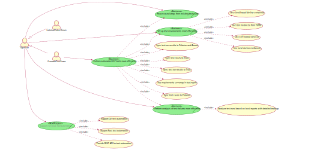
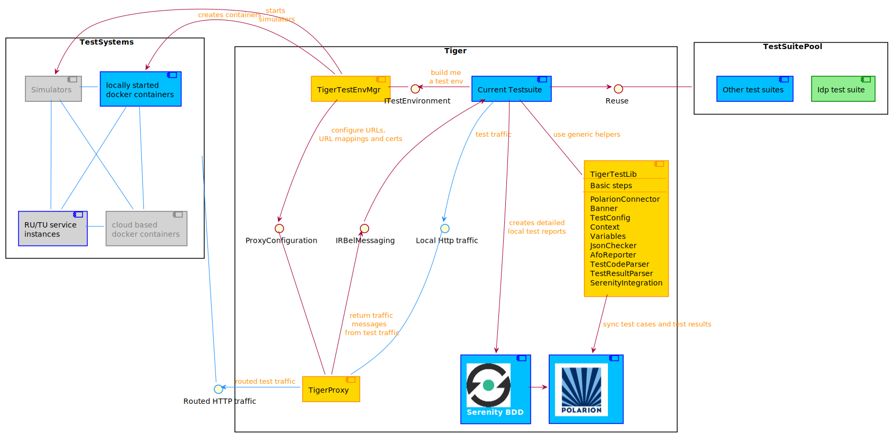

# Tiger v0.1

## Pitching the Tiger

So you heard there is a new tool in the house? But what is tiger for?

Take a look at our short pitch video explaining the basic ideo of Tiger

## Target audience 

* Internal test teams that want to perform iop or e2e tests for reference or product implementation.

* Internal test teams that want to perform acceptance tests for reference or product implementation.

Within the test teams we focus on testers, with not necessarily too much programming skills.
It must be easy to set up and implement tests against service nodes, potentially reusing test steps from other test suites.
For non BDD test suites it must be easily possible to utilize most of the features of Tiger by directly calling public interface methods.

* External product teams, which need to do automated IOP/E2E testing for their health applications.

## Use cases

## Architecture in a nutshell

## Product specification draft

For more details please check out the [specification document](doc/specification/tiger_product_definition.md) 