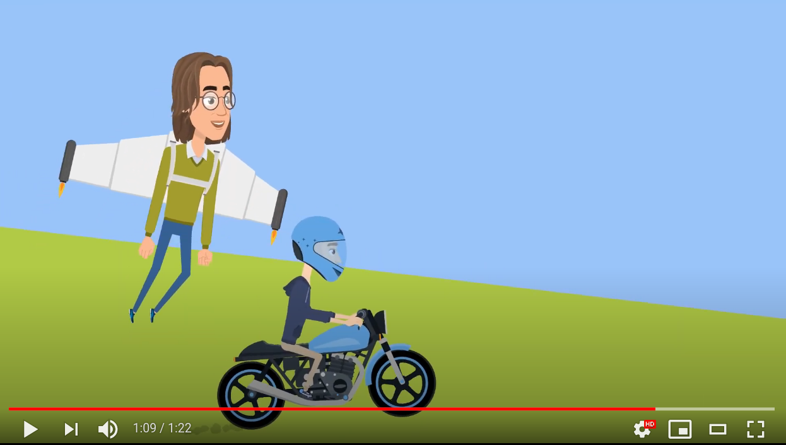

# Tiger

## Pitching the Tiger

So you heard there is a new tool in the house? But what is tiger for?

Take a look at our short pitch video explaining the basic idea of Tiger

## Target audience

* Internal test teams that want to perform iop or e2e tests for reference or product implementation.

* Internal test teams that want to perform acceptance tests for reference or product implementation.

Within the test teams we focus on testers, with not necessarily too much programming skills.
It must be easy to set up and implement tests against service nodes, potentially reusing test steps from other test
suites.
For non BDD test suites it must be easily possible to utilize most of the features of Tiger by directly calling public
interface methods.

* External product teams, which need to do automated IOP/E2E testing for their health applications.

## Tiger-User-Manual

Every information at one place: check out our Tiger-User-Manual!

* HTML: [Tiger-User-Manual](https://gematik.github.io/app-Tiger/Tiger-User-Manual.html)

* PDF: [Tiger-User-Manual](https://gematik.github.io/app-Tiger/Tiger-User-Manual.pdf)

## Use cases

## Architecture in a nutshell

## Product specification draft

For more details please check out more Plantuml diagrammes at [specification folder](doc/specification)

## Simple example project

[For a standalone example see here in our examples section](doc/examples/tigerOnly)

# How to use tiger in a testsuite

[Here](https://gematik.github.io/app-Tiger/Tiger-User-Manual.html#_requirements) are the requirements for using the
tiger.

## Using other libraries / source code

The package "de.gematik.test.tiger.mockserver" of the module tiger-proxy is based upon
mockserver (https://github.com/mock-server/mockserver), licensed under Apache License 2.0 (January 2004).

Files under the tiger-proxy/src/main/resources/css and webfonts folders were taken from the projects with listed
licenses:

* bootstrap css [MIT](http://opensource.org/licenses/MIT)
* Font Awesome by Dave Gandy - [Website](http://fontawesome.io) [License](https://fontawesome.com/license/free) (Icons:
  CC BY 4.0, Fonts: SIL OFL 1.1, Code: MIT License)

## License

Copyright [YEAR CREATED]-[CURRENT YEAR] gematik GmbH

EUROPEAN UNION PUBLIC LICENCE v. 1.2

EUPL © the European Union 2007, 2016

See the [LICENSE](./LICENSE) for the specific language governing permissions and limitations under the License

## Additional Notes and Disclaimer from gematik GmbH

1. Copyright notice: Each published work result is accompanied by an explicit statement of the license conditions for
   use. These are regularly typical conditions in connection with open source or free software. Programs
   described/provided/linked here are free software, unless otherwise stated.
2. Permission notice: Permission is hereby granted, free of charge, to any person obtaining a copy of this software and
   associated documentation files (the "Software"), to deal in the Software without restriction, including without
   limitation the rights to use, copy, modify, merge, publish, distribute, sublicense, and/or sell copies of the
   Software, and to permit persons to whom the Software is furnished to do so, subject to the following conditions::
1. The copyright notice (Item 1) and the permission notice (Item 2) shall be included in all copies or substantial
   portions of the Software.
2. The software is provided "as is" without warranty of any kind, either express or implied, including, but not limited
   to, the warranties of fitness for a particular purpose, merchantability, and/or non-infringement. The authors or
   copyright holders shall not be liable in any manner whatsoever for any damages or other claims arising from, out of
   or in connection with the software or the use or other dealings with the software, whether in an action of contract,
   tort, or otherwise.
3. The software is the result of research and development activities, therefore not necessarily quality assured and
   without the character of a liable product. For this reason, gematik does not provide any support or other user
   assistance (unless otherwise stated in individual cases and without justification of a legal obligation).
   Furthermore, there is no claim to further development and adaptation of the results to a more current state of the
   art.
3. Gematik may remove published results temporarily or permanently from the place of publication at any time without
   prior notice or justification.
4. Please note: Parts of this code may have been generated using AI-supported technology.’ Please take this into
   account, especially when troubleshooting, for security analyses and possible adjustments.

## Contact

We take open source license compliance very seriously. We are always striving to achieve compliance at all times and to
improve our processes.
This software is currently being tested to ensure its technical quality and legal compliance. Your feedback is highly
valued.
If you find any issues or have any suggestions or comments, or if you see any other ways in which we can improve, please
reach out to: tiger@gematik.de
