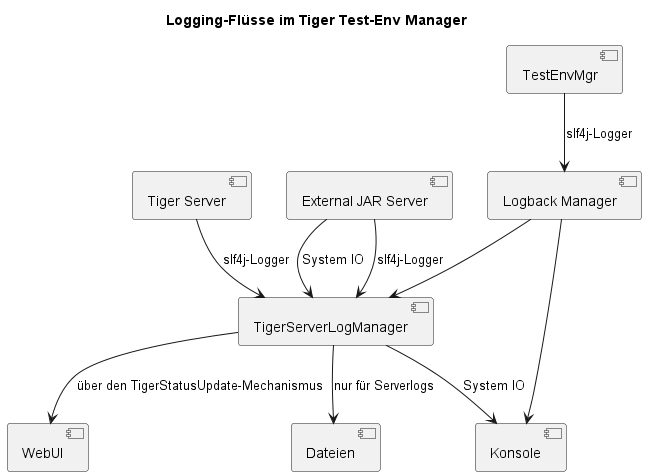

= ADR 001: Logging

== Kontext
Geklärt werden soll die Struktur und der Fluß von Logging-Nachrichten durch den TestEnv-Mgr und Servern hin zur Kommandozeile und der WebUI.

== Status
* Es existieren sowohl log4j2 als auch logback im classpath. Logback wird von Spring-Boot und dem Rbel-Logger eingebracht.
* Konkret verwendet werden ausschließlich Slf4j Logger.

== Entscheidungen

Es wird ein switch auf logback durchgeführt werden

* technische Überlegenheit (nachgestellt)
* Flexibilität bei der Umstellung der Logging-Flüsse (siehe weiter unten)

---

Die Logging-Flüsse werden wie folgt umgestellt

* Der Großteil der Anwendung (hier als TestEnvMgr beispielhaft dargestellt) loggt nach wie vor per slf4j
* Nach wie vor werden alle Log-Meldungen in der Konsole angezeigt
* Hinzu kommt die konfigurierbare Möglichkeit die Logs von Servern getrennt in Dateien abzulegen
* Die Server nutzen eine speziellen Logger (vom geerbten TigerServer) damit sie später eindeutig trennbar sind
* Beim ExternalJarServer wird das System.out zusätzlich auf diesen Logger rausgeloggt.
* Der TigerServerLogManager macht die Appender pro Serverlog aufs File und die Console, später die Anbindung der Logs an `TigerStatusUpdate`
* Die WebUI muss letztlich noch die neuen Updates der Server-Logs abarbeiten können. Für den ersten Wurf werden hier JSON-Strukturen für jede neue Zeile samt zugehöriger Meta-Information per WebSocket/STOMP übertragen.
