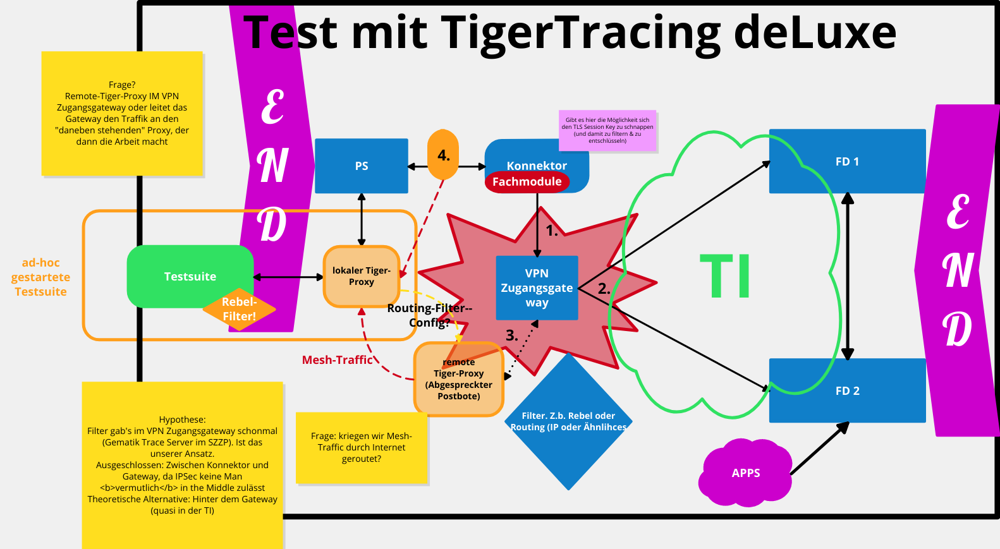

= ADR 002: Tracing

== Kontext

* Was ist das System Under Test? Auch das Fachmodul?
* WEM wollen wir hier konkret helfen? (Keine diffusen "wäre schön" Anforderungen)

== Status

* Es gibt keine (bzw nur diffuse) Aussagen über System Under Test
* Primäres Anliegen ist der Support der Primärsystemhersteller.
* Je weiter hinten Datenpakete abgegriffen werden, desto höher die Sicherheitsanforderungen und die Komplexität einer Implementierung.
* Traffic zwischen PS und Konnektor ist für den PS-Hersteller aussagekräftiger.
* IPSec und VPN schwer bis gar nicht aufbrechbar.

== Entscheidungen

* Testenv-Manager mit entsprechender Konfiguration wird lokal beim PS gestartet. Routing in realen Konnektor oder Konnektorfarm. TLS man-in-the-middle.
* Weniger beteiligte Stakeholder (keine SI, keine Server-Hersteller)
* Abstrahierung vom konkreten Fachdienst

== Verifikation

* Wir sammeln Kunden (hausinterne Projekte welche in den nächsten 6 Monaten eine entsprechende Testsuite an den Start bringen wollen)
* Konkretes Architekturbild entwerfen (genauer als das hier angefügte)
* WENN alle Projekte damit erschlagen werden können, scheint dieser Ansatz "gut genug". (Andernfalls müssen wir hier nochmal ran)
