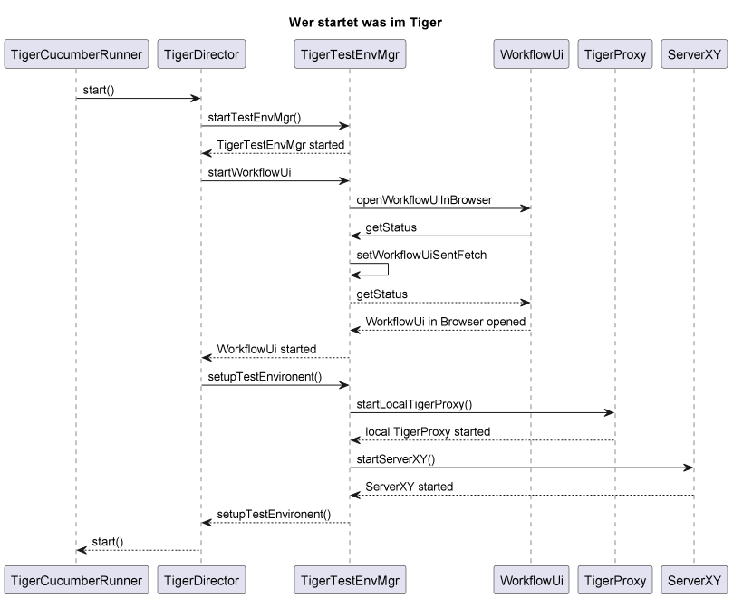

== Kontext
Erklärt wird die Reihenfolge des Erzeugens der einzelnen Tigerkomponenten um ein besseres Verständnis zu bekommen und ggf. hier "nachschlagen" zu können.
Testet der Nutzer ein Feature File so wird der TigerCucumberRunner, die Main Klasse, gestarted. Dieser ruft die start() Methode auf. Diese startet den TestEnvMgr, die WorkflowUi und zu guter Letzt über den TigerTestEnvMgr den lokalen TigerProxy und die in der tiger.yaml definierten Server.

== Sequenzdiagramm

