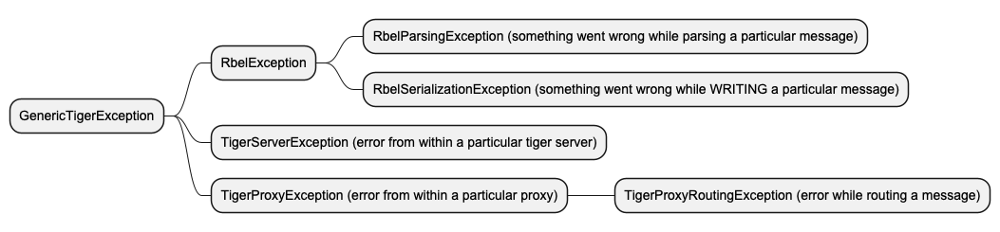

== ADR 011: Exception handling

== Context

We have multiple sources of exceptions in the codebase. These are not handled in a consistent way, lack informations and are not always logged.

* We want to have a consistent way to handle exceptions.
* We want to log exceptions in a consistent way.
* Metadata should be added to the exceptions to help debugging.
* Exceptions should, if applicable, be shown in the TigerProxy-Log

== Decision

We introduce the GenericTigerException. This exception is a runtime exception and should be the base for all exceptions that are thrown in the codebase.

== Consequences

* This is a team effort. Please always have this in the back of your mind.
* Multiple future tickets will pave the way to build the base for this exception handling.