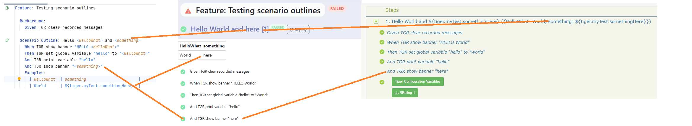

== ADR 013: Resolve placeholders in reports

== Context

Ticket KOB-29 brings the requirement that placeholders for configuration values coming from the yaml file should be resolved in the reports.

E.g.:

[source,gherkin]
----
Wenn KOB lade die EML für die KVNR "${kob.kvnrIbm}" im Format "${kob.emlType}" von dem Aktensystem "IBM" herunter
----

should have the placeholders "${kob.kvnrIbm}" and "${kob.emlType}" resolved to the actual values being used.

This can be achieved by adding the resolved values to the .json report data generated by the SerenityReporterCallbacks and performing the variable substitution before generating the report in TigerSerenityReportMojo.

However, to ensure consistency with the Workflow UI behaviour we should decide what shall be done with placeholders that are used as values in an example table.
Currently, in the Workflow UI we resolve the full text of the Step descriptions and the example tables by calling `TigerGlobalConfiguration.resolvePlaceholders()` on them.
This is a very "aggressive" replacement because:

- The concept of resolving a placeholder only makes sense if being used in a "tigerResolvedString".
By replacing the full text without checking what may or may not be a tigerResolvedString may replace too much.
- The value of the configured value may change during the execution of a test case.
These are values coming from the TigerGlobalConfiguration.
This may be confusing when replacing values on the examples table.
What is the time point of replacing this value?
Is it the value at the beginning of the test case?
But the actual resolution being used in a step is made only when the step is run.
The value may also change during the test, with different values being used in different steps.

For better understanding see the following image:

The placeholder `${tiger.myTest.somethingHere}`, is immediately resolved in the Workflow Ui for the Scenario title and Examples table.
What if the value was changed during a step before the actual use of it in the step "TGR show banner <something>"?

In the report, the value is resolved for the Step text with the value that was determined when the step was executed.
The Scenario name has no replacement being done.

To resolve only values that actually resolved by the glue code method, we can identify the variables types based on their parameter type.
This information is based on the name of the TigerParameterTypeDefinitions.
If the variable is of type "tigerResolvedString" or "tigerResolvedUrl", we resolve it.
Otherwise, we don't.

Additionally, we have variables of type docstring and datatable.
There are the multiline variables that come after a step. e.g.:

[source,gherkin]
----
  Then this is a docstring variable:
    """
    bla bla bla
    """
  And this is a datatable variable:
    | a     | b    | c     |
    | hello | data | table |
----

They are treated differently by the cucumber framework, but we can still identify them in code by checking the type of the step argument ( see `io.cucumber.plugin.event.Step.getArgument()` ).
What we cannot do is, based only on the parameter type, know if this will be resolved or not.
The TigerParameterTypeDefinitions do not apply to the doc string or datatables.

I propose the introduction of an annotation `@ResolvableArgument` which we can use to mark the methods whose docstring or datatable argument should be resolved.
This way we only resolve the variables when it makes sense.

== Decision

- Only resolve placeholders in the Workflow UI and in the html report that are of type `tigerResolvedString` or `tigerResolvedUrl` or are docstrings/dataTables where the method is marked with the annotation `@ResolvableArgument`.
- Do not resolve data variants in the examples table -> the resolution or not resolution of a value only makes sense in the context of the step where it is used.
Additionally, a value may change during the execution of a test case and its resolution has no meaning for the duration of the full scenario execution.

== Consequences

- Resolvable variables are resolved in both Workflow UI and the html report.
The users can better understand which value was used in the test case.
- The examples table stays unresolved.
This may make some users unhappy, because in their use case the resolved values do not change in the duration of a scenario.

