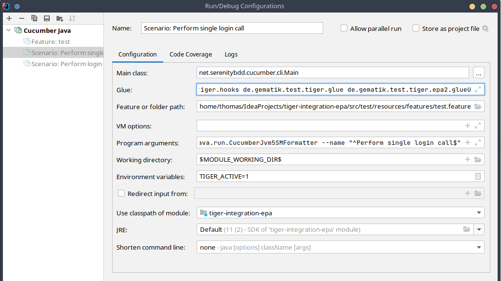

# Starten von Testszenarien mit Tiger aus der Intellij IDE

Um aus IntelliJ Szenerien per Click starten zu können sind die Run/Debug Einstellungen wie folgt anzupassen:

* Main class: net.serenitybdd.cucumber.cli.Main
* Glue:
  * de.gematik.test.tiger.glue
  * de.gematik.test.tiger.hooks
  * weitere für die jeweilige Testsuite spezifische Packages
* Environment variables:
  * TIGER_ACTIVE=1

Am besten sind diese Änderungen bei den **Configuration Templates** für Cucumber Java einzufügen um diese nicht für jedes Szenario oder Feature erneut anpassen zu müssen.

Intellij fügt als Default Configuration gerne auch net.serenitybdd.cucumber.actors in die Liste der Glue Packages. 
Diesen Eintrag bitte entfernen (außer ihr nutzt explizit den Serenity Screenplay pattern). 
