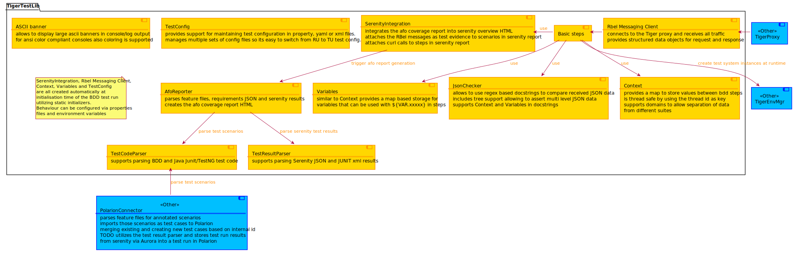

# Tiger Produkt Definition

** TODO convert to english **

## Zielgruppen/Nutzer

* Gematik interne Testteams (GemTT) die IOP Tests für ihre Ref oder Produktentwicklungen durchführen

* Gematik interne Testteams (GemTT) die IOP und Zulassungstests für externe Produkte durchführen

    * innerhalb der Testteams richtet sich der Fokus auf Tester*innen, welche wenig Programmiererfahrung haben. Diesen
      soll es BDD / Cucumber ermöglichen trotzdem automatisierte Testfälle anzulegen Java Programmiererfahrung haben.
      Diese können die Cucumber Schritte der anderen Suites nutzen bzw. eigene Steps in ihren Testsuiten bauen.
    * Alternativ können sie die, hinter dem Glue code liegenden Stepklassen für JUnit/TestNG Testmethoden nutzen.

* Externe Produkthersteller*innen (ExtProd), welche automatisierte IOP Tests für ihre Produkte benötigen

## Anwendungsfälle

** needs to be synced with diagramme **

* Als ExtProd möchte ich mein Produkt unter Zuhilfenahme vorgefertigter Testsuites/Testschritte systemintegrationstesten

    * gegen lokal Instanzen (Github download, manuelle gestartet oder Docker Image über lokalen Docker client oder über
      Cloud based Docker hosts)
    * gegen gehostete Instanzen in Gematik RUs/TUs
* Als GemTT möchte ich externe und interne Produkte einfach systemintegrationstesten
    * Ich möchte Schritte aus anderen Testsuite einfach wiederverwenden
    * Ich möchte lokale Testumgebungen für mehrere TI Services / Produkte, welche von der Gematik entwickelt wurden,
      einfach konfigurieren und für meine Tests nutzen
    * Ich möchte einen detaillierten Testreport erhalten, in welchem neben dem Verdict auch die Kommunikation
      mitprotokolliert wurde.
    * Ich möchte die Abdeckung der Anforderungen durch den aktuellen Testlauf einsehen
* Als GemTT möchte ich die Testfälle und Testergebnisse ins Polarion (über Aurora) einspielen und revisionssicher
  aufbewahren

* Als GemTT möchte ich Zulassungstests gegen Produkte in der RU/TU durchführen
 
* Als GemTT möchte ich bei der Durchführung meiner Tests eine Anbindung an Titus (Ablegen der
  Testdurchführungsergebnisse)

* Als Gematik möchte ich diese Dienste gegen Gebühren an dezidierte Nutzer*innen vermieten

## Systemgrenzen

## Out of system scope (as of May 2021)

* Connect to service nodes in PU
* Support for non Java test code
* External test teams doing only UI based test automation

## Architekturdraft

### Testumgebungsmanager

** needs to be synced with diagramme **

Aufgabe des Testumgebungsmanagers ist es der verwendenden Testsuite konfigurierte Instanzen von
Referenzimplementierungen / TI Produkten zur Verfügung zu stellen, bzw. Routen über den Reverse Proxy zu routen.

* Instantiieren von Docker images auf lokalem Docker client
* (Instantiieren von Docker images in Cloud Diensten)
* Routen am Reverse Proxy zu Instanzen in RU/TU zu aktivieren
* Die Produkttestsuiten so zu konfigurieren, dass deren Testschritte diese konfigurierten Instanzen ansprechen.

### Tiger Test Lib

** needs to be synced with diagramme **

AfoReporter, Polarion integration für JUnit, TestNG, Cucumber

Generische Blöcke

* Context, Variablen,
* Testkonfigurationen für das jeweilie Produkt
* Automatisches Setup der Instanz durch den Testumgebungsmanager
* Upload der Testergebnisse via Aurora nach Polarion
* Set of Gematik BDD Ref/Produkt Testsuites

Um eine klare Abgrenzung der einzelnen Testschritte der einzelnen Testsuites sicherzustellen muss jeder Testschritt mit
dem Produktkürzel in Großbuchstaben beginnen.

IDP für den Identity Provider, ERZP für das eRezept, EPA für die elektronische Patientenakte

### Tiger Proxy

** needs some text **

Reverse Proxy zur Anbindung von RU/TU Umgebungen + RbelLogger service

### Anbindung an Titus (→PI IV)

Derzeit wird von Seiten Titus für das aktuelle PI bis 30.6. keine Realisierung einer API angedacht.

Da sowohl die Synchronisierung von Testfällen als auch die Speicherung von Testlaufergebnissen stark von der
Ausgestalteten API abhängen sind Konzeptions- und erste Implementierungsarbeiten von einer detailierten inhaltlichen
Abstimmung mit dem Titus Platformteam Vorraussetzung.

### Lokales Reporting basierend auf Serenity

....

### Unterstützung bei der Erstellung von Feature files

* Erstellung von Feature Files mit Intellij Obacht derzeit werden Custom Parameter Annotations aus externen JARs nicht
  unterstützt. Die Testschrittparameter sind also ausschließlich auf den Standard-Cucumber6-Typen zu basieren (
  Siehe https://youtrack.jetbrains.com/issue/IDEA-211600).

* Projektübergreifende Erstellung von Testfällen über AssertThat (→PI IV)
  Siehe https://marketplace.atlassian.com/apps/1219033/assertthat-bdd-cucumber-for-jira?tab=overview&hosting=cloud

