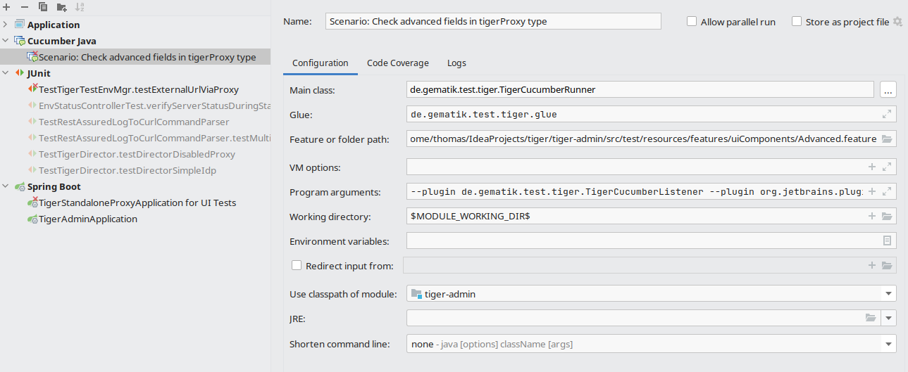

== Getting started

ifdef::backend-html5[]
 ROOOARRR! Ready to rumble!

endif::[]

Tiger is based on Java, Maven and Serenity BDD - so saddle the horses, check the operating system requirements and hit the road.

NOTE: We do not at the moment have any plans to support gradle or other build environments.
But if you are using it in your projects feel free to contact us, and we might find a way to support your specific build environment.

If you don't have time right now to look through the whole documentation, you can directly jump to our <<Example project>> section.

=== Requirements

.Operating system requirements
* Open JDK >= 11
* Maven >= 3.6
* IntelliJ >= 2021.2.3

TIP: On Windows please refrain from using Powershell or DOS command line windows but stick with GitBash

=== Maven in a nutshell
In order to use Tiger with your BDD/Cucumber/Serenity based test suite you need to add a few dependencies to integrate with Tiger

* Current version of Tiger test library
* Current version of Tiger test library as test-jar artefact

NOTE: The second dependency is needed so that the IntelliJ Cucumber plugin detects the Steps/Glue code provided by the Tiger test library.

And to trigger the test suite's execution, you will need to add these plugins

* Tiger driver generator plugin
* Maven Surefire plugin
* Serenity maven plugin

.Simple Tiger Maven pom.xml
[source,xml]
----
include::../examples/tigerOnly/pom.xml[]
----

For a successful startup you also need a minimum Tiger test environment configuration yaml file in your project root:

.Minimum Test environment configuration
[source,yaml]
----
include::../examples/tigerOnly/tiger.yaml[]
----

and finally a minimal feature file under src/test/resources/features:

.Minimum Cucumber feature file
[source]
----
include::../examples/tigerOnly/src/test/resources/features/test.feature[]
----

With these three files in place you can run the simple dummy test scenario defined in the feature file by issuing

----
mvn verify
----

=== Maven plugin details

This section is for the ones that love to know all the details. If you are happy that everything works and
don't bother to understand all the bits / properties and settings just skip this section and head over to the <<Example project>> section.

// ==== Tiger driver generator plugin

include::../../tiger-driver-generator-maven-plugin/README.adoc[leveloffset=+3]

==== SureFire plugin

The surefire plugin will trigger the test run.
It is important to activate the **testFailureIgnore** property, to ensure that even if the test fails, the serenity report is created.

To filter the scenarios/features to be run you may pass in the Java system property cucumber.filter.tags. You can do so either within the <systemPropertyVariables> tag or via the command line using -Dcucumber.filter.tags

For more details about how to use filter tags see https://cucumber.io/docs/cucumber/api/#tags
[source,xml]
----
include::../../doc/examples/tigerOnly/pom.xml[tag="surefire-plugin"]
----

TIP: We do not recommend the parallel test execution with Tiger at the moment.

Reason is that when using Tiger Proxies with the Tiger test library validation feature parallel execution may lead to messages
from different threads / forked processes ending up in the wrong listening queue
making it very complicated to make sure your validations are working as expected in different timing situations.

==== Optionally Failsafe plugin

CAUTION: We do NOT support the `maven-failsafe-plugin` at the moment.

Although the failsafe plugin is used quite often with spring boot applications under test to trigger start up / tear down of the app
via pre and post integration hooks, we found that the same
can be achieved utilizing spring annotated JUnit driver classes.

For more details please google @SpringBootTest, follow https://lmgtfy.app/?q=%40springboottest[this link] and/or check the `/src/test/jtmpl/SpringBootDriver.jtmpl file in the tiger-admin module.

==== Serenity Maven plugin

The `serenity-maven-plugin` has three goals, which will aggregate the data coming from the test results as XML and JSON, create the HTML reports and
fail the maven job if any test run via the surefire plugin failed.

[source,xml]
----
include::../../doc/examples/tigerOnly/pom.xml[tag="serenity-plugin"]
----

=== Example project

In the /doc/examples/tigerOnly` folder of this project you will find an example for a minimum configured maven project that

* embedds Tiger
* allows to use its Cucumber steps and
* allows to easily configure your test environment

All you need is to set up three files:

* a Maven `pom.xml` file to declare the dependencies and the plugins needed
* a `tiger.yaml` to declare your test environment (servers needed, proxy routes,...). This is currently "empty".
* a `test.feature` file containing a test scenario and dummy test steps to be performed.

[plantuml, "tigerOnly-file-structure", "svg", title="File structure of TigerOnly example project"]
----
@startwbs
!include ./plantuml.style

title File structure of TigerOnly example project

* TigerOnly root folder <<Folder>>
** src <<Folder>>
*** test <<Folder>>
**** resources <<Folder>>
***** features <<Folder>>
****** test.feature <<File>>
** pom.xml <<File>>
** tiger.yaml <<File>>
@endwbs
----

=== How to contact the Tiger team

You can reach us via

* GitHub https://github.com/gematik/app-Tiger
* or email TIGER@gematik.de

=== IntelliJ

We recommend to use latest version of IntelliJ at least version 2021.1.

==== Run/Debug settings

To be able to successfully start scenarios/features you first need to configure the Run/Debug settings of your project:

.Run/Debug settings for Java Cucumber template
* Main class: net.serenitybdd.cucumber.cli.Main
* Glue:
    ** de.gematik.test.tiger.glue
    ** de.gematik.test.tiger.hooks
    ** net.serenitybdd.cucumber.actors +
       if you are using the screenplay pattern (PREFERRED!)
    ** additional packages specific to your test suite
* VM Options:
    ** Java proxy system properties (see <<Proxy configuration>> below)
* Environment variables:
    ** Proxy environment variables (see <<Proxy configuration>> below)

Best is to add these settings to the **Configuration Templates** for Cucumber Java.
Depending on the version of IntelliJ these settings are located either on the top icon bar or at the bottom left as link.

Else you would have to apply these settings to any new Debug/Run Configuration, like when you start a new scenario, which was never executed before.

==== Proxy configuration

If you are located behind a proxy please make sure to set the environment variables HTTPS_PROXY and HTTP_PROXY as well as
the Java system properties http.proxyHost, http.proxyPort, https.proxyHost and https.proxyPort appropriately so that the internet connections are routed properly through your **company proxy**.

Please also make sure IntelliJ has its proxy settings configured appropriately for HTTP and HTTPS so that it can download the dependencies for the IntelliJ build environment too.

TIP: BOTH settings (environment variables and system properties) are required as Maven and Java code and HTTP client libraries use both settings.
