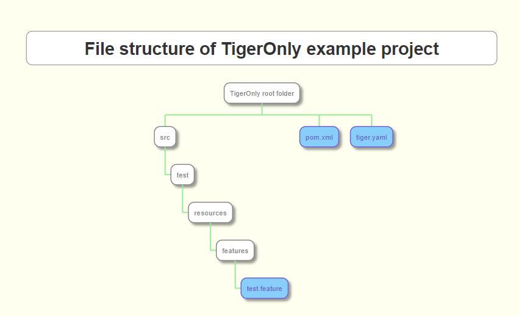

== Getting started

ifdef::backend-html5[]
 ROOOARRR!
Ready to rumble!

endif::[]

Tiger is based on Java, Maven and Serenity BDD - check the system requirements and get started.

NOTE: Currently, there are no plans to support Gradle or other build environments.
However, if you are using it in your projects, feel free to contact us and we might find a way to support your specific build environment.

If you do not have time to read the entire documentation, you can jump directly to the xref:_example_project[] section.

=== Requirements

.System requirements
* Open JDK >= 17
* Maven >= 3.6

When you are developing a testsuite (further), you should use an IDE (we recommend IntelliJ >= 2021.2.3 because of the IntelliJ Cucumber plugin, see xref:tiger_user_manual.adoc#_intellij[IntelliJ] section for more detail).

TIP: On Windows you can use Git Bash or Powershell

=== Maven in a nutshell

==== Using the Tiger Starter Pom

We provide a start pom which makes it faster to bootstrap a new test suite project.
You need to extend the tiger-starter-parent pom in your project, and you get a project with all the tiger dependencies and plugins configured to run tests with maven.

.Example of a minimal project using the tiger-starter-parent
[source,xml]
----
<?xml version="1.0" encoding="UTF-8"?>
<project xmlns="http://maven.apache.org/POM/4.0.0"
         xmlns:xsi="http://www.w3.org/2001/XMLSchema-instance"
         xsi:schemaLocation="http://maven.apache.org/POM/4.0.0 http://maven.apache.org/xsd/maven-4.0.0.xsd">
    <modelVersion>4.0.0</modelVersion>

    <parent>
        <groupId>de.gematik.test</groupId>
        <artifactId>tiger-starter-parent</artifactId>
        <version>${RELEASE_VERSION}</version>
    </parent>

    <artifactId>tiger-demo</artifactId>
    <version>0.0.1-SNAPSHOT</version>
    <packaging>jar</packaging>

</project>
----

You can execute the tests in this project by running:

[source,shell]
----
mvn verify
----

This will run your cucumber feature files using the Tiger Framework and generate serenity html reports.
For quick configuration we have set the following maven properties, which you can override in your project pom:

[source,xml]
----
<tiger.featuresDir>${basedir}/src/test/resources/features</tiger.featuresDir>
<tiger.glues>${project.groupId}</tiger.glues>
----

More detailed configuration can still be performed directly on the tiger-maven-plugin and maven-failsafe-plugin.
See the following section for details.

We also provide a maven profile which allows you to execute a test suite without the maven failsafe plugin.

With

[source,shell]
----
mvn exec:java -Ptiger-ui
----

you can start tiger as a java application without the full maven lifecycle.
This profile is pre-configured to start the Workflow UI with the interactive test selector dialog.
This means the tests will not be run automatically on start up and you can select exactly what you want to execute via the tiger ui.

==== Without the Tiger Start Pom

To use Tiger with your BDD/Cucumber/Serenity based test suite you need to add a few dependencies to integrate with Tiger

* Current version of Tiger-bom in your dependencyManagement section
* Tiger test library in your dependencies section
* or the current version of Tiger test library as test-jar artefact

And to trigger the test suite's execution, you will need to add these plugins

* Tiger maven plugin
* Maven FailSafe plugin

.Simple Tiger Maven pom.xml
[source,xml]
----
include::../examples/tigerOnly/pom.xml[]
----

For a successful startup you also need a minimum Tiger test environment configuration YAML file in your project root:

.Minimum Test environment configuration
[source,yaml]
----
include::../examples/tigerOnly/tiger.yaml[]
----

and finally a minimal feature file under src/test/resources/features:

.Minimum Cucumber feature file
[source,gherkin]
----
include::../examples/tigerOnly/src/test/resources/features/test.feature[]
----

With these three files in place you can run the simple dummy test scenario defined in the feature file by issuing

[source,shell]
----
mvn verify
----

If you are interested in the plugins Tiger uses, please refer to the section ( xref:tiger_user_manual.adoc#_maven_plugin_deep_dive[Maven Plugin Deep Dive]).

[#_example_project]
=== Example project

In the `/doc/examples/tigerOnly` folder of this project you will find an example for a minimum configured maven project that

* embeds Tiger
* allows to use its Cucumber steps and
* allows to easily configure your test environment

All you need is to set up three files:

* a Maven `pom.xml` file to declare the dependencies and the plugins needed
* a `tiger.yaml` to declare your test environment (servers needed, proxy routes,...).
This is currently "empty".
* a `test.feature` file containing a test scenario and dummy test steps to be performed.

=== How to contact the Tiger team

You can reach us via

* GitHub https://github.com/gematik/app-Tiger
* or email TIGER@gematik.de
