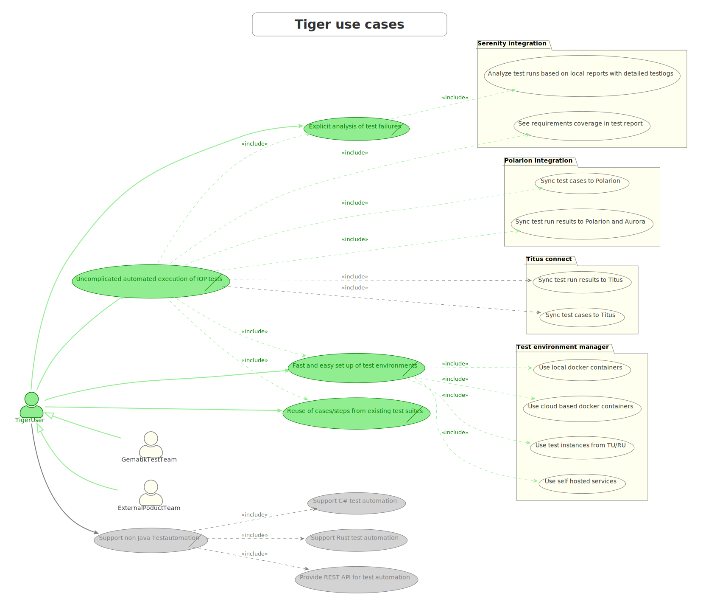
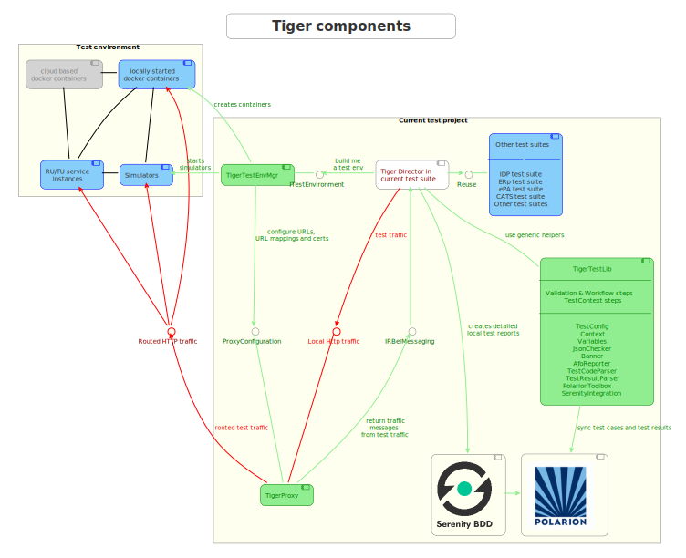

[#_overview]
== Overview

ifdef::backend-html5[]
image:media/tiger2-plain.svg[200,200,role="thumb",float="right",title="Tiger logo"]
endif::[]

It all started with a crazy idea on the 1^st^ of April... +

What if we could come up with something new

* lightweight
* flexible
* customizable
* fun to work with

Something to make our life as testers easier? Using the latest technologies and **focusing on the needs of testing in an agile environment**?

Quickly a small group of committed volunteers formed and began evolving the rough idea of an agile test framework for the German Telematik Infrastructure @ gematik GmbH.

And so the **TIger project was started!**

ifdef::backend-pdf[]

endif::[]

<<<
=== Use cases

In our first dive we focused on what Tiger should stand for and how we could improve the situation of test teams.

.Core business use cases
* Fast and easy set up of test environments
* Uncomplicated automated execution of IOP tests
* Explicit analysis of test failures
* Reuse of cases/steps from existing test suites
* (non Java test automation support is not implemented yet)

<<<
=== Elevator pitch

ifdef::backend-html5[]
To get a quick introduction to the core concepts and features of the Tiger test framework check out our video
endif::[]
ifdef::backend-pdf[]
To get a quick introduction to the core concepts and features of the Tiger test framework check out our video at
https://youtu.be/eJJZDeuFlyI?autoplay
endif::[]

image::media/tiger-pitch-still.png[width="1024",title=Tiger product pitch video,align=center,link=https://youtu.be/eJJZDeuFlyI?autoplay]

// TODO TGR-315 write down the pitch

<<<
=== Components

Tiger has a clear separation in three components, ech of them having a clear purpose, described in the next subsections:

* Tiger Proxy
* Tiger Testenvironment Manager
* Tiger Test library

==== Tiger Proxy

The Tiger Proxy at its core is an extended Mock server, that has the following additional core feature set:

* **Rerouting** - allows rerouting requests based on a configured lookup table
* **Modifications** - allows modifying the content of requests / responses on the fly
* **Mesh set up** - allows forwarding traffic data from one proxy to another for aggregated validations
* **TLS man in the middle** - allows tracing TLS encrypted traffic
* **RBel logging** - breaks up and parses each request / response received. This includes decryption of VAU and encrypted JWT.
Structured data like JSON, XML, JWT is displayed in a sophisticated HTML report.

==== Tiger test environment manager

The Tiger test environment manager provides methods to configure and instantiate multiple server nodes in your test environment and offers the following core feature set:

* **Instantiating test nodes** - docker containers, docker compositions, external Jars** and
accessing server instances via external URL configurations
* **Instantiating preconfigured server nodes** - for common test scenarios like ePA, ERp, IDP, Demis
* **Automatic shutdown** - on tear down of test run, all the instantiated test nodes are ended
* **Highly configurable** - Multitude of parameters and configuration properties
* **Flexible environment management** - exporting and importing environment variables and system properties to other test nodes
* **Customizing configuration properties** - via command line system properties or environment variables

==== Tiger test library

The Tiger test library provides the following core features:

* **Validation** - BDD steps to filter requests and validate responses
* **Workflow UI** - BDD steps to support tester guidance in test workflows
* **Content assertion** - BDD steps to assert JSON / XML data structures
* **Product Integration** - Synchronisation with Polarion, Serenity BDD and screenplay pattern

==== Working together

The Testenvironment Manager instantiates all test nodes configured in the `tiger-testenv.yaml` config file.
It also instantiates one local Tiger Proxy for the current test suite.
This Tiger Proxy instance (and others created in the test environment if using a mesh setup) traces all requests and responses
forwarded via this proxy and provides them to the test suite for further validation.

For each server node instantiated, the local Tiger Proxy adds a route so that the instantiated server node
can be reached by the test suite via HTTP and the configured server hostname.

Each Tiger Proxy can be configured in a multitude of ways: as reverse or forward proxy with special routing features and
modifications of content easily configurable, or in a mesh setup as proxy forwarding traffic to other Tiger Proxies...

The BDD or JUnit test suite can integrate the Tiger test library to validate messages (requests and responses) sent/received
over Tiger Proxies using features such as RBelPath, VAU decryption, JSON checker and XML checker.

