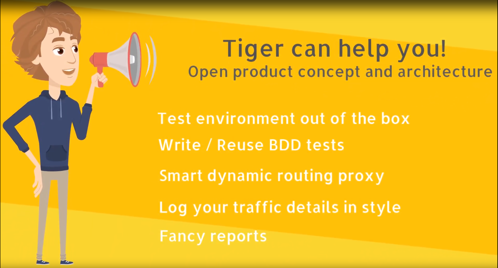
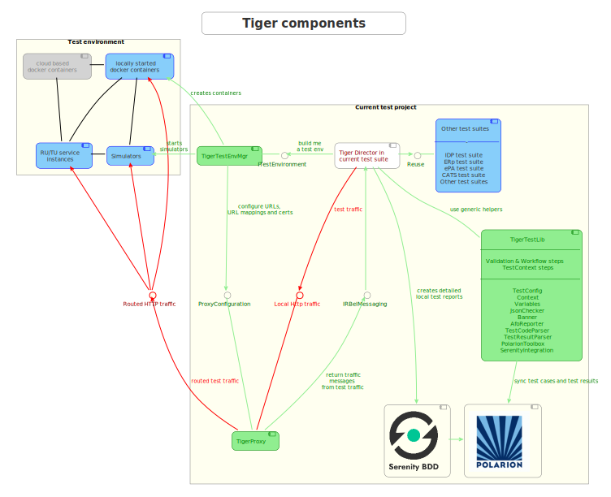

[#_overview]
== Overview

ifdef::backend-html5[]
To get a quick introduction to the core concepts and features of the Tiger test framework check out our video
endif::[]
ifdef::backend-pdf[]
To get a quick introduction to the core concepts and features of the Tiger test framework check out our video at
https://youtu.be/eJJZDeuFlyI?autoplay
endif::[]

Tiger is a framework for interface-driven BDD black-box-testing.

Tiger is a toolbox that supports and guides you when writing test suites.
It lets you focus on writing the tests and solves typical problems that every team encounters (configuration, setting up the test environment, parametrization, result reporting, test running).
How, you ask?

* Tiger does not focus on components but on the interactions between them.
The tiger proxy captures the traffic between components.
* The tiger proxy parses the traffic and builds a tree structure which abstracts away the encoding (XML, JSON, JWT, ASN.1, MIME and many more) and lets you focus on the data.
* The Tiger test environment manager handles Docker containers, Helm charts, JARs and external servers, boots the configured setup and routes the traffic, all with zero lines of Java, all in YAML only.
* A complete configuration toolkit, which combines multiple sources and supports custom configuration of your test suite as well, again with zero lines of Java.
* Common tasks (JSON validation, message filtering, scenario configuration, configuration of simulators...) can be performed with the Tiger test library, which can be seamlessly imported into BDD test suites.
This allows you to build powerful test suites with zero lines of Java.
* If you want to write custom steps and glue code, our Java API has got you covered by supporting common tasks (crypto, serialization...) for you. The Tiger Workflow UI is a web-based user interface designed to guide the tester through complex test workflows. It provides an interactive and visual way to execute, monitor, and control BDD test scenarios.
So the little lines you have to write are to be powerful and descriptive?!

=== Components

Tiger has a clear separation in three components, each of them having a clear purpose, described in the next subsections:

* xref:overview.adoc#_tiger_test_environment_manager_overview[Tiger Testenvironment Manager]
* xref:overview.adoc#_tiger_proxy_overview[Tiger Proxy]
* xref:overview.adoc#_tiger_test_library_overview[Tiger Test Library]

[#_tiger_test_environment_manager_overview]
==== Tiger Test Environment Manager

* **Instantiating test nodes** - external JARs, Docker containers, Docker Compose stacks, Helm charts, Zion and accessing server instances via external URL configurations
* **Automatic shutdown** - on teardown of the test run, all instantiated test nodes are stopped
* **Highly configurable** - a multitude of parameters and configuration properties
* **Flexible environment management** - exporting and importing environment variables and system properties to other test nodes
* **Customizing configuration properties** - via command-line system properties or environment variables

See chapter xref:tigerTestEnvironmentManager.adoc#_tiger_test_environment_manager[Tiger Test Environment Manager] for a detailed description and configuration options.

[#_tiger_proxy_overview]
==== Tiger Proxy

* **Rerouting** - allows rerouting requests based on a configured lookup table
* **Modifications** - allows modifying the content of requests / responses on the fly
* **Mesh set up** - allows forwarding traffic data from one proxy to another for aggregated validations
* **TLS man in the middle** - allows tracing TLS encrypted traffic
* **RBel logging** - breaks up and parses each request / response received.
This includes decryption of VAU (https://gemspec.gematik.de/docs/gemILF/gemILF_PS_ePA/gemILF_PS_ePA_V4.0.0/#A_24494), ZETA/ASL and encrypted JWT.
Structured data like JSON, XML, JWT, ASN.1, MIME, X.509, LDAP and many more are displayed in a sophisticated HTML report.
See xref:tigerProxy.adoc#_supported_formats[Supported formats] for a full list.

See chapter xref:tigerProxy.adoc#_tiger_proxy[Tiger Proxy] for a detailed description and configuration options.

[#_tiger_test_library_overview]
==== Tiger Test Library

The Tiger test library provides the following core features:

* **Validation** - BDD steps to filter requests and validate responses
* **Workflow UI** - BDD steps to support tester guidance in test workflows
* **Content assertion** - BDD steps to assert JSON / XML data structures
* **Product Integration** - Synchronisation with Polarion, Serenity BDD and screenplay pattern

See chapter xref:tigerTestLibrary.adoc#_tiger_test_library[Tiger Test Library] for a detailed description and usage examples.

==== Working together

The test environment manager instantiates all test nodes configured in the `tiger.yaml` config file.
It also instantiates one local tiger proxy for the current test suite.
The local tiger proxy instance (and others created in the test environment if using a mesh setup) traces all requests and responses forwarded via this proxy and provides them to the test suite for further validation.

For each server node instantiated, the local tiger proxy adds a route so that the test suite can reach the instantiated server node via HTTP and the configured server hostname.

Each tiger proxy can be configured in a multitude of ways: as a reverse or forward proxy with special routing features and content modifications, or in a mesh setup forwarding traffic to other Tiger Proxies.

The BDD or JUnit test suite can integrate the Tiger test library to validate messages (requests and responses) sent and received over Tiger Proxies using features such as RBelPath, VAU decryption, JSON checker and XML checker.

==== Tiger extensions

As Tiger evolves, we have implemented a set of extensions that make your job as a tester easier in areas not directly covered by the Tiger core.
The following extensions are currently available:

* **Zion** extension provides a customizable zero line mock server
* **Mail** extension enables testing of email flows and querying mails in test cases
* **Cloud** extension provides the docker, docker compose and helm chart server types for the Tiger test environment manager
* **FHIR validation** extension provides BDD steps to perform FHIR schema-based and FHIRPath-based validations
* **CATS** extension (gematik internal only) provides BDD steps for configuring and interacting with the Cats Card Terminal Simulator
* **Konnektormanagement** extension (gematik internal only) provides BDD steps for administering Konnektors
* **PSSim** extension (gematik internal only) provides BDD steps for simulating a primary system
* **Kartenterminal Robot** extension (gematik internal only) provides BDD steps for controlling the card terminal robot

See xref:tigerExtensions.adoc#_tiger_extensions[Tiger Extensions] for a detailed description of each extension.
