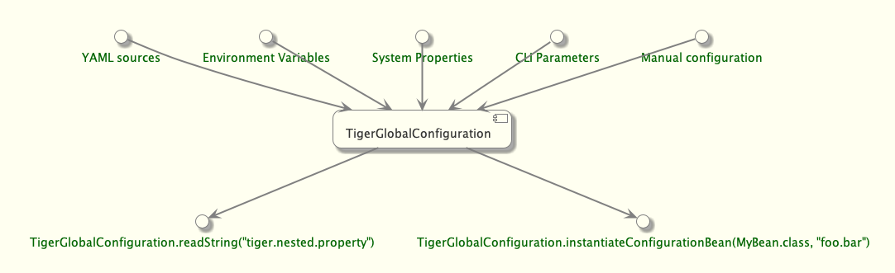

== Tiger Configuration

Configuration is an integral part of testing. To make this task easier for you and to make configuration the various parts of the system as easy as possible Tiger has a central configuration store: TigerGlobalConfiguration. It combines properties from multiple source and feeds into various parts of the system.

This allows a vastly simplified retrieval and configuration of nearly all aspects of the system. It is therefore recommended reusing this system for your own testsuite as well.

=== Inlets

The following inlets are considered in the TigerGlobalConfiguration (ordered from most to least important, meaning if a property occurs in multiple sources the one at the top is considered first):

* Manually added properties (TigerGlobalConfiguration.putString("foo.bar")). Here there are three sub-distinctions:
** Global properties
** Test properties
** Thread-based properties
* Command-line properties
* System-Properties (System.setProperty)
* Environment-Variables (export "FOO_BAR" = 42)
* YAML-Files (tiger-testenv.yaml)

=== Key-translation

To easily convert between the multiple sources the TigerGlobalConfiguration offers key-translation:

`tiger.foo.bar` is equal to `TIGER_FOO_BAR` is equal to `tIgER.fOO.BaR`

* When the key consists only of letters and underscores then the underscores are converted to points.
* Names are compared without considering the case.

=== Thread-based configuration

To enable execution of multiple tests simultaneously some data has to be stored in a thread-based manner (the first step could for example store the result of a request in a variable, the second step could read it from that variable).

To enable this simply reference the Thread-context when storing a variable:

[source,java]
----
TigerGlobalConfiguration.putValue("foo.value", "bar", SourceType.THREAD_CONTEXT);
----

When retrieving the variable you could simply ask for `foo.value`: Only when you are in the thread that stored this variable you will find it again.

=== Placeholders

The TigerGlobalConfiguration supports the use of placeholders. Say for example you have a test-environment with two servers, "A" and "B". For the server "A" you have two choices: Either a real URL in the internet or a locally booted server. The use can choose which to activate by setting "active" of the server to use. The server "B" should now use the activated server, without having to set it manually while booting.

You could achieve this by exporting the URL (`servers.myServer.exports`) and referencing it in an argument which is passed into server "B" (`serverAUrl=${serverA.url}`. The first part here before the equal is the name of the environment variable passed into server "B" while booting, the second part behind the equal is the name of the property. compare this to the exports in the two serverA-options):

[source,YAML,title="Configuring using placeholders and exports"]
----
servers:
  serverAInternet:
    active: true
    type: externalUrl
    source:
      - https://my.real.server/api
    exports:
# The string SERVERA_URL is split internally into SERVERA and URL, which are then considered
# as lowercase keys
      - SERVERA_URL=https://my.real.server/api
  serverALocal:
    active: false
    type: externalUrl
    source:
      - https://localhost:8080/api
    exports:
      - SERVERA_URL=https://localhost:8080/api
  serverB:
    type: externalJar
    source:
      - http://nexus/download/server.jar
    externalJarOptions:
      arguments:
# The second part is the placeholder which will be resolved using the internal value store.
# The string "serverA.url" is split into "serverA" and "url", again considered as lowercase,
# which then matches to "SERVERA_URL",
        - --serverAUrl=${serverA.url}
      healthcheck: http://127.0.0.1:19307
----

WARNING: Placeholders which can not be resolved will not lead to errors but rather they will simply not be replaced.

=== Examples

Some examples to clarify:

==== Example 1

Say you have an environment configured in your testenv.yaml. You want the Tiger Proxy to forward traffic on one route to your backend-server. This will normally be a local server, but on the build-server you want to address another host. You can simply set an environment variable to do the job for you. Below are the relevant snippets:

[source,YAML,title="tiger-testenv.yaml with the Tiger Proxy routing everything to the local server"]
----
tigerProxy:
    proxyRoutes:
        - from: /
          to: http://127.0.0.1:8080
----

In the buildserver you can now simply overwrite the "to"-part of this route like so:

[source,bash]
----
export TIGERPROXY_PROXYROUTES_0_TO = "http://real.server"
----

==== Example 2

In the above example let's say you only want to customize the port. This can be done by using placeholders:

[source,YAML,title="tiger-testenv.yaml with the Tiger Proxy routing everything to the local server"]
----
tigerProxy:
    proxyRoutes:
        - from: /
          to: http://127.0.0.1:${backend.server.port}
----

This time we don't overwrite the complete to-url but only the port like so:

[source,bash]
----
export BACKEND_SERVER_PORT = "8080"
----

==== Example 3

Now we want to assert that the reply coming from the server has the correct backend-url in the XML that is returned to the sender. To do this we have to reference the configured URL from above, since the value could be different on every execution. We can solve this using placeholders:

[source,Gherkin,title="The testsuite"]
----
    TGR current response with attribute "$.body.ReplyStructure.Header.Sender.url" matches "http://127.0.0.1:${backend.server.port}"
----

The glue-code in Tiger automatically resolves the placeholders.

=== Pre-Defined values

Tiger adds some pre-defined values to make your life easier configuring the environment. Currently these are:

* `free.port.0` - `free.port.255`: Free ports that are randomly determined at startup but stay fixed during the execution. This enables side effect free execution of the testsuite.

//TODO when screenplay: Please use Serenity-BDD-Screenplay Actor (to avoid thread-pooled misshaps)

