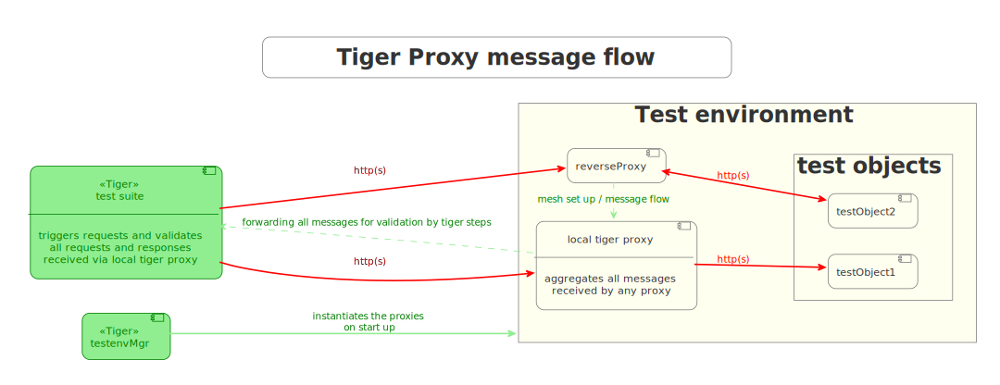
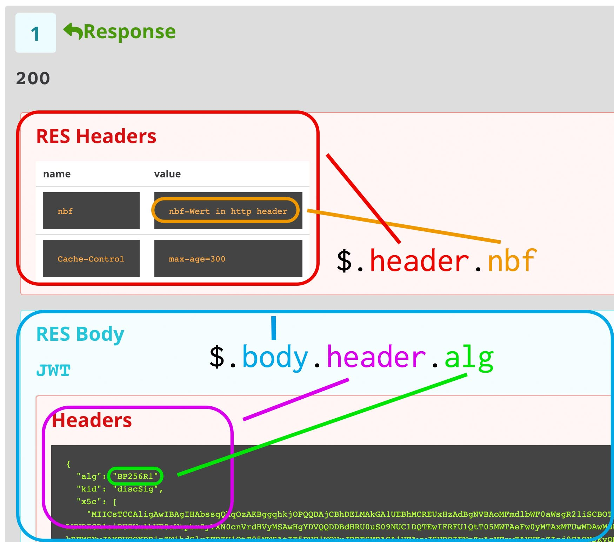
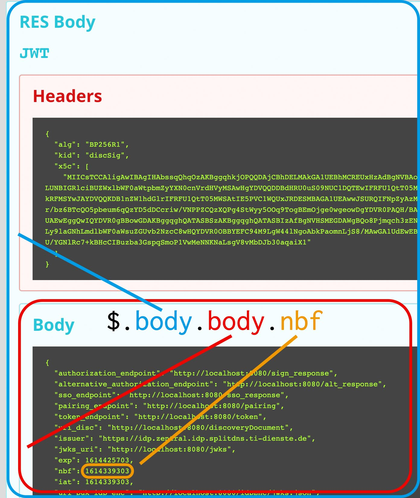
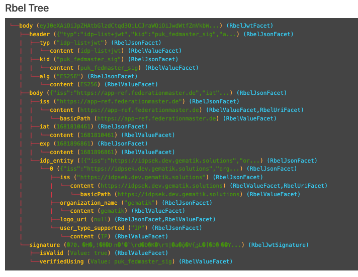

== Tiger Proxy

=== Excurse: What are proxies, reverse, forward

There are a lot of different kind of proxies.
Here we talk only about HTTP and HTTPS proxies!

==== Forward proxies

Forward proxies work like a switch-station: You send a packet to your destination, via proxy.
The proxy receives the packet, sees the address and can send that packet to wherever he sees fit.
To use a forward proxy the sender has to be aware of it and send the packet accordingly.

This allows the creation of virtual domains, something we use extensively in tiger.

A forward proxy can always read the entire content of your communication, something we also use heavily.

Lastly a forward proxy acts as a man-in-the-middle, enabling the penetration of TLS-traffic.
We also use this, but we will explain it in more depth later.

==== Reverse proxies

Reverse proxies also receive traffic and may reroute them at their own discretion.
But unlike a forward proxy a reverse proxy is invisible to the sender.
Reverse proxies act like normal servers and are addressed as such.
They then send the received packet to its actual destination and return the answer to the original caller.

The reverse proxy can also read the complete traffic.

The eventual destination is opaque to the original caller.
This also enables path-rewriting (for example the GET http://reverse.proxy.de/my/deep/url might be mapped to http://gematik.de/deep/url, eliminating the /my)

A reverse proxy also terminates https, always.
This is less of a problem with a reverse proxy since it is technically not a man-in-the-middle attack, due to the traffic being addressed to the reverse proxy.

=== Tiger Proxy basics

The Tiger Proxy is a proxy-server.
It comes in two flavours: Tiger Proxy and Tiger Standalone Proxy.
The standalone tiger proxy is started from a JAR-file.
The test environment manager boots the main tiger proxy (local tiger proxy) and also any additional ones (normal tiger proxy, not standalone).

Both types have a proxy-port (configurable via `tigerProxy.proxyPort`), which supports both http- and https-traffic, (so you do not have to differentiate between the two).
Additionally, they have an admin-port (configurable via `tigerProxy.adminPort`).
This provides a WebUI to monitor the traffic (described in detail xref:tigerWebUI.adoc#_web_ui[here]), a rest-interface to customize the behavior (add/delete route, add/delete modifications) and a web-socket interface to stream rbel-messages between multiple Tiger Proxies.

=== Understanding routes

Routes are the fundamental mechanic of how the Tiger Proxy handles traffic.
They can be for a forward- or reverse-proxy.
A route has the following properties:

==== from

From where should the traffic be collected?
This can either be an absolute URL (e.g. http://foobar), which defines a forward-proxy route, or relative (e.g. /blub), defining a reverse-proxy-route.
Please note: You can freely add parts (e.g. http://foobar/extra/part) to further specify the mapping.

==== to

The target of the mapping.
This has to be an absolute URL.
The Tiger Proxy will, upon receiving a request to this mapping, execute a matching request to the defined host.

An example.
Consider the following route:

[source,yaml]
----
tigerProxy:
    proxyRoutes:
      - from: http://my.domain/
        to: http://orf.at/
----

The "http://" in the **from property** indicates that we have a forward-proxy route defined.
So when we execute: (assuming the Tiger Proxy is started locally under the port 1234)

 curl -x http://localhost:1234 http://my.domain/news

The result will match the following curl

 curl http://orf.at/news

Additional headers are kept and just patched through.
The same goes for the body and the HTTP-Method.

Added parts of the from-URL are stripped when forwarding.
Meaning: If you have a mapping

[source,yaml]
----
tigerProxy:
    proxyRoutes:
      - from: http://my.domain/deep/
        to: http://orf.at/blub/
----

and you execute GET http://my.domain/deep/deeper, you will get the result of GET http://orf.at/blub/deeper (the /deep in between has been eliminated along with my.domain).

==== criterions

As an additional measure for a more fine-grained matching you can use criterions. These are JEXL-expressions which have to be fulfilled for the route to be used. This can be leveraged to make the routing decision dependent on the content of the message.

[source,yaml]
----
tigerProxy:
    proxyRoutes:
      - from: /
        to: http://orf.at/blub/
        criterions:
          - $.header.foo == 'bar'
----

This will only forward messages where the header contains a key "foo" with the value "bar".

==== disableRbelLogging

You can deactivate the rbel-Logging on a per-Route basis.
Rbel is a versatile and powerful tool, but the analysis of individual messages consumes a lot of both CPU and memory.
Deactivating it for routes in which it is not needed is therefore a good idea.

==== basicAuth

You can add optional basic-auth configuration which will be added to the forwarded message.
Theoretically this could also be done via modifications, but this a more convenient approach.

[source,yaml]
----
tigerProxy:
    proxyRoutes:
      - from: http://my.domain/deep/
        to: http://orf.at/blub/
        basicAuth:
          username: "test1"
          password: "pwd2"
----

=== TLS, keys, certificates a quick tour on proxies

A fundamental part of a proxy setup is TLS.
Since a proxy is a constant man-in-the-middle attack TLS is designed to make this exact scenario (eavesdropping while forwarding) impossible.
Since a lot of the traffic in the gematik context is security-relevant and thus TLS-secured this point is a very relevant one.

Fundamentally breaking into TLS requires two things:

* A certificate which the server can present which is valid for the given domain
* The certifying CA (or a CA reachable via a certification path) has to be part of the client truststore

There a different ways to reach these two requirements.
Which one should be taken is dependent on the setting and the client used (most importantly, of course: can you alter the truststore for the test-setup?)

Here are a few things to know and ways in which to enable TLS:

==== TLS and HTTPS-Proxy

TLS can be done via a http- or a https-proxy.
The proxy-protocol does NOT equate to the client-server-protocol.
To minimize the headache in configuration it is therefore strongly recommended to simply always use the http-proxy (sidenote: using a http-proxy does NOT reduce the security of the overall protocol.
The security still relies on server-certificate-verification.)

If, however, you can not avoid using the https-proxy you have to make sure that you add the given certificate to your truststore.
In class TigerProxy.java in Tiger there are methods such as SSLContext getConfiguredTigerProxySslContext(), X509TrustManager buildTrustManagerForTigerProxy() and KeyStore buildTruststore() which can help you configure the SSLContext in your case, if you use HTTP 3rd party libraries (Unirest, okHttp, RestAssured, etc.) as well as vanilla Java.
If you encounter any problems, please contact us.

==== Dynamic server identity

For successfully breaking into TLS traffic the Tiger Proxy needs to present a certificate which features the domain-name of the server.
Since the domain-names are known only at runtime, we generate the needed certificate on-the-fly during the first connection.

For a forward-proxy this is easy: The client sends not only the path, but the complete URL to the proxy, letting him handle DNS-resolution.
So when the Tiger Proxy receives a new request the necessary domain-name is given by the client.
A new, matching, certificate is generated (these are cached) and presented.
To complete the setup the client-truststore needs to be patched.
The CA used by the Tiger Proxy is dynamically generated on each startup.

For a reverse-proxy the domain name, which should be used, is unknown to the Tiger Proxy (DNS-resolution is done on the client-side).
Thus, a domain-name needs to be provided, which should be used for certificate-generation:

[source,yaml]
----
tigerProxy:
    tls:
        domainName: deep.url.of.server.de
----

==== Client-sided truststore modification

When using a non-default certificate (which will almost always be the case for the Tiger Proxy) the modification of the client-truststore is necessary.
For cases where the client is running in the same JVM as the target Tiger Proxy (which is the typical case for a tiger-based testsuite) there exists helper method to make this task easier.

Depending on your HTTP- or REST- or SOAP-API you will need to choose the exact way yourself.
The following two examples might give you some idea of what to do.

[source,java]
----
Unirest.config().sslContext(tigerProxy.buildSslContext());
----

[source,java]
----
 OkHttpClient client = new OkHttpClient.Builder()

    .proxy(new Proxy(
        Proxy.Type.HTTP,
        new InetSocketAddress(
            "localhost",
            tigerProxy.getPort())))

    .sslSocketFactory(
        tigerProxy.getConfiguredTigerProxySslContext().getSocketFactory(),
        tigerProxy.buildTrustManagerForTigerProxy())

    .build();
----

==== Custom CA

If you can not or don't want to alter the client-truststore you have two choices: You can either provide a custom CA to be used (and trusted by the client) or you can give the certificate to be used by the Tiger Proxy.
To set a custom CA to be used for certificate generation simply specify it:

[source,yaml]
----
tigerProxy:
    tls:
        serverRootCa: "certificate.pem;privateKey.pem;PKCS8"
# for more information on specifying PKI identities in tiger see "Configuring PKI identities"
----

==== Fixed server identity

The final, easiest and most unflexible way to solve TLS-issues is to simply give a fixed server-identity.
This identity will be used for all routes.

[source,yaml]
----
tigerProxy:
    tls:
      serverIdentity: "certificateAndKeyAndChain.p12;Password"
----

==== OCSP stapling

If you want the Tiger Proxy to use OCSP stapling you can directly specify the OCSP-Signer to use in the configuration.

[source,yaml]
----
tigerProxy:
    tls:
      ocspSignerIdentity: "myOcspSigner.p12;Password"
----

The server will then use this OCSP-Signer to create a fake OCSP-Response during the TLS-handshake.

=== Modifications

Modifications are a powerful tool to alter messages before forwarding them.
They can be applied to requests and responses, to routes in forward- and reverse-proxy-mode.
You can choose to modify only specific parts of the message and only alter messages, if certain conditions are met.
Response messages support so called "reason phrases" which are small text explanations to the response code, e.g. "200 OK", ("OK" is a reason phrase).
You can add, modify and remove reason phrases.

Below is a sample configuration giving insight into how modifications are organized:

[source,yaml]
----
tigerProxy:
    modifications:
    # a list of modifications that will be applied to every proxied request and response

        # The following modification will replace the entire "user-agent" in all requests
      -
        condition: "isRequest"
        # a condition that needs to be fullfilled for the modification to be applied (JEXL grammar)
        targetElement: "$.header.user-agent"
        # which element should be targeted?
        replaceWith: "modified user-agent"
        # the replacement string to be filled in.

        # The following modification will replace the body of every 200 response completely with the given json-string
        # (This ignores the existing body. For example this could be an XML-body. Content-Type-headers will NOT be set accordingly)
      -
        condition: "isResponse && $.responseCode == 200"
        targetElement: "$.body"
        name: "body replacement modification"
        # The name of this modification. This can be used to identify, alter or remove this modification. A name is optional
        replaceWith: "{\"another\":{\"node\":{\"path\":\"correctValue\"}}}"

        # The following modification has no condition, so it will be applied to every request and every response
      -
        targetElement: "$.body"
        regexFilter: "ErrorSeverityType:((Error)|(Warning))"
        # The given regex will be used to target only parts of targeted element.
        replaceWith: "ErrorSeverityType:Error"
----

[#_mesh_setup_traffic_endpoints]
=== Mesh set up

One of the fundamental features of the Tiger Proxy is mesh set up AKA rbel-message forwarding.
This transmits the information about the messages, which the proxy has logged, to other Tiger Proxies (where they will be logged as well).
This enables the creation of "proxy-meshes", staggered Tiger Proxies.

In a mesh set up the "remote tiger proxy" is the one which intercepts the traffic and sends the information.
Conversely, the "receiving tiger proxy" receives the information about the message from the remote tiger proxy.
The "local tiger proxy" is the main tiger proxy booted by the testsuite.
If you configured it to receive traffic from another tiger proxy (which should always be the case when you are doing a mesh set up) then it is also a receiving tiger proxy.

Common scenario for this approach might be the use of multiple reverse-proxies on the root level (e.g. when the client only allows the configuration of the server IP or domain, but no path-prefix) or the aggregation of traffic across machine-boundaries (e.g. one constantly running Tiger Proxy which is used by a testsuite on another machine).

In the above picture the test object 2 would not be accessible directly by the test suite, thus using the reverse proxy allows circumventing network restrictions.
The reverse proxy could either be started by the test environment manager or as standalone process.

[source,yaml]
----
tigerProxy:
    proxyId: IBM
    trafficEndpoints:
      - http://another.tiger.proxy:<adminPort>
    # A list of upstream Tiger Proxies. This proxy will try to connect to all given sources to
    # gather traffic via the STOMP-protocol.
    skipTrafficEndpointsSubscription: false
    # If false then the subscription is tested at the beginning and if any of the given endpoints are not accessible the
    # server will not boot. (fail fast, fail early)
    # default of skipTrafficEndpointsSubscription is false
    downloadInitialTrafficFromEndpoints: true
    # Should the traffic currently available (cached) in the remote be download upon initial connection?
----

Please be advised to use the server-port (`server.port`) here, not the proxy-port (`tigerProxy.proxyPort`).
The traffic from routes with `disableRbelLogging: true` will not show up here.

NOTE: If you are setting up a Tiger Proxy to run constantly and simply forward traffic to a testsuite that is booted ad-hoc you might run into performance-problems.
This is due to the Rbel-Logger being a very hungry beast.
To stop Rbel from parsing all message simply add `tigerProxy.activateRbelParsing: false`.
This will vastly reduce memory and CPU consumption of the application, while still forwarding logged traffic.

==== Mesh API

The Tiger Proxies use https://stomp.github.io/[STOMP] a simple/streaming text oriented messaging protocol via web socket to forward received traffic.
For an external client to receive these traffic data, it must subscribe to the traces topic reachable at the subscription path /topic/traces.
To do so the client must connect to the traffic endpoint URL of the Tiger Proxy.
This is answered with HTTP status 100 and then redirected to web socket protocol via the same port.
For each received traffic data pair (request/response) the Tiger Proxy will push a web socket message to all subscribed clients.

This JSON encoded message consists of:
* UUID string * http request as base64 encoded data * http response as base64 encoded data * hostname and port of sender (if retrievable, worst case only IP address or empty) * hostname and port of receiver (if retrievable, worst case only IP address or empty)

[source,json]
----
{
    "uuid": "UUID string",
    "request": "base64 encoded http request",
    "response": "base64 encoded http response",
    "sender": {
      "hostname": "hostname/ip address of sender",
      "port": portAsInt
    },
    "reveiver": {
      "hostname": "hostname/ip address of receiver",
      "port": portAsInt
    }
}
----

[#_rbel_path_details]
=== Understanding RBelPath

RBeL-Path is a XPath or JSON-Path inspired expression-language enabling the quick traversal of captured RBeL-Traffic (navigation of the RbelElement-tree).

A simple example:
[source,java]

----
assertThat(convertedMessage.findRbelPathMembers("$.header"))
    .containsExactly(convertedMessage.getFacetOrFail(RbelHttpMessageFacet.class).getHeader());
----

or
[source,java]

----
assertThat(convertedMessage.findElement("$.header"))
    .get()
    .isSameAs(convertedMessage.getFacetOrFail(RbelHttpMessageFacet.class).getHeader());
----

(The first example executes the RbelPath and returns a list of all matching element, the second one returns an Optional containing a single result.
If there are multiple matches an exception is given.)

RBeL-Path provides seamless retrieval of nested members.

Here is an example of HTTP-Message containing a JSON-Body:

The following message contains a JWT (Json Web Token, a structure which contains of a header, a body and a signature).
In the body there is a claim (essentially a Key/Value pair represented in a JSON-structure) named `nbf` which we want to inspect.

Please note that the RBeL-Path expression contains no information about the types in the structure.
This expression would also work if the HTTP-message contained a JSON-Object with the corresponding path, or an XML-Document.

[source,java]
----
assertThat(convertedMessage.findRbelPathMembers("$.body.body.nbf"))
    .containsExactly(convertedMessage.getFirst("body").get()
    .getFirst("body").get()
    .getFirst("nbf").get()
    .getFirst("content").get());
----

(The closing .getFirst("content") in the assertion is due to a fix to make RbelPath in JSON-Context easier: If the RbelPath ends on a JSON-Value-Node the corresponding content is returned.)

You can also use wildcards to retrieve all members of a certain level:

 $.body.[*].nbf

Alternatively you can recursively descend and retrieve all members:

 $..nbf

and

 $.body..nbf

will both return the same elements (maybe amongst other elements).

To use keys containing spaces, escape them via `['foo bar']`, like so:

`$.body.['foo bar'].key`

Please note that the keys in the bracket are URL unescaped.
So to use special characters please URL encode them (Space is a special case since + and ' ' are allowed, depending on the exact position).

==== Alternate keys

To find alternating values, concatenate them using the pipe symbols, like so:
`$.body.['foo'|'bar'].key`

This expression will explore both subtrees to try to find the following nodes
`$.body.foo.key` and `$.body.bar.key`.
Please note that only elements that are present are returned.
So if only always one of the two elements is present, only a single element will be returned.

==== Case-insensitive matching

Sometimes it can be helpful to match keys in a case-insensitive manner. To achieve this you can use the `~`-operator:
`$.body.[~'fOO'].key`

This will match `$.body.foo.key` and `$.body.FOO.key` (and any other case-insensitive match).

To find multiple case-insensitive matches, concatenate them using the pipe symbols, like so:
`$.body.[~'fOO'|~'bAR'].key`. With this expression, the following nodes will be found: `$.body.foo.key`, `$.body.FOO.key`, `$.body.bar.key` and `$.body.BAR.key` (and any other potential matches).

[#_jexl_expressions]
==== JEXL expressions

RBeL-Path can be integrated with JEXL-expression, giving a much more powerful and flexible tool to extract certain element.
This can be done using the syntax from the following example:

 $..[?(key=='nbf')]

The expression in the round-brackets is interpreted as JEXL.
The available syntax is described in more detail xref:tigerUserInterfaces.adoc#_jexl_expression_detail[here] or https://commons.apache.org/proper/commons-jexl/reference/syntax.html

Please note that these Jexl-Expression can not be nested inside each other deeper then one level (You can write a RbelPath that contains a Jexl-Expression.
And this Jexl-Expression can even contain a RbelPath.
But the inner RbelPath can not contain another Jexl-Expression).

The variables that can be used are listed below:

* `element` contains the current RBeL-Element
* `parent` gives direct access to the parent element of the current element.
Is `null` if not present
* `message` contains the HTTP-Message under which this element was found.
It contains:
** `method` is the HTTP-Method (or null if it is a response)
** `url` is the request URL (or null if it is a response)
** `statusCode` is the status response code (or null if it is a request)
** `request` is a boolean denoting whether this message is a request
** `response` is a boolean denoting whether this message is a response
** `header` is a map containing all headers (as `Map<String, List<String>>`)
** `bodyAsString` is the body of the message as a raw string, or null if none given
** `body` is the RbelElement of the message-body, or null if none given

* `request` is the corresponding HTTP-Request.
If `message` is a response, then the corresponding Request will be returned.
If `message` is a request, then the `message` itself will be returned.
* `response` is the corresponding HTTP-Response.
If `message` is a request, then the corresponding Response will be returned.
If `message` is a response, then the `message` itself will be returned.
* `key` is a string containing the key that the current element can be found under in the parent-element.
* `path` contains the complete sequence of keys from `message` to `element`.
* `type` is a string containing the class-name of `element` (eg `RbelJsonElement`).
* `content` is a string describing the content of `element`.
The actual representation depends heavily on the type of `element`.

Additionally you can always reference the current element (via @.) or the root element (via $.) in any JEXL-expression.
Lets explain this using an example.

For more detailed information on JEXL expressions please refer to xref:tigerUserInterfaces.adoc#_jexl_expression_detail[Detailed JEXL-expressions].

==== Nested RbelPath expressions

Consider the following rbel tree:

At `$.body.body.idp_entity` we have an array with potentially multiple entries (here there is only one, entry `0`).
We want to select an entry where the `iss`-claim matches our expectation.
We can achieve this with using a nested Rbel-Path inside the JEXL-Expression:

`$.body.body.idp_entity.[?(@.iss.content=='https://idpsek.dev.gematik.solutions')]`

Here the `@.` references the current element: For each array entry the expression is tested, with `@.` always referring to the current entry.
To access elements starting from the root you can use `$.` like so:

`$.body.body.idp_entity.[?(@.iss.content==$.body.body.idp_entity.0.iss.content)]`

You can use recursive descent here as well:
`$.body.[?(@..content == 'ES256')]` would yield `$.body.header`.
Let's unpack this expression:

* `$.body` selects the http body
* `.` then selects a child (of the http-body, meaning either `header`, `body` or `signature`)
* The JEXL-selector `[?(@..content == 'ES256')]` is then tested on each of the candidates.
** In turn `@..` executes a recursive descent, meaning it will select all child nodes individually
** `content` selects only the elements which have a key matchin `content`.
So we end up with all nodes in the respective subtrees that are named `content`.
** The JEXL-expression `* == 'ES256''` is then selected for every member of the subtree (so for the header it will test `$.body.header.typ.content`, `$.body.header.kid.content` and `$.body.header.alg.content`).
The individual results are then reduced using (so the overall expression matches if there is ANY matching element)
* Since only one of the subtrees does fulfill the expression only this subtree is returned (and NOT the element itself, i.e. `$.body.header.alg.content`)

Please note that since the RbelPath-expressions are executed prior to the JEXL-expression the negation might yield unexpected results.
Currently it is not recommended to use these. (e.g. `$.body.[?(not (@.. == 'ES256'))]`)

==== Debugging Rbel-Expressions

To help users create RbelPath-Expressions there is a Debug-Functionality which produces log message designed to help.
These can be activated by `RbelOptions.activateRbelPathDebugging();`.
Please note that this is strictly intended for development purposes and will flood the log with quite a lot of messages.
Act accordingly!

When you want to debug RbelPath in BDD test suites, you can add a `tiger.yaml` file to your project root and add the following property (for more details see xref:tigerTestLibrary.adoc#_tiger_test_lib_configuration[this chapter]):

[source,yaml]
----
lib:
    rbelPathDebugging: true
----

To get a better feel for a RbelElement (whether it being a complete message or just a part) you can print the tree with the `RbelElementTreePrinter`.
It brings various options:

[source,java]
----
RbelElementTreePrinter.builder()
    .rootElement(this) //the target element
    .printKeys(printKeys) // should the keys for every leaf be printed?
    .maximumLevels(100) // only descend this far into the three
    .printContent(true) // should the content of each element be printed?
    .build()
    .execute();
----

=== Running Tiger Proxy as standalone JAR

If you only want to run a Tiger Proxy instance without test environment manager or test library you may do so (e.g. in certain tracing set-ups).
A spring boot executable JAR is available via https://repo1.maven.org/maven2/de/gematik/test/tiger-standalone-proxy[maven central].

Supplying an application.yaml file allows you to configure the standalone proxy just like an instance started by the test environment manager.
All properties can be used the same way as described in xref:tigerTestEnvironmentManager.adoc#_configuring_the_local_test_suite_tiger_proxy[this chapter].
There is however one additional property for the standalone proxy specifically:

[source,yaml]
----
# flag whether to load all resources (js,css) locally or via CDN/internet.
# useful if you have no access to the internet in your environment
localResources: false
----

=== Additional configuration

There are some additional configuration-flags in the Tiger Proxy:

==== Performance

Below some properties along with their respective default values:
[source,yaml]

----
tigerProxy:
    activateRbelParsing: true
    activateAsn1Parsing: false
    activateEpaVauAnalysis: false
    parsingShouldBlockCommunication: false
    activateTrafficLogging: true
----

===== activateRbelParsing

Deactivating this flag turns off all Rbel-Analysis of the incoming traffic.
This is a huge deal in terms of memory- and CPU-consumption but you will loose all benefit of performing Rbel-Analysis.

===== activateAsn1Parsing

This is off by default.
ASN.1 objects are very common in crypto applications.
While parsing them will enable you to directly have a look inside certificates it comes with a penalty in performance and also clutters the object-tree.
Often it's enough to know that there is a certificate, only in some scenarios is the content of interest.
If the latter is of interest to you activate ASN.1 parsing.

===== activateEpaVauAnalysis/activateErpVauAnalysis

VAU-Analysis adds information about the current session to every single VAU-message.
If you are not trying to analyze ePA-VAU messages leave this option turned off.
If you do, enabling it will give you additional information about the messages.

===== parsingShouldBlockCommunication

If blocking is enabled the Tiger Proxy will only return the response when message parsing is completed.
This is inadvisable in high-speed scenarios.
It, however, greatly simplifies the test suite (after the communication is concluded the parsed message appears in the log).
Therefore, the blocking is deactivated by default.
The only exception is the local Tiger Proxy, which WILL block communication until parsing is completed.
For all Tiger Proxies this default behavior can be changed.

===== directReverseProxy

To enable the use of the TigerProxy for non-HTTP scenarios you can use the option `directReverseProxy`:

[source,yaml]
----
tigerProxy:
    directReverseProxy:
        hostname: 127.0.0.1
        port: 3858
----

This will directly forward any request to the given host.
This is a form of reverseProxy, only also applicable for non-http-traffic.
HTTP traffic will still be forwarded through use of a global reverse proxy.
Other traffic will be directly forwarded, rerouted directly on the TCP layer.
Messages transmitted can still be parsed via RBel.

==== activateTrafficLogging

This flag controls whether the Tiger Proxy will log all traffic. If activated every request and response is noted in the log. This can lead to a verbose and bloated log. If you are not interested in the traffic log, but only in the Rbel-Analysis, you can deactivate this flag. Default is true.

==== rewriteHostHeader

This flag activates the rewriting of the host-header. If activated the host-header will be rewritten to the target host (only applicable for reverse proxy routes). Default is false.

==== rewriteLocationHeader

This flag activates the rewriting of the location-header for 3xx responses. If activated the location-header will be modified so the client will still use the proxy to reach the new location. Default is true.

=== Understanding filtering

The filtering of messages in the tiger proxy consists of three main stages.
These are:

* Traffic filter (trafficEndpointFilterString / readFilter, Determines which messages are accepted into the tiger proxy)
* WebUI filter (Which messages are displayed in the WebUI?)
* Pagination (Look around in smaller pages of messages)

Lets dive a bit deeper!

==== Traffic filter

At the core of the Tiger Proxy sits a RbelLogger instance.
Here the messages are parsed and stored.
Three sources feed into the RbelLogger:

* Messages intercepted in the Tiger Proxy
* Messages relayed using a mesh setup
* Messages imported from a file

Messages that are intercepted are automatically stored (the exception being the `tigerProxy.activateForwardAllLogging`-property, which can deactivate the logging of traffic not specifically forwarded via a route).
For messages in a mesh setup and from a source file filter expressions can be defined to limit the messages that are actually stored.
These can be defined using the `tigerProxy.trafficEndpointFilterString` (for mesh setups) and `tigerProxy.fileSaveInfo.readFilter` (for tgr-files) respectively.

When messages pass the filter, partner messages (request/response pairs) are kept intact.
So when you filter for messages that have a return code of 200 the corresponding requests do not match the filter expression.
They are however kept in memory since the partner, the response in that case, do match.

Filter expressions are xref:tigerProxy.adoc#_jexl_expressions[JEXL-expressions].

==== WebUI filter

When you display the messages on the WebUI you have the ability to filter out certain messages to be displayed exclusively.
The messages, which are filtered out, do still remain stored in the Tiger Proxy.
Consequently, this has no effect if you store a TGR file (be it via the WebUI or the YAML).

The menu on the right side will only show the messages being filtered out to avoid confusion.
However, the messages numbers do reference the order in the main Tiger Proxy store.
This way they are consistent across different WebUI filters (message #10 will always refer to the same message, regardless of the WebUI filter being applied).

Filter expressions are xref:tigerProxy.adoc#_jexl_expressions[JEXL-expressions].

==== Pagination

Finally, pagination is applied in the WebUI.
This comes after the WebUI-Filter has been applied.
So when would filter out every second message via a WebUI-Filter every page would still contain 20 (or whatever page size you have set) messages.