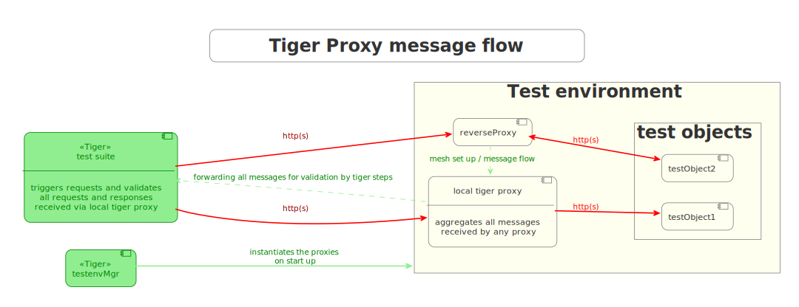
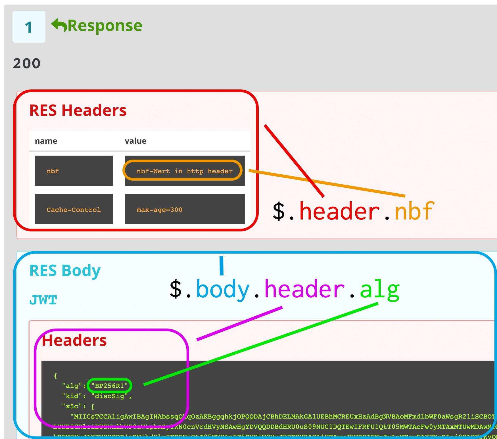
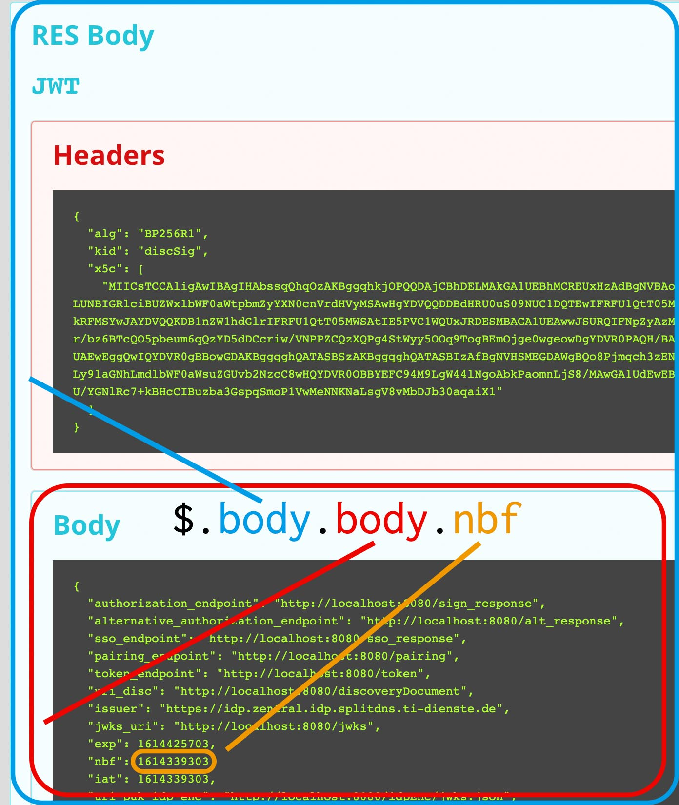
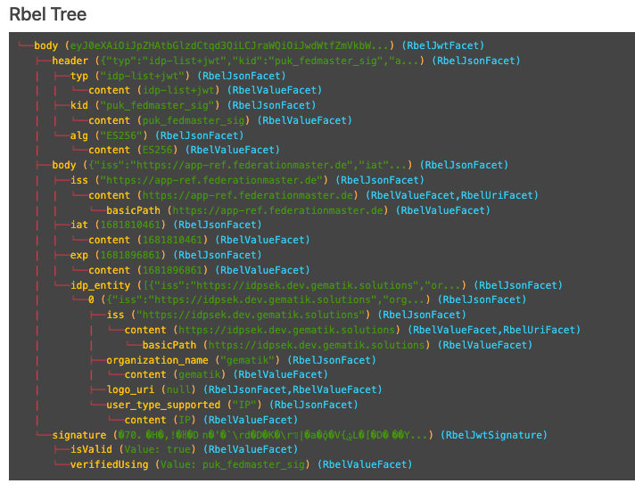

[#_tiger_proxy]
== Tiger Proxy

[#_excurse_what_are_proxies_reverse_forward]
=== Introduction: What are proxies, reverse and forward proxies?

There are many different types of proxies.
Here, we only discuss HTTP and HTTPS proxies.

==== Forward proxies

Forward proxies work like a relay station: you send a packet to your destination via the proxy.
The proxy receives the packet, reads the address, and can forward it to wherever it sees fit.
To use a forward proxy, the sender must be aware of it and send the packet accordingly.

This allows the creation of virtual domains, which is used extensively in Tiger.

Lastly a forward proxy acts as a man-in-the-middle, enabling the penetration of TLS-traffic.
We also use this, but we will explain it in more depth later.

==== Reverse proxies

Reverse proxies also receive traffic and may reroute it at their own discretion.
Unlike a forward proxy, a reverse proxy is invisible to the sender.
Reverse proxies act like normal servers and are addressed as such.
They then forward the received packet to its actual destination and return the answer to the original caller.

The reverse proxy can also read the complete traffic.

The eventual destination is opaque to the original caller.
This also enables path rewriting (for example, a GET to `http://reverse.proxy.de/my/deep/url` might be mapped to `http://gematik.de/deep/url`, eliminating the `/my` prefix).

A reverse proxy also terminates HTTPS, always.
This is less of a problem with a reverse proxy since it is technically not a man-in-the-middle attack, as the traffic is addressed directly to the reverse proxy.

[#_tiger_proxy_basics]
=== Tiger Proxy basics

The tiger proxy is a proxy server.
It comes in two flavors: tiger proxy and Tiger Standalone Proxy.
The standalone tiger proxy is started from a JAR file.
The test environment manager boots the main tiger proxy (so-called local tiger proxy) and also any additional ones (remote tiger proxy, not standalone).

The local tiger proxy has the following configuration properties in the tiger.yaml:
[source,YAML]
----
tigerProxy:
  adminPort: 9090
  proxyPort: 3128
  # and so on
----
That means the properties are directly under the `tigerProxy`-node.

Whereas in the case of a remote tiger proxy, the properties are under `tigerProxy.tigerProxyConfiguration`:
[source,YAML]
----
tigerProxy:
  tigerProxyConfiguration:
    adminPort: 9090
    proxyPort: 3128
  # and so on
----

Both types (local and remote) have a proxy port (configurable via `tigerProxy.proxyPort` resp. `tigerProxy.tigerProxyConfiguration.proxyPort`), which supports both HTTP and HTTPS traffic (so you do not have to differentiate between the two).
Additionally, they have an admin port (configurable via `tigerProxy.adminPort` resp. `tigerProxy.tigerProxyConfiguration.adminPort`).
This provides the tiger proxy log to monitor the traffic (described in detail xref:tigerWebUI.adoc#_web_ui[here]), a REST interface to customize the behavior (add/delete routes, add/delete modifications), and a WebSocket interface to stream RBel messages between multiple tiger proxies.

The following example shows a complete tiger proxy configuration with all available properties (keep in mind that the local tiger proxy does not need the additional `.tigerProxyConfiguration`).
The individual attributes are described in detail in the subsections below.

.Complete tiger proxy configuration example
[source,YAML]
----
tigerProxy:
  # ----General-------------------------------------------------
  name: "my-tiger-proxy"            # OPTIONAL display name for this proxy instance
  tigerProxyConfiguration:
    adminPort: 9090                   # port for the admin UI and REST interface
    proxyPort: 3128                   # port for proxying HTTP/HTTPS traffic
    additionalProxyPorts:             # OPTIONAL additional proxy ports
      - 3129
    proxyLogLevel: WARN               # log level: TRACE, DEBUG, INFO, WARN, ERROR
    localResources: true              # serve UI resources locally (no internet needed)
    username: "admin"                 # OPTIONAL: credentials for the admin interface
    password: "secret"

    # ----Routes--------------------------------------------------
    proxyRoutes:
      - from: http://my.domain/       # forward-proxy route (absolute URL)
        to: http://backend.example.de/
        hosts:                        # OPTIONAL: match specific Host headers
          - "www.google.com"
        criterions:                   # OPTIONAL: JEXL conditions for route matching
          - "$.header.foo == 'bar'"
        disableRbelLogging: false     # set to true to skip RBel parsing for this route
        authentication:               # OPTIONAL: add authentication to forwarded requests
          username: "user"
          password: "pass"
          # bearerToken: "mytoken"    # alternatively use Bearer Token
        matchForProxyType: true       # match only the proxy-mode suggested by "from"
        preserveHostHeader: false     # set to true to keep the original Host header

    # ----TLS-----------------------------------------------------
    tls:
      domainName: "my.backend.example.de"
      serverRootCa: "certificate.pem;privateKey.pem;PKCS8"     # custom CA for cert generation
      serverIdentity: "myIdentity.p12;changeit"                # fixed server identity
      allowGenericFallbackIdentity: false
      serverIdentities:                                        # multiple server identities
        - "identity1.p12;00"
        - "identity2.p12;changeit"
      ocspSignerIdentity: "myOcspSigner.p12;Password"
      masterSecretsFile: "masterSecrets.txt"
      forwardMutualTlsIdentity: "clientIdentity.jks;changeit;JKS"  # mTLS client identity
      alternativeNames:
        - "localhost"
        - "127.0.0.1"
      serverSslSuites:                                       # restrict allowed TLS cipher suites on the server side (replaces defaults)
        - "TLS_ECDHE_RSA_WITH_AES_256_CBC_SHA"
      clientSslSuites:                                       # restrict allowed TLS cipher suites on the client side (when proxy connects to upstream)
        - "TLS_ECDHE_RSA_WITH_AES_256_CBC_SHA"
      serverTlsProtocols:                                    # allowed TLS protocol versions for the server side
        - "TLSv1.2"
      clientSupportedGroups:                                 # ECDH groups to offer in the TLS ClientHello (e.g. brainpool curves)
        - "brainpoolP256r1"

    # ----Modifications-------------------------------------------
    modifications:
      - condition: "isRequest"
        targetElement: "$.header.user-agent"
        replaceWith: "Tiger-Proxy"
      - condition: "isResponse && $.responseCode == 200"
        targetElement: "$.body"
        name: "body-replacement"
        replaceWith: "{\"status\":\"ok\"}"

    # ----Traffic file save/load----------------------------------
    enableLegacyTraffic: false          # enables support for legacy traffic formats, this is useful when integrating with older tiger proxy instances, default is false
      writeToFile: false                # true = dump all traffic to a .tgr file on shutdown
      filename: "tiger-proxy.tgr"       # name of the file to write traffic to
      name: "tigerProxy Tracing Point"  # display name shown
      sourceFile: ""                    # OPTIONAL path to a .tgr file to load traffic from at startup
      readFilter: ""                    # JEXL filter; only messages matching this expression are loaded from source file

    # ----Mesh setup (traffic endpoints)--------------------------
    trafficEndpoints:
      - http://another.tiger.proxy:9090
    skipTrafficEndpointsSubscription: false
    failOnOfflineTrafficEndpoints: false
    requireHealthyTrafficEndpoints: false
    downloadInitialTrafficFromEndpoints: false
    enableLegacyTraffic: false          # enables support for legacy traffic formats, this is useful when integrating with older tiger proxy instances, default is false
    trafficEndpointFilterString: ""
    trafficEndpointConfiguration:
      name: "TigerProxy Tracing Point"  # display name shown
      wsEndpoint: "/tracing"            # WebSocket endpoint path used for STOMP connections
      stompTopic: "/traces"             # STOMP topic to subscribe to for receiving traffic

    # ----Forward proxy (if the target is behind another proxy)---
    forwardToProxy:
      hostname: 192.168.1.10            # hostname/IP of the upstream forward proxy
      port: 3128                        # port of the upstream forward proxy
      type: HTTP                        # HTTP or HTTPS, default is HTTP
      username: "proxyuser"             # OPTIONAL credentials for the upstream proxy
      password: "proxypass"
      noProxyHosts:                     # list of hosts that should bypass the upstream proxy
        - "localhost"
        - "127.0.0.1"

    # ----Direct reverse proxy for non-HTTP traffic---------------
    directReverseProxy:
      hostname: 127.0.0.1               # target hostname to forward TCP traffic to
      port: 3858                        # target port
      ignoreConnectionErrors: false     # true = suppress connection error logs
      modifierPlugins: []               # OPTIONAL plugin classes to modify traffic on the TCP layer before forwarding

    # ----Notes on messages---------------------------------------
    notes:
      - message: "This is a note"
        jexlCriterion: "isRequest && path == '$.method'"

    logConnectMessages: false   # if set to true, the tiger proxy will log HTTP CONNECT messages (used for tunneling HTTPS through a forward proxy), default is false
    # Folders containing keys (e.g. PEM, P12) loaded into RBel for decrypting traffic during analysis
    keyFolders:
      - "."

    # ----RBel parsing--------------------------------------------
    activateRbelParsing: true
    activateRbelParsingFor:
      - epa-vau
      - X509
    activateForwardAllLogging: true
    activateTlsTermination: true
    parsingShouldBlockCommunication: false
    activateTrafficLogging: true
    logConnectMessages: false   # if set to true, the tiger proxy will log HTTP CONNECT messages (used for tunneling HTTPS through a forward proxy), default is false

    # ----Buffer sizes--------------------------------------------
    rbelBufferSizeInMb: 1024
    stompClientBufferSizeInMb: 1
    perMessageBufferSizeInMb: 100
    skipParsingWhenMessageLargerThanKb: 8000
    skipDisplayWhenMessageLargerThanKb: 512

    # ----Timeouts------------------------------------------------
    connectionTimeoutInSeconds: 10            # Timeout for establishing connections (default: 10)
    maximumPartialMessageAgeInSeconds: 300    # Maximum age of incomplete/partial messages before they are discarded (default: 300)
    waitForPreviousMessageBeforeParsingInSeconds: 5.0
    previousMessageTimeoutDetectionGracePeriodInSeconds: 10.0
    previousMessageTimeoutDetectionTimeGapThresholdInSeconds: 30.0
    previousMessageTimeoutDetectionRecentConnectionThresholdInMinutes: 5.0

    # ----Display-------------------------------------------------
    maximumDefaultExpandedMessageDepth: 3

    # ----Header rewriting----------------------------------------
    rewriteHostHeader: false
    rewriteLocationHeader: true
    honorHostHeaderRouting: false
    # ----Traffic download pagination-----------------------------
    maximumTrafficDownloadPageSize: 100000    # Maximum number of messages per download (default: 100000)
----

=== Understanding routes

Routes are the fundamental mechanic of how the Tiger Proxy handles traffic.
They can be for a forward- or reverse-proxy.
A route has the following properties:

==== from

From where should the traffic be collected?
This can either be an absolute URL (e.g. `http://foobar`), which defines a forward-proxy route, or relative (e.g. `/foo`), defining a reverse-proxy-route.
Please note: You can freely add parts (e.g. `http://foobar/extra/part`) to further specify the mapping.

You can add multiple routes that match the same URL.
If multiple matches are found, the most specific route is selected.
For example, if you have two routes `/` and `/foo` then for a request to `/foo/bar` the route `/foo` will be selected.

A route will only match when the proxy-mode is met.
A reverse-proxy-route will thus not match when a forward-proxy request is received.
To disable this proxy-mode matching, you can set the flag `matchForProxyType` to false (default is true).

==== to

The target of the mapping.
This has to be an absolute URL.
The tiger proxy will, upon receiving a request to this mapping, execute a matching request to the defined host.

An example.
Consider the following route:

[source,yaml]
----
tigerProxy:
  tigerProxyConfiguration:
    proxyRoutes:
      - from: http://my.domain/
        to: http://orf.at/
----

The `http://` in the **from property** indicates that we have a forward-proxy route defined.
So when we execute: (assuming the tiger proxy is started locally under the port 1234)

[source,shellscript]
----
 curl -x http://localhost:1234 http://my.domain/news
----

The result will match the following curl

[source,shellscript]
----
 curl http://orf.at/news
----

Additional headers are kept and just patched through.
The same goes for the body and the HTTP-Method.

Added parts of the from-URL are stripped when forwarding.
Meaning: If you have a mapping

[source,yaml]
----
tigerProxy:
  tigerProxyConfiguration:
    proxyRoutes:
      - from: http://my.domain/deep/
        to: http://orf.at/blub/
----

and you execute GET http://my.domain/deep/deeper, you will get the result of GET http://orf.at/blub/deeper (the /deep in between has been eliminated along with my.domain).

==== Trailing Slashes

Trailing slashes in routes may be significant for the server.
Thus, the handling of the tiger proxy is important.
To achieve a consistent behavior while maintaining ease of use, the following rules apply:

* If the request is longer than the from-path of the route (eg. if `from` is `/foo` and the request is `/foo/bar`, then `/bar` is the deep-path), the trailing slash behavior from the request is taken.
This only is the case for more path-fragments (`/foo/bar`), and not simply a longer string (`/foobar`), as this would not be matched to the route.
* If the to-URL has a trailing slash, the request is forwarded with a trailing slash.
* Finally, if the request ends with a slash and the from-URL does NOT end with one, a trailing slash is added.
(The logic being the slash in the from-URL expresses an anticipated slash.
Thus, a slash being present in the request is simply "expected".)

This leads to the following examples:

[%autowidth]
|===
|from | to | request | forwarded to

|"/webapp/" | "/api/" | "/webapp" | "/api/"
|"/webapp/" | "/api" | "/webapp" | "/api"
|"/webapp/" | "/api/" | "/webapp/" | "/api/"
|"/webapp/" | "/api" | "/webapp/" | "/api"
|"/webapp" | "/api/" | "/webapp" | "/api/"
|"/webapp" | "/api" | "/webapp" | "/api"
|"/webapp" | "/api/" | "/webapp/" | "/api/"
|"/webapp" | "/api" | "/webapp/" | "/api/"
|"/webapp<irrelevant>" | "/api<irrelevant>" | "/webapp/foo" | "/api/foo"
|===

==== Multiple targets

Sometimes you can only at runtime know which target to use.
This can be achieved by using the `to`-property as a list of targets:

[source,yaml]
----
tigerProxy:
  tigerProxyConfiguration:
    proxyRoutes:
    -
      from: /
      to:
        - http://orf.at/blub/
        - http://ard.de/bla/
----

When booting the tiger proxy, the proxy tries to reach the target host by sending a HEAD-request to the host (dropping the path).
If the server sends a valid HTTP (or HTTPS) response, the target is considered reachable and the route is used.
If no target can be reached, an exception is thrown.
The return code is ignored.

You can deactivate the rbel-Logging on a per-Route basis.
Rbel is a versatile and powerful tool, but the analysis of individual messages consumes a lot of both CPU and memory.
Deactivating it for routes in which it is unnecessary is therefore a good idea.

==== hosts

In some instances you might be pressed to "hosts" multiple servers on one tiger proxy.
This can happen when you can influence DNS-Resolvement, but neither the path nor the port used.
In this case you can use the hosts-property to define which hosts should be routed to which target.

[source,yaml]
----
tigerProxy:
  tigerProxyConfiguration:
    proxyRoutes:
      hosts:
        - "www.google.com"
        - ".*.bing.com"
----

The entries are matched first as a total match, failing that as regular expressions.
If you want to add ports, you are free to do so: "myHost:80".
This, however, will require that the ports on all entries in this specific list are given (this does not apply to other routes).

==== criterions

As an additional measure for a more fine-grained matching, you can use criteria.
These are JEXL expressions that have to be fulfilled for the route to be used.
This can be leveraged to make the routing decision dependent on the content of the message.

[source,yaml]
----
tigerProxy:
  tigerProxyConfiguration:
    proxyRoutes:
      - from: /
        to: http://orf.at/blub/
        criterions:
          - $.header.foo == 'bar'
----

This will only forward messages where the header contains a key "foo" with the value "bar".

==== disableRbelLogging

You can deactivate the rbel-Logging on a per-Route basis.
Rbel is a versatile and powerful tool, but the analysis of individual messages consumes a lot of both CPU and memory.
Deactivating it for routes in which it is unnecessary is therefore a good idea.

==== authentication

You can add optional authentication configuration which will be added to the forwarded message.
Here either Basic access authentication or Bearer Token can be used:

[source,yaml]
----
tigerProxy:
   tigerProxyConfiguration:
      proxyRoutes:
        - from: http://my.domain/basicAuth/
          to: http://orf.at/blub/
          authentication:
            username: "test1"
            password: "pwd2"
        - from: http://my.domain/bearerToken/
          to: http://orf.at/blub/
          authentication:
            bearerToken: "blubblab"
----

Please note that the phrase "Bearer " will be added automatically.
Please do not add it yourself!

==== matchForProxyType

By default, a proxy route will only match when the proxy-mode defined by the `from` attribute is met.
For example, a route with `from: /foo` will not match with a forward-proxy request like so:

[source,shell]
----
curl -x localhost:59163 http://backend.domain/
----

To enable matching for both proxy-modes, you can use the `matchForProxyType`-flag:

[source,yaml]
----
tigerProxy:
   tigerProxyConfiguration:
      proxyRoutes:
        - from: /foobar
          to: http://orf.at/blub/
          matchForProxyType: false
----

This will match with both of the following requests:

[source,shell]
----
curl -x localhost:59163 http://backend.domain/foobar
curl http://localhost:59163/foobar
----

==== preserveHostHeader

This option will disable the rewrite of the Host-header in the forwarded request.
This will lead to inconsistent Host-headers in the proxied requests, which might lead to unexpected behavior on the target server. (e.g. when forwarding from http://my.domain/ to http://orf.at/ the Host-header will still contain "my.domain" instead of "orf.at").
Default is false.

==== alpnProtocols

The Tiger Proxy automatically probes each HTTPS backend at route-add time to discover its ALPN (Application-Layer Protocol Negotiation) capabilities.
Based on the result, the proxy restricts the protocols it advertises to clients during the TLS handshake — ensuring transparent behavior (the client sees the same protocol it would with a direct connection).

In most cases this works automatically and requires no configuration.
However, for ambiguous setups — such as two routes on the same hostname pointing to different backends with different protocol support — you can explicitly declare the ALPN protocols per route using the `alpnProtocols` property:

[source,yaml]
----
tigerProxy:
    proxyRoutes:
      - from: /api
        to: https://h2-server:443
        alpnProtocols:
          - "h2"
          - "http/1.1"
      - from: /legacy
        to: https://h1-server:443
        alpnProtocols:
          - "http/1.1"
----

When `alpnProtocols` is set, the declaration **overrides the automatic probe** for that route — no probe is performed.
If multiple routes with explicit `alpnProtocols` declarations match the same client connection (same SNI hostname), the proxy computes the **intersection** of the declared lists (conservative approach).

Valid protocol identifiers are `h2` (HTTP/2) and `http/1.1`.

===== Automatic behavior (no `alpnProtocols` set)

[%autowidth]
|===
|Backend probe result |Proxy advertises to client |Rationale

|Backend prefers `h2` |`[h2, http/1.1]` |Backend supports h2; also offer h1 for h1-only clients
|Backend only speaks `http/1.1` |`[http/1.1]` |Backend can't do h2 — don't offer it to the client
|Probe failed (unreachable) |`[h2, http/1.1]` |Fail-open — keep default, fall back to protocol translation
|HTTP backend (no TLS) |`[h2, http/1.1]` |No TLS → no probe possible → keep default
|Mixed backends (h2 + h1) |`[http/1.1]` |Conservative — only offer what ALL backends support
|===

===== When to use explicit `alpnProtocols`

* **Path-ambiguous routes:** Two routes with different paths on the same hostname but different backends.
The automatic probe can't know which path the client will request at TLS time, so it falls back to the conservative approach (only h1 if any backend is h1-only).
Use `alpnProtocols` to resolve this explicitly.
* **Backend unreachable at startup:** If the backend is not reachable when the route is added, the probe fails and the proxy defaults to `[h2, http/1.1]`.
Use `alpnProtocols` to declare the correct protocols.
* **Force a specific protocol:** For testing purposes you may want to force h2 or h1, regardless of what the backend actually supports.

=== TLS, keys, certificates a quick tour on proxies

A fundamental part of a proxy setup is TLS.
Since a proxy is a constant man-in-the-middle attack, TLS is designed to make this exact scenario (eavesdropping while forwarding) impossible.
Since a lot of the traffic in the gematik context is security-relevant and thus TLS-secured, this point is very relevant.

Fundamentally breaking into TLS requires two things:

* A certificate which the server can present which is valid for the given domain
* The certifying CA (or a CA reachable via a certification path) has to be part of the client truststore

There are different ways to reach these two requirements.
Which one should be taken is dependent on the setting and the client used (most importantly, of course: can you alter the truststore for the test-setup?)

Here are a few things to know and ways in which to enable TLS:

==== TLS and HTTPS-Proxy

TLS can be done via an http- or a https-proxy.
The proxy-protocol does NOT equate to the client-server-protocol.
To minimize the headache in configuration, it is therefore strongly recommended to simply always use the http-proxy (sidenote: using an http-proxy does NOT reduce the security of the overall protocol.
The security still relies on server-certificate-verification.)

If, however, you cannot avoid using the https-proxy, you have to make sure that you add the given certificate to your truststore.
In class TigerProxy.java in Tiger there are methods such as SSLContext getConfiguredTigerProxySslContext(), X509TrustManager buildTrustManagerForTigerProxy,() and KeyStore buildTruststore() that can help you configure the SSLContext in your case, if you use HTTP third party libraries (Unirest, okHttp, RestAssured, etc.) as well as vanilla Java.
If you encounter any problems, please contact us.

[#_configuring_pki_identities_in_tiger_proxys_tls_section]
==== Configuring PKI identities in tiger proxy's tls section

PKI identities can be supplied in a number of ways (JKS, BKS, PKCS1, PKCS8).
In every place a string can be given.
It could be one of

* "my/file/name.p12;p12password"
* "p12password;my/file/name.p12"
* "cert.pem;key.pkcs8"
* "rsaCert.pem;rsaKey.pkcs1"
* "key/store.jks;key"
* "key/store.jks;key1;key2"
* "key/store.jks;jks;key"

Not supported pathname strings:

* "D:\\myproject\\key\\store.jks;key"

Supported pathname string on all platforms:

* "myproject/key/store.jks;key"

Please notice, that double backslashes ("\\") are not supported as file separators, since they are not accepted on all platforms.
Invalid pathname strings will also produce an exception.

The following attributes `serverRootCa`, `forwardMutualTlsIdentity`, `serverIdentity`, and `ocspSignerIdentity` can be configured via a one-line string or via sub properties.

[source,yaml]
----
tigerProxy:
  tigerProxyConfiguration:
    tls:
      serverRootCa: "certificate.pem;privateKey.pem;PKCS8"     # custom CA for cert generation
      serverIdentity: "myIdentity.p12;changeit"                # fixed server identity
      serverIdentities:                                        # multiple server identities
        - "identity1.p12;00"
        - "identity2.p12;changeit"
      ocspSignerIdentity: "myOcspSigner.p12;Password"
      forwardMutualTlsIdentity: "clientIdentity.jks;changeit;JKS"  # mTLS client identity
----

Example for a one-line string:
[source,yaml]
----
tigerProxy:
   tigerProxyConfiguration:
      tls:
        serverIdentity: "myIdentity.p12;changeit;P12;myAlias"
----

Example for sub properties:
[source,yaml]
----
tigerProxy:
   tigerProxyConfiguration:
      tls:
        serverIdentity:
          filename: "myIdentity.p12"
          password: "changeit"
          storeType: "P12"     # (accepted are P12, PKCS12, JKS, BKS, PKCS1 and PKCS8)
          alias: "myAlias"
----

In this case both the storeType and the password are not mandatory and would be guessed (the store-type via the file extension and the password via a default-list, see next section).

===== PKI identity passwords

Tiger will attempt to decrypt a given P12 file with a list of common passwords, among these are: `00`, `123456`, `gematik`, `changeit`.

Users can insert additional passwords by configuring the `tiger.yaml` as follows

[source,yaml]
----
lib:
    additionalKeyStorePasswords: ["foo", "bar", "baz"]
----

==== Dynamic server identity

To successfully break into TLS traffic, the tiger proxy needs to present a certificate which features the domain-name of the server.
Since the domain-names are known only at runtime, we generate the necessary certificate on-the-fly during the first connection.

For a forward-proxy this is straightforward: The client sends not only the path, but the complete URL to the proxy, letting him handle DNS-resolution.
So when the tiger proxy receives a new request, the necessary domain-name is given by the client.
A new, matching, certificate is generated (these are cached) and presented.
To complete the setup, the client-truststore needs to be patched.
The CA used by the tiger proxy is dynamically generated on each startup.

For a reverse-proxy the domain name, which should be used, is unknown to the tiger proxy (DNS-resolution is done on the client-side).
Thus, a domain-name needs to be provided, which should be used for certificate-generation:

[source,yaml]
----
tigerProxy:
   tigerProxyConfiguration:
      tls:
        domainName: deep.url.of.server.de
----

==== Client-sided truststore modification

When using a non-default certificate (which will almost always be the case for the tiger proxy), the modification of the client-truststore is necessary.
For cases where the client is running in the same JVM as the target tiger proxy (which is the typical case for a tiger-based testsuite) there exists a helper method to make this task easier.

Depending on your HTTP- or REST- or SOAP-API, you will need to choose the exact way yourself.
The following two examples might give you some idea of what to do.

[source,java]
----
Unirest.config().sslContext(tigerProxy.buildSslContext());
----

[source,java]
----
 OkHttpClient client = new OkHttpClient.Builder()

    .proxy(new Proxy(
        Proxy.Type.HTTP,
        new InetSocketAddress(
            "localhost",
            tigerProxy.getPort())))

    .sslSocketFactory(
        tigerProxy.getConfiguredTigerProxySslContext().getSocketFactory(),
        tigerProxy.buildTrustManagerForTigerProxy())

    .build();
----

==== Custom CA

If you cannot or don't want to alter the client-truststore, you have two choices: You can either provide a custom CA to be used (and trusted by the client) or you can give the certificate to be used by the tiger proxy.
To set a custom CA to be used for certificate generation, specify it:

[source,yaml]
----
tigerProxy:
   tigerProxyConfiguration:
      tls:
        serverRootCa: "certificate.pem;privateKey.pem;PKCS8"
# for more information on specifying PKI identities in tiger see "Configuring PKI identities"
----

==== Fixed server identity

The final, easiest, and most unflexible way to solve TLS-issues is to simply give a fixed server-identity.
This identity will be used for all routes, but only if it matches the domain-name given by the client during the handshake.
As a fallback (if the domain-name does not match) the dynamic server-identity will be used.

[source,yaml]
----
tigerProxy:
   tigerProxyConfiguration:
      tls:
        serverIdentity: "certificateAndKeyAndChain.p12;Password"
----

If you want to use the fixed-server identity only for requests to matching hosts and you have NOT supplied a `serverRootCa`, you can use the `allowGenericFallbackIdentity`-property:

[source,yaml]
----
tigerProxy:
   tigerProxyConfiguration:
      tls:
        serverIdentity: "certificateForFoobar.p12;Password"
        allowGenericFallbackIdentity: true
----

If `certificateForFoobar.p12` contains a certificate for the FQDN `foobar.com`, then a request to `foobar.com` will use this certificate.
If the request is to `barfoo.com` the generic server-identity will be used.
If you have supplied a `serverRootCa` this CA will always be used for any request for which an exact match is not found.

==== Multiple server identities

Sometimes you might want to use different server-identities for different hosts that are proxied.
This can be achieved by using the `serverIdentities`-property.
Simply list the properties, the proxy will automatically try to choose the correct one.

[source,yaml]
----
tigerProxy:
   tigerProxyConfiguration:
      tls:
        serverIdentities:
          - "someIdentity.p12;00"
          - "anotherIdentity.p12;changeit"
----

==== OCSP stapling

If you want the tiger proxy to use OCSP stapling, you can directly specify the OCSP-Signer to use in the configuration.

[source,yaml]
----
tigerProxy:
   tigerProxyConfiguration:
      tls:
        ocspSignerIdentity: "myOcspSigner.p12;Password"
----

The server will then use this OCSP-Signer to create a fake OCSP-Response during the TLS-handshake.

==== forwardMutualTlsIdentity

The forwardMutualTlsIdentity property specifies the client certificate (identity) that the tiger proxy should use when establishing a mutual TLS (mTLS) connection to an upstream server. This is required if the target server expects the proxy to authenticate itself using a client certificate. You can provide the identity as a string (e.g., myIdentity.p12;changeit;JKS) or as a map with filename, password, and storeType. This ensures secure, authenticated communication between the proxy and the upstream server.

[source,yaml]
----
tls:
  tigerProxyConfiguration:
    forwardMutualTlsIdentity:
      filename: myIdentity.p12
      password: "changeit"
      storeType: P12
----

==== TLS Decryption in wireshark

Sometimes you might want to look at decrypted TLS-traffic in wireshark.
To achieve this, we need to extract the masterSecrets of every connection from the tiger proxy and provide them to wireshark.
This is actually pretty straight forward, with one big issue: It is very insecure to access the masterSecrets of a TLS-connection, so we need to attach a Java-Agent to the VM.

When you are using the tiger proxy in a normal tiger-testsuite, you can add the                             `<goal>attach-tiger-agent</goal>` goal to the tiger-maven-plugin:

[source,xml]
----
            <plugin>
                <groupId>de.gematik.test</groupId>
                <artifactId>tiger-maven-plugin</artifactId>
                <version>${project.version}</version>
                <executions>
                    <execution>
                        <phase>generate-test-sources</phase>
                        <goals>
                            <goal>generate-drivers</goal>
                            <goal>attach-tiger-agent</goal>
                        </goals>
                    </execution>
                </executions>
            </plugin>
----

This will modify the `argLine` property used by failsafe to start the testsuite and attach the TigerAgent to the VM.
Next we need to set the filename where to write the masterSecrets to:

[source,yaml]
----
tigerProxy:
   tigerProxyConfiguration:
      tls:
        masterSecretsFile: "myMasterSecrets.txt"
----

The tiger proxy will write the secrets to the given file.

The final step is to import the masterSecrets into wireshark:

Go to Edit -> Preferences.
Open the Protocols tree and select TLS.
Alternatively, select a TLS packet in the packet list, right-click on the TLS layer in the packet details view, and open the Protocol preferences menu.
Set the `(Pre)-Master-Secret log filename` to the file containing the master secrets.
Now wireshark should decrypt TLS traffic routed through the tiger proxy on-the-fly.

[#_modifications]
=== Modifications

Modifications are a powerful tool to alter messages before forwarding them.
They can be applied to requests and responses, to routes in forward- and reverse-proxy-mode.
You can choose to modify only specific parts of the message and only alter messages if certain conditions are met.
Response messages support so-called "reason phrases" which are small text explanations to the response code, e.g. "200 OK", ("OK" is a reason phrase).
You can add, modify, and remove reason phrases.

Below is a sample configuration giving insight into how modifications are organized:

[source,yaml]
----
tigerProxy:
  tigerProxyConfiguration:
    modifications:
    # a list of modifications that will be applied to every proxied request and response

        # The following modification will replace the entire "user-agent" in all requests
      -
        condition: "isRequest"
        # a condition that needs to be fullfilled for the modification to be applied (JEXL grammar)
        targetElement: "$.header.user-agent"
        # which element should be targeted?
        replaceWith: "modified user-agent"
        # the replacement string to be filled in.

        # The following modification will replace the body of every 200 response completely with the given JSON string
        # (This ignores the existing body. For example this could be an XML-body. Content-Type-headers will NOT be set accordingly)
      -
        condition: "isResponse && $.responseCode == 200"
        targetElement: "$.body"
        name: "body replacement modification"
        # The name of this modification. This can be used to identify, alter or remove this modification. A name is optional
        replaceWith: "{\"another\":{\"node\":{\"path\":\"correctValue\"}}}"

        # The following modification has no condition, so it will be applied to every request and every response
      -
        targetElement: "$.body"
        regexFilter: "ErrorSeverityType:((Error)|(Warning))"
        # The given regex will be used to target only parts of targeted element.
        replaceWith: "ErrorSeverityType:Error"

        # Here we take the value of one header and copy it into another header
      -
        # Check if the header 'foo' is actually present in the request
        condition: "isRequest && $.header.[~'foo'] != null"
        targetElement: "$.header.copy-of-foo"
        replaceWith: "?{$.header.[~'foo']}-modified"
----

When targeting http headers, if the header is not present, it will be added to the request.

[#_mesh_setup_traffic_endpoints]
=== Mesh set up

One of the fundamental features of the tiger proxy is mesh set up AKA rbel-message forwarding.
This transmits the information about the messages, which the proxy has logged, to other Tiger Proxies (where they will be logged as well).
This enables the creation of "proxy-meshes", staggered Tiger Proxies.

In a mesh set up the "remote tiger proxy" is the one that intercepts the traffic and sends the information.
Conversely, the "receiving tiger proxy" receives the information about the message from the remote tiger proxy.
The "local tiger proxy" is the main tiger proxy booted by the testsuite.
If you configured it to receive traffic from another tiger proxy, (which should always be the case when you are doing a mesh set up) then it is also a receiving tiger proxy.

A common scenario for this approach might be the use of multiple reverse-proxies on the root level (e.g. when the client only allows the configuration of the server IP or domain, but no path-prefix) or the aggregation of traffic across machine-boundaries (e.g. one constantly running tiger proxy which is used by a testsuite on another machine).

In the above picture testObject2 would not be accessible directly by the test suite, thus using the reverse proxy allows circumventing network restrictions.
The reverse proxy could either be started by the test environment manager or as a standalone process.

[source,yaml]
----
tigerProxy:
  tigerProxyConfiguration:
    proxyId: IBM
    # A list of upstream Tiger Proxies. This proxy will try to connect to all given sources to
    # gather traffic via the STOMP-protocol.
    trafficEndpoints:
      - http://another.tiger.proxy:<adminPort>
    # If false, then the subscription is tested at the beginning, and if any of the given endpoints are not accessible, the
    # server will not boot. (fail fast, fail early)
    skipTrafficEndpointsSubscription: false   # default
    # Should the tiger proxy fail on startup, when a traffic endpoint is offline?
    # Ignoring this error might lead to an unexpected testing environment!
    failOnOfflineTrafficEndpoints: false   # default is true
    # If set to true, the tiger proxy will only consider traffic endpoints as healthy
    # if they are reachable and functioning correctly.
    requireHealthyTrafficEndpoints: true   # default is true
    # Should the traffic currently available (cached) in the remote be download upon initial connection?
    downloadInitialTrafficFromEndpoints: true  # default
    trafficEndpointConfiguration:
        name: "TigerProxy Tracing Point"   # Display name for this tracing endpoint (default: "tigerProxy Tracing Point")
        wsEndpoint: "/tracing"             # WebSocket endpoint path (default: "/tracing")
        stompTopic: "/traces"              # STOMP topic to subscribe to (default: "/traces")
----

Please be advised to use the server-port (`server.port`) here, not the proxy-port (`tigerProxy.proxyPort`).
The traffic from routes with `disableRbelLogging: true` will not show up here.

NOTE: If you are setting up a tiger proxy to run constantly and simply forward traffic to a testsuite that is booted adhoc, you might run into performance problems.
This is due to the Rbel-Logger being a very hungry beast.
To stop Rbel from parsing all messages simply add `tigerProxy.activateRbelParsing: false`.
This will vastly reduce memory and CPU consumption of the application, while still forwarding logged traffic.

==== Clock-Skew Compensation

In a mesh setup the participating Tiger Proxies may run on different machines whose system clocks are not perfectly synchronised.
Because Tiger uses timestamps to order messages, even small clock differences can cause messages from different sources to appear in the wrong order.

To compensate for this, the receiving Tiger Proxy automatically determines the clock offset to each remote proxy at connection time in an NTP-style fashion.
The resulting offset is applied to all timestamps of messages received from that remote proxy.

[source,yaml]
----
tigerProxy:
    clockSyncSamples: 3
    # Number of round-trips used to estimate the clock offset to a remote proxy.
    # Default is 3. Set to 0 to disable clock-skew compensation entirely.
----

==== Mesh API

The tiger proxies use https://stomp.github.io/[STOMP] a simple/streaming text oriented messaging protocol via web socket to forward received traffic.
For an external client to receive these traffic data, it must subscribe to the trace topic reachable at the subscription path /topic/traces.
To do so, the client must connect to the traffic endpoint URL of the tiger proxy.
This is answered with HTTP status 100 and then redirected to web socket protocol via the same port.
For each received traffic data pair (request/response) the tiger proxy will push a web socket message to all subscribed clients.

This JSON encoded message consists of:

* UUID string
* http request as base64 encoded data
* http response as base64 encoded data
* hostname and port of sender (if retrievable, worst case only IP address or empty)
* hostname and port of receiver (if retrievable, worst case only IP address or empty)

[source,json]
----
{
    "uuid": "UUID string",
    "request": "base64 encoded http request",
    "response": "base64 encoded http response",
    "sender": {
      "hostname": "hostname/ip address of sender",
      "port": portAsInt
    },
    "reveiver": {
      "hostname": "hostname/ip address of receiver",
      "port": portAsInt
    }
}
----

==== forwardToProxy

If the target server is behind another proxy, you can configure a forward proxy to be used:

[source,yaml]
----
tigerProxy:
    tigerProxyConfiguration:
        forwardToProxy:
            hostname: 192.168.110.10
            port: 3128
            type: HTTP              # HTTP or HTTPS, default is HTTP
            username: "proxyuser"   # OPTIONAL: username for proxy authentication
            password: "proxypass"   # OPTIONAL: password for proxy authentication
            noProxyHosts:
              - "localhost"
              - "127.0.0.1"
----

==== directReverseProxy

To enable the use of the tiger proxy for non-HTTP scenarios, you can use the option `directReverseProxy`:

[source,yaml]
----
tigerProxy:
    tigerProxyConfiguration:
        directReverseProxy:
            hostname: 127.0.0.1
            port: 3858
            ignoreConnectionErrors: false
----

This will directly forward any request to the given host.
This is a form of reverseProxy, only also applicable for non-http-traffic.
HTTP traffic will still be forwarded through the use of a global reverse proxy.
Other traffic will be directly forwarded, rerouted directly on the TCP layer.
Messages transmitted can still be parsed via RBel.
If the optional flag `ignoreConnectionErrors` is true, no connection errors will be logged; the default is false.

==== directReverseProxy modifierPlugins

The `directReverseProxy` configuration supports an optional list of modifier plugins that can be used to modify traffic at the TCP layer before it is forwarded:

[source,yaml]
----
tigerProxy:
    tigerProxyConfiguration:
        directReverseProxy:
            hostname: 127.0.0.1
            port: 3858
            ignoreConnectionErrors: false
            modifierPlugins:
              - pluginClass: "de.gematik.test.tiger.proxy.modifier.MyCustomModifier"
----

=== Adding notes to messages

To add notes to certain messages, you can add a list of criteria with messages that shall be added to any message in the rbel log matching the specific criterion.

[source,yaml]
----
tigerProxy:
    tigerProxyConfiguration:
      proxyId: meshProxy2
      notes:
        - message: "This is a note on the HTTP method"
          jexlCriterion: "isRequest && path == '$.method'"
        - message: "Hackers were here..."
          jexlCriterion: "element.decryptedUsingKeyWithId == 'mySuperSecretKey'"
----

=== Rbel Parsing

For a detailed description of RBelPath, please refer to the xref:tigerProxy.adoc#_rbel_path_details[Understanding RBelPath].

==== activateRbelParsing

Deactivating this flag turns off all Rbel-Analysis of the incoming traffic.
This is a huge deal in terms of memory- and CPU-consumption, but you will lose all benefits of performing Rbel-Analysis.

==== activateRbelParsingFor

Tiger RBel parses and decodes a wide range of formats and protocols out of the box.
The following formats are supported **by default** (always active):

[#_supported_formats]

[cols="1,3",options="header"]
|===
| Format | Description

| JSON | Full JSON structure parsing and tree navigation
| XML | Full XML structure parsing and tree navigation
| JWT | JSON Web Token – header, body, and signature are parsed separately
| HTTP/HTTPS | HTTP request and response parsing including headers, body, and status codes
| URL | URL parsing including path, query parameters, and fragments
| Base64 | Automatic Base64 decoding of encoded content
|===

The following formats are **optional** and must be explicitly activated:

[cols="1,2,3",options="header"]
|===
| Key | Converter(s) | Description

| `pop3` | RbelPop3CommandConverter, RbelPop3ResponseConverter | POP3 mail protocol commands and responses
| `smtp` | RbelSmtpCommandConverter, RbelSmtpResponseConverter | SMTP mail protocol commands and responses
| `mime` | RbelMimeConverter, RbelEncryptedMailConverter | MIME-encoded messages and encrypted mails
| `asn1` | RbelAsn1Converter | ASN.1 binary structures (e.g., in certificates or smart card communication)
| `epa-vau` | RbelVauEpaConverter, RbelVauEpaKeyDeriver | ePA VAU encrypted traffic decryption
| `erp-vau` | RbelErpVauDecryptionConverter | eRP VAU encrypted traffic decryption
| `epa3-vau` | RbelVauEpa3Converter | ePA 3.0 VAU encrypted traffic decryption
| `asl` | RbelAslConverter | ASL encrypted traffic decryption
| `sicct` | RbelSicctCommandConverter, RbelSicctEnvelopeConverter | SICCT smart card terminal protocol
| `X500` | RbelX500Converter | X.500 directory service structures
| `X509` | RbelX509Converter, RbelX500Converter | X.509 certificate parsing
| `ldap` | RbelLdapConverter | LDAP protocol messages
| `b64gzip` | RbelBase64GzipConverter | Base64-encoded and GZip-compressed content
| `OCSP` | RbelOcspResponseConverter | OCSP (Online Certificate Status Protocol) responses
| `websocket` | Various converters | WebSocket, SockJS and STOMP messages
|===

.Example: activating optional converters
[source,yaml]
----
tigerProxy:
    tigerProxyConfiguration:
      activateRbelParsingFor:
        - epa-vau
        - X509
        - mime
        - websocket
----

NOTE: Optional converters can also be activated and deactivated at runtime via BDD glue code steps.
See xref:tigerTestLibrary.adoc#_complete_set_of_steps_in_validation_glue_code[Complete set of steps in validation glue code].

==== parsingShouldBlockCommunication

If blocking is enabled, the tiger proxy will only return the response when message parsing is completed.
This is inadvisable in high-speed scenarios.
It, however, greatly simplifies the test suite (after the communication is concluded the parsed message appears in the log).
Therefore, the blocking is deactivated by default.
The only exception is the local tiger proxy, which WILL block communication until parsing is completed.
For all Tiger Proxies this default behavior can be changed.

==== activateTrafficLogging

This flag controls whether the tiger proxy will log all traffic.
If activated, every request and response is noted in the log.
This can lead to a verbose and bloated log.
If you are not interested in the traffic log, but only in the Rbel-Analysis, you can deactivate this flag.
Default is true.

=== Buffer sizes

Several buffer-size properties allow fine-tuning of memory usage:

[source,yaml]
----
tigerProxy:
  tigerProxyConfiguration:
    rbelBufferSizeInMb: 1024          # Limits the RBel buffer to approximately this size (default: 1024)
    stompClientBufferSizeInMb: 1      # Buffer size for STOMP client connections (default: 1)
    perMessageBufferSizeInMb: 100     # Maximum buffer size per single message (default: 100)
    skipParsingWhenMessageLargerThanKb: 8000   # Skip RBel parsing for messages larger than this (default: 8000)
    skipDisplayWhenMessageLargerThanKb: 512    # Skip display for messages larger than this (default: 512)
----

=== Timeouts and waiting times
==== waitForPreviousMessageBeforeParsingInSeconds

Defines the timeout in seconds (supports decimal values) to wait for a previous message before parsing the current message when messages reference each other in mesh setups.
If the referenced previous message doesn't arrive within this timeframe, the current message will be parsed anyway.
Default is 5.0 seconds.

==== previousMessageTimeoutDetectionGracePeriodInSeconds

Grace period in seconds (supports decimal values) for clock skew between mesh nodes when detecting messages that will never arrive.
This compensates for small time differences between different proxy instances.
Default is 10.0 seconds.

==== previousMessageTimeoutDetectionTimeGapThresholdInSeconds

Minimum age in seconds (supports decimal values) for previous messages to trigger timeout detection.
If a referenced previous message has a timestamp older than this threshold, it may be considered as "will never arrive" and the current message will be processed immediately.
Default is 30.0 seconds.

==== previousMessageTimeoutDetectionRecentConnectionThresholdInMinutes

Time threshold in minutes (supports decimal values) for considering a mesh connection as "recent".
Timeout detection only applies to connections that are newer than this threshold to avoid false positives in long-running connections.
Default is 5.0 minutes.

[source,yaml]
----
tigerProxy:
  tigerProxyConfiguration:
    waitForPreviousMessageBeforeParsingInSeconds: 5.0
    previousMessageTimeoutDetectionGracePeriodInSeconds: 10.0
    previousMessageTimeoutDetectionTimeGapThresholdInSeconds: 30.0
    previousMessageTimeoutDetectionRecentConnectionThresholdInMinutes: 5.0
----

=== Displaying Nested Messages

Some messages are deeply nested and thus inconvenient to handle in the UI.

With the property `tigerProxy.maximumDefaultExpandedMessageDepth` you can control how many levels of the message are displayed by default.

Message-parts that are deeper than the given depth are displayed as collapsed but can be expanded.

[source,yaml]
----
tigerProxy:
  tigerProxyConfiguration:
    maximumDefaultExpandedMessageDepth: 3 # default is 3, use 0 to display all messages collapsed
----

=== Header rewriting and routing behavior
==== rewriteHostHeader

This flag activates the rewriting of the host-header.
If activated, the host-header will be rewritten to the target host (only applicably for reverse proxy routes).
Default is false.

==== rewriteLocationHeader

This flag activates the rewriting of the location-header for 3xx responses.
If activated, the location-header will be modified, so the client will still use the proxy to reach the new location.
Default is true.

==== honorHostHeaderRouting

When enabled, reverse proxy requests that do not match any configured route will be forwarded to the host specified in the incoming `Host` header.
This is useful when the TigerProxy acts as a transparent reverse proxy in front of a dynamic set of backends, or when clients already set the `Host` header correctly to the actual backend.

The fallback has the lowest priority: if a configured route matches the request, that route is always used.
Only when no route matches does the Host header fallback kick in.

If the `Host` header points back to the TigerProxy itself (e.g. `localhost` on the proxy port), the connection will be closed to prevent infinite loops.

NOTE: When this option is enabled, the TigerProxy can potentially forward requests to arbitrary hosts specified by a client in the `Host` header.
For test environments (the primary use case of TigerProxy) this is generally not a concern.

[source,yaml]
----
tigerProxy:
  tigerProxyConfiguration:
    honorHostHeaderRouting: true
----

Default is false.

==== maxLoopCounter

By default, the tiger proxy will keep count of the number of requests it executes on itself (e.g., when a request is forwarded to the tiger proxy itself).
If this counter exceeds the value of `maxLoopCounter` the request will be aborted.
The default value is 10 (Meaning after 10 loops, the request will end in an error).
Note: This behavior can only be customized for all Tiger Proxies.

=== Understanding filtering

The filtering of messages in the tiger proxy consists of three main stages.
These are:

* Traffic filter (trafficEndpointFilterString / readFilter, Determines which messages are accepted into the tiger proxy)
* Tiger proxy Log filter (Which messages are displayed in the tiger proxy Log?)
* Pagination (Look around in smaller pages of messages)

Lets dive a bit deeper!

==== Traffic filter

At the core of the tiger proxy sits a RbelLogger instance.
Here the messages are parsed and stored.
Three sources feed into the RbelLogger:

* Messages intercepted in the tiger proxy
* Messages relayed using a mesh setup
* Messages imported from a file

Messages that are intercepted are automatically stored (the exception being the `tigerProxy.activateForwardAllLogging`-property, which can deactivate the logging of traffic not specifically forwarded via a route).
For messages in a mesh setup and from a source file filter expressions can be defined to limit the messages that are actually stored.
These can be defined using the `tigerProxy.trafficEndpointFilterString` (for mesh setups) and `tigerProxy.fileSaveInfo.readFilter` (for tgr-files) respectively.

When messages pass the filter, partner messages (request/response pairs) are kept intact.
So when you filter for messages that have a return code of 200 the corresponding requests do not match the filter expression.
They are however kept in memory since the partner, the response in that case, do match.

Filter expressions are xref:tigerProxy.adoc#_jexl_expressions[JEXL expressions].

==== Tiger Proxy Log filter

When you display the messages on the tiger proxy Log you have the ability to filter out certain messages to be displayed exclusively.
The messages, which are filtered out, do still remain stored in the tiger proxy.
Consequently, this has no effect if you store a TGR file (be it via the tiger proxy Log or the YAML).

The menu on the right side will only show the messages being filtered out to avoid confusion.
However, the messages numbers do reference the order in the main tiger proxy store.
This way they are consistent across different tiger proxy Log filters (message #10 will always refer to the same message, regardless of the tiger proxy Log filter being applied).

Filter expressions are xref:tigerProxy.adoc#_jexl_expressions[JEXL expressions].

==== Pagination

Finally, pagination is applied in the tiger proxy Log.
This comes after the tiger proxy Log-Filter has been applied.
So when would filter out every second message via a tiger proxy Log-Filter every page would still contain 20 (or whatever page size you have set) messages.

[#_rbel_path_details]
=== Understanding RBelPath

RBelPath is a powerful expression language specifically designed for navigating and analyzing messages within the Tiger Proxy. Inspired by well-known concepts like XPath and JSONPath, RBelPath is tailored to the unique requirements of HTTP traffic and complex testing scenarios. With RBelPath, testers and developers can precisely access any part of a message, extract values, filter, or compare data—regardless of whether the content is JSON, XML, JWT, HTTP headers, or other supported formats. This flexibility greatly simplifies the validation and evaluation of test data, making message analysis more efficient and adaptable.

RBeL-Path is a XPath or JSON-Path inspired expression-language enabling the quick traversal of captured RBeL-Traffic (navigation of the RbelElement-tree).

A simple example:

[source,java]
----
assertThat(convertedMessage.findRbelPathMembers("$.header"))
    .containsExactly(convertedMessage.getFacetOrFail(RbelHttpMessageFacet.class).getHeader());
----

or

[source,java]
----
assertThat(convertedMessage.findElement("$.header"))
    .get()
    .isSameAs(convertedMessage.getFacetOrFail(RbelHttpMessageFacet.class).getHeader());
----

(The first example executes the RbelPath and returns a list of all matching elements; the second one returns an Optional containing a single result. If there are multiple matches, an exception is given.)

RBeL-Path provides seamless retrieval of nested members.

Here is an example of HTTP-Message containing a JSON-Body:

The following message contains a JWT (Json Web Token, a structure which contains of a header, a body, and a signature).
In the body there is a claim (essentially a Key/Value pair represented in a JSON structure) named `nbf` which we want to inspect.

Please note that the RBeL-Path expression contains no information about the types in the structure.
This expression would also work if the HTTP message contained a JSON object, an XML document, a JWT, a URL, a MIME message, an ASN.1 structure, an X.509 certificate, or any other format supported by Tiger RBel (see xref:tigerProxy.adoc#_supported_formats[Supported formats]).

[source,java]
----
assertThat(convertedMessage.findRbelPathMembers("$.body.body.nbf"))
    .containsExactly(convertedMessage.getFirst("body").get()
    .getFirst("body").get()
    .getFirst("nbf").get()
    .getFirst("content").get());
----

(The closing .getFirst("content") in the assertion is due to a fix to make RbelPath in JSON-Context easier: If the RbelPath ends on a JSON-Value-Node the corresponding content is returned.)

You can also use wildcards to retrieve all members of a certain level:

 $.body.[*].nbf

or

 $.body.*.nbf

Alternatively, you can recursively descend and retrieve all members:

 $..nbf

and

 $.body..nbf

will both return the same elements (maybe amongst other elements).

To use keys containing spaces, escape them via `['foo bar']`, like so:

`$.body.['foo bar'].key`

Please note that the keys in the bracket are URL unescaped.
So to use special characters, please URL encode them (space is a special case since + and ' ' are allowed, depending on the exact position).

==== Arrays

To make things easy and consistent, the entries of an array are simply stored as a map with the index as key.
So the following expression will return the first element of the array:

`$.body.array.0`

==== Differentiating between multiple elements

When a key is present multiple times, all elements are returned.
To differentiate between them, you can use the index:

`$.body.entry[0]`

would give the first element in the following XML:

[source,xml]
----
<body>
    <entry>first</entry>
    <entry>second</entry>
</body>
----

==== Alternate keys

To find alternating values, concatenate them using the pipe symbols, like so:
`$.body.['foo'|'bar'].key`

This expression will explore both subtrees to try to find the following nodes
`$.body.foo.key` and `$.body.bar.key`.
Please note that only elements that are present are returned.
So if only always one of the two elements is present, only a single element will be returned.

==== Case-insensitive matching

Sometimes it can be helpful to match keys in a case-insensitive manner.
To achieve this you can use the `~`-operator:
`$.body.[~'fOO'].key`

This will match `$.body.foo.key` and `$.body.FOO.key` (and any other case-insensitive match).

To find multiple case-insensitive matches, concatenate them using the pipe symbols, like so:
`$.body.[~'fOO'|~'bAR'].key`.
With this expression, the following nodes will be found: `$.body.foo.key`, `$.body.FOO.key`, `$.body.bar.key` and `$.body.BAR.key` (and any other potential matches).

[#_jexl_expressions]
==== JEXL expressions

RBeL-Path can be integrated with JEXL expression, giving a much more powerful and flexible tool to extract a certain element.
This can be done using the syntax from the following example:

 $..[?(key=='nbf')]

The expression in the round-brackets is interpreted as JEXL.
The available syntax is described in more detail xref:tigerUserInterfaces.adoc#_jexl_expression_detail[here] or https://commons.apache.org/proper/commons-jexl/reference/syntax.html

Please note that these JEXL expressions cannot be nested inside each other deeper than one level (You can write a RbelPath that contains a Jexl-Expression.
And this Jexl-Expression can even contain a RbelPath.
But the inner RbelPath cannot contain another Jexl-Expression).

The variables that can be used are listed below:

* `element` contains the current RBeL-Element
* `parent` gives direct access to the parent element of the current element.
Is `null` if not present
* `message` contains the HTTP-Message under which this element was found.
It contains:
** `method` is the HTTP-Method (or null if it is a response)
** `url` is the request URL (or null if it is a response)
** `statusCode` is the status response code (or null if it is a request)
** `request` is a boolean denoting whether this message is a request
** `response` is a boolean denoting whether this message is a response
** `header` is a map containing all headers (as `Map<String, List<String>>`)
** `bodyAsString` is the body of the message as a raw string, or null if none is given
** `body` is the RbelElement of the message-body, or null if none is given

* `request` is the corresponding HTTP-Request.
If `message` is a response, then the corresponding Request will be returned.
If `message` is a request, then the `message` itself will be returned.
* `response` is the corresponding HTTP-Response.
If `message` is a request, then the corresponding Response will be returned.
If `message` is a response, then the `message` itself will be returned.
* `key` is a string containing the key that the current element can be found under in the parent-element.
* `path` contains the complete sequence of keys from `message` to `element`.
* `type` is a string containing the class-name of `element` (eg `RbelJsonElement`).
* `content` is a string describing the content of `element`.
The actual representation depends heavily on the type of `element`.

Additionally, you can always reference the current element (via @.) or the root element (via $.) in any JEXL-expression.
Let's explain this using an example.

For more detailed information on JEXL expressions, please refer to xref:tigerUserInterfaces.adoc#_jexl_expression_detail[Detailed JEXL expressions].

==== Nested RbelPath expressions

Consider the following rbel tree:

At `$.body.body.idp_entity` we have an array with potentially multiple entries (here there is only one, entry `0`).
We want to select an entry where the `iss`-claim matches our expectation.
We can achieve this by using a nested Rbel-Path inside the JEXL-Expression:

`$.body.body.idp_entity.[?(@.iss.content=='https://idpsek.dev.gematik.solutions')]`

Here the `@.` references the current element: For each array entry the expression is tested, with `@.` always referring to the current entry.
To access elements starting from the root you can use `$.` like so:

`$.body.body.idp_entity.[?(@.iss.content==$.body.body.idp_entity.0.iss.content)]`

You can use recursive descent here as well:
`$.body.[?(@..content == 'ES256')]` would yield `$.body.header`.
Let's unpack this expression:

* `$.body` selects the http body
* `.` then selects a child (of the http-body, meaning either `header`, `body` or `signature`)
* The JEXL-selector `[?(@..content == 'ES256')]` is then tested on each of the candidates.
** In turn `@..` executes a recursive descent, meaning it will select all child nodes individually
** `content` selects only the elements which have a key matchin `content`.
So we end up with all nodes in the respective subtrees that are named `content`.
** The JEXL-expression `* == 'ES256''` is then selected for every member of the subtree (so the header it will test `$.body.header.typ.content`, `$.body.header.kid.content` and `$.body.header.alg.content`).
The individual results are then reduced using (so the overall expression matches if there is ANY matching element)
* Since only one of the subtrees does fulfill the expression, only this subtree is returned (and NOT the element itself, i.e. `$.body.header.alg.content`)

Please note that since the RbelPath-expressions are executed prior to the JEXL expression the negation might yield unexpected results.
Currently, it is not recommended to use these. (e.g. `$.body.[?(not (@.. == 'ES256'))]`)

==== Debugging Rbel-Expressions

To help users create RbelPath-Expressions, there is a Debug-Functionality that produces log messages designed to help.
These can be activated by `RbelOptions.activateRbelPathDebugging();`.
Please note that this is strictly intended for development purposes and will flood the log with quite a lot of messages.
Act accordingly!

When you want to debug RbelPath in BDD test suites, you can add a `tiger.yaml` file to your project root and add the following property (for more details see xref:tigerTestLibrary.adoc#_tiger_test_lib_configuration[this chapter]):

[source,yaml]
----
lib:
    rbelPathDebugging: true
----

To get a better feel for a RbelElement (whether it being a complete message or just a part) you can print the tree with the `RbelElementTreePrinter`.
It brings various options:

[source,java]
----
RbelElementTreePrinter.builder()
    .rootElement(this) //the target element
    .printKeys(printKeys) // should the keys for every leaf be printed?
    .maximumLevels(100) // only descend this far into the three
    .printContent(true) // should the content of each element be printed?
    .build()
    .execute();
----

=== Running tiger proxy as standalone JAR

If you only want to run a tiger proxy instance without test environment manager or test library you may do so (e.g. in certain tracing set-ups).
A spring boot executable JAR is available via https://repo1.maven.org/maven2/de/gematik/test/tiger-standalone-proxy[maven central].

Supplying an application.yaml file allows you to configure the standalone proxy just like an instance started by the test environment manager.
All properties can be used the same way as described in xref:tigerProxy.adoc#_tiger_proxy[this chapter].
There is, however, one additional property for the standalone proxy specifically:

[source,yaml]
----
# flag whether to load all resources (js,css) locally or via CDN/internet.
# useful if you have no access to the internet in your environment
localResources: false
----

=== Running tiger proxy as a docker container

You can also simply run the tiger proxy as a docker container:

[source,bash]
----
docker run -p 8080:8080 -p 9090:9090 --rm gematik1/tiger-proxy-image:latest
----

This exposes the admin-port (8080) and the proxy-port (9090) on the host.
Be aware: When you change configuration in the container, make sure to always keep the admin port on 8080. Otherwise, the health-check of the container will fail.

If you want to use a custom configuration, you can mount a configuration file into the container:

[source,bash]
----
docker run \
  -v application.yaml:/app/application.yaml \
  -p 8080:8080 -p 9090:9090 --rm \
  gematik1/tiger-proxy-image:latest
----
