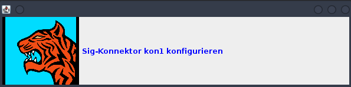

== Tiger Test library

As outlined in xref:tiger_user_manual.adoc#_overview[the overview section] the Tiger test libarary is
one of the three core components of the Tiger test framework.
Its main goal is to provide extensive support for BDD/Cucumber testing and integrating the local Tiger Proxy
with the test environment manager and the started test environment.

CAUTION: As of now we do not support multithreaded / parallel test runs.

[#_tiger_test_lib_configuration]
=== Tiger test lib configuration

In the root folder of your test project you may place a _tiger.yaml_ configuration file to customize the Tiger test library integration
and activate / deactivate certain features.

[source,yaml]
----
rbelPathDebugging: false
# Flag to activate tracing at the Rbel Path Executor.
# If activated the Executor will dump all evaluation steps of all levels to the console
# when traversing through the document tree
# Deactivated by default
rbelAnsiColors: true
# Flag whether the Executor's dump shall be in ANSI color.
# If you are working on operating systems (Windows) that do not support
# Ansi color sequences in their console you may deactivate the coloring with this flag.
# Activated by default.
activateMonitorUI: false
# Flag whether to start a small Java Swing UI to display the current steps / banner messages
# when executing the test suite.
# This feature can be used to instruct the tester to follow
# a specific test workflow for manual tests.
# Deactivated by default
----

=== Cucumber and TigerTestHooks

As Tiger focuses on BDD and Cucumber based test suites all the setup and tear down as well as steps based actions are defined
in the TigerTestHooks class.

That's why it is mandatory to add the package de.gematik.test.tiger.hooks to the glue packages list.

The TigerTestHooks class initializes a static single RBelMessage listener to collect all messages received by the local Tiger Proxy and
provides those messages via a getter method to the Tiger filter and validation steps.

The @Before method calls the TigerDirector once
to initiate the Tiger test environment manager, the local Tiger Proxy and optionally the monitoring UI and parses the current scenario / feature file.
It adds a RbelMessage Listener once to the local Tiger proxy and also clears the RbelMessages queue before each scenario / scenario outline variant.

The @After method saves all collected RbelMessages as HTML file to the `target/rbellogs` folder, attaches it to the SerenityBDD report as test evidence and logs the current test run state (scucess/failed rate) to the console.

The TigerDirector in the future will become a general high level access class to all the major features of the Tiger test framework.
Such things as syncing test cases and test reports with Polarion, creating requirements coverage reports,
using the Tiger test framework from non Cucumber test drivers, ...etc.

NOTE: For now, the TigerDirector is only for internal use and does not provide any implementation of the aforementioned features.

==== How to use Tiger in a non Cucumber scenario

If you are using TestNG, plain JUnit or other Test harness frameworks, you have to ensure that you call the four methods defined
in the TigerTestHooks class at the appropriate times.

* The @Before method must be called before each Test scenario
* The @BeforeStep method MIGHT be called before each test step
* The @After method MIGHT be called after each Test scenario

If you provide a dummy Scenario instance with dummy steps matching your test code to the method you might use all methods.
Else you just pass in a null Scenario to the methods or do not call the other methods in your test run.

But take note that this will not pop up UI Workflow banner messages and will not save RBelMessage HTML files.
As a workaround you might use the TigerDirector to manually trigger UI Monitor popups via its method `updateStepInMonitor(Step step)`.

=== Using the Cucumber Tiger validation steps

The Tiger validation steps are a set of Cucumber steps that enable you to search for requests and associated responses
matching certain criteria.
All of that without need to write your own code. Basic knowledge about RBelPath and regular expressions are sufficient.
In order to use these steps you must ensure that the relevant traffic is routed via the local Tiger Proxy of the test suite or
construct a xref:tigerProxy.adoc#_mesh_setup_traffic_endpoints[Tiger Proxy mesh] set up.

==== Filtering requests

.Core features
* Filter for server, method, path, RBelPath node matching given value in request
* Find first / next matching request
* Clear all recorded messages
* Specify timeout for filtering request

With the `find next request ...` steps you can validate a complete workflow of requests to exist in a specific order and
validate each of their responses (see next chapter).

// as HTML passthrough is not supported for pdf backend we need to keep this cucumber steps duplicated :(

ifdef::backend-html5[]
.Tiger validation filtering steps example
--
++++
<pre class="CodeRay highlight">

  Feature Tiger validation steps

    Scenario: Example steps

      # clear all previousely recorded messages (requests and responses)
      Given TGR clear recorded messages
      # restrict filtering requests to a specific host
      And TGR filter requests based on host "testnode.example.org"
      # restrict filtering requests to a specific HTTP method
      And TGR filter requests based on method "POST"
      # specify timeout for filter queries
      And TGR set request wait timeout to 20 seconds
      # find the first request matching criteria
      When TGR find request to path "/path/blabla" with "$..tag.value.text" matching "abc.*"
      # validate response to the filtered request using RBelPath
      Then TGR current response with attribute "$..answer.result.text" matches "OK.*"
      # find the next request matching criteria
      When TGR find next request to path "/path" with "$..value.text" matching "abc.*"

      ....
</pre>
++++
--
endif::[]
ifdef::backend-pdf[]
.Tiger validation filtering steps example
----
Feature Tiger validation steps

  Scenario: Example steps

    # clear all previousely recorded messages (requests and responses)
    Given TGR clear recorded messages
    # restrict filtering requests to a specific host
    And TGR filter requests based on host "testnode.example.org"
    # restrict filtering requests to a specific HTTP method
    And TGR filter requests based on method "POST"
    # specify timeout for filter queries
    And TGR set request wait timeout to 20 seconds
    # find the first request matching criteria
    When TGR find request to path "/path/blabla" with "$..tag.value.text" matching "abc.*"
    # validate response to the filtered request using RBelPath
    Then TGR current response with attribute "$..answer.result.text" matches "OK.*"
    # find the next request matching criteria
    When TGR find next request to path "/path" with "$..value.text" matching "abc.*"

    ....
----
endif::[]

==== Validating responses

.Core features
* Assert that the boty of the resposne matches regex
* Assert that a given RBelPath node matches regex
* Assert that a given RBelPath node matches a JSON struct using the JSONChecker feature set
* Assert that a given RBelPath node matches an XML struct using the XMLUnit difference evaluator

// as HTML passthrough is not supported for pdf backend we need to keep this cucumber steps duplicated :(

ifdef::backend-html5[]
.Tiger response validation steps example
--
++++
<pre class="CodeRay highlight">

Feature Tiger validation steps

  Scenario: Example steps
    ...
    # find the first request matching criteria
    <b>When</b> TGR find request to path "/path/path/blabla" with "$..tag.value.text" matching "abc.*"
    # validate response to the filtered request using RBelPath
    <b>Then</b> TGR current response with attribute "$..answer.result.text" matches "OK.*"
    # find the next request matching criteria
    <b>When</b> TGR find next request to path "/path" with "$..value.text" matching "abc.*"
    # validate response to the filtered request comparing body content
    <b>Then</b> TGR current response body matches
    """
         body content
    """
    # validate response to the filtered request based upon JSONChecker
    <b>And</b> TGR current response at "$..tag" matches as JSON
    """
      {
        "arr1": [
          "asso", "bsso"
        ]
      }
    """
    # validate response to the filtered request based upon XML comparison
    <b>And</b> TGR current response at "$..tag" matches as XML
    """
      &lt;arr1>
        &lt;entry index="1">asso&lt;/entry>
        &lt;entry index="2">bsso&lt;/entry>
      &lt;/arr1>
    """
</pre>
++++
--
endif::[]

ifdef::backend-pdf[]
.Tiger response validation steps example
----
Feature Tiger validation steps

  Scenario: Example steps
    ...
    # find the first request matching criteria
    When TGR find request to path "/path/blabla" with "$..tag.value.text" matching "abc.*"
    # validate response to the filtered request using RBelPath
    Then TGR current response with attribute "$..answer.result.text" matches "OK.*"
    # find the next request matching criteria
    When TGR find next request to path "/path" with "$..value.text" matching "abc.*"
    # validate response to the filtered request comparing body content
    Then TGR current response body matches
    """
         body content
    """
    # validate response to the filtered request based upon JSONChecker
    And TGR current response at "$..tag" matches as JSON
    """
      {
        "arr1": [
          "asso", "bsso"
        ]
      }
    """
    # validate response to the filtered request based upon XML comparison
    And TGR current response at "$..tag" matches as XML
    """
      <arr1>
        <entry index="1">asso</entry>
        <entry index="2">bsso&</entry>
      </arr1>
    """
----
endif::[]

===== XMLUnit Diff Builder

Using the validation steps `TGR current response at {string} matches as XML` or
`TGR current response at {string} matches as XML and diff options {string}` you are able to compare
the content of any RbelPath node in the response.
The latter method even allows passing in the following options to the XMLUnit's DiffBuilder:

* "nocomment" for DiffBuilder::ignoreComments
* "txtignoreempty" for DiffBuilder::ignoreElementContentWhitespace
* "txttrim" for DiffBuilder::ignoreWhitespace
* "txtnormalize" for DiffBuilder::normalizeWhitespace

Per default the comparison algorithm will ignore mismatches in namespace prefixes and URIs.
Comparison is also performed on similarity and not equal content.

For more detailed explanation about the XMLUnit difference evaluator we refer to the
https://github.com/xmlunit/user-guide/wiki/DiffBuilder[online documentation of the XMLUnit project].

===== JSONChecker

Using the validation step `TGR current response at {string} matches as JSON` you are able to compare the content of any RbelPath node
in the response to the doc string beneath the step, with the help of the JSONChecker comparison algorithm.

The purpose of JSONChecker class is to compare JSON structures, including checking for the integrity of the whole RbelPath node, as well as matching values for particular keys.

To make sure all the attributes in your JSON RbelPath structure are present, such features as ${json-unit.ignore}, $NULL, optional attributes, regular expressions and lenient mode can come in handy.

${json-unit.ignore} is a parameter which allows to ignore certain values in your RbelPath node while comparing, and the result of such comparison always returns true.
It also works when ${json-unit.ignore} is used in a JSON array or nested JSON object.
This parameter should be placed as a value of a key.
Also to ignore some attributes in the JSON structure, you can set a boolean value checkExtraAttributes as false.
In this case if you miss one attribute in your doc string, the comparison will still be equal to true.

To check whether the value for a particular key is null, you can either use null or parameter $NULL at the place of the value.
Checking whether a nested key is null also works with JSONChecker.

Four underscores "____" before the JSON keys indicate that these keys are optional and will be checked for the value ONLY if the value exists in the test JSON RBelPath node.
Please note that checking whether a nested key is optional, is not yet possible with JsonChecker.

JSON Arrays are compared in lenient mode, meaning that the order of elements in JSON array doesn't matter.

Identifying missing keys is made easy in JSONChecker with the help of parameter $REMOVE.

If you specify the name of the key and then $REMOVE parameter as its value, the comparison will result in true, if the key is indeed missing and false, if the key is present.
It is worth noting that even if the value of the key is null, the key doesn't count as missing.

Last but not least, regular expressions, which can be used for matching the whole JSON element, as well as particular values.
It will be first checked, whether the expected value is equal to the actual one, and only afterwards, if the actual value matches a regular expression.

It should also be noted, that although JSONChecker can match multilevel JSON objects at a high level, it is not yet possible to access nested attributes out of the box. We are working on it :)

.Simple adapted example from the IDP test suite
[source, json]
----
  {
    "alg": "dir",
    "enc": "A256GCM",
    "cty": "$NULL",
    "exp": "[\\d]*",
    "____kid": ".*",
    "dummyentry": "${json-unit.ignore}",
    "dummyarray": [ "entry1", "entry2" ],
    "dummyarray2":  "${json-unit.ignore}"
  }
----

The example above shows three main features of the JSONChecker.

* Value specified as $NULL, meaning this value of this key is equal to null.
* Usage of regular expression (e.g. ".\*" and "[\\d]*") to match values.
* Usage of "____" preceeding a json key.- This indicates that the entry is optional but if it exists it must match the given value.
* if a value is specified as "${json-unit.ignore}", there is no check performed at all. This applies also to objects and arrays as seen in the dummyarray2 entry.
* if we match key dummyEntry2 to the value of $REMOVE, it will return true, because this key does not exist.

===== Regex matching

When comparing values (e.g. in the `TGR current response body matches`) generally the algorithms check for equality and
only check for regex matches if they were not equal.

==== Complete set of steps in validation glue code

[source, java]
----
// copied from module /tiger-test-lib
// /src/test/java/de/gematik/test/tiger/glue/RBelValidatorGlue.java

/**
 * Specify the amount of seconds Tiger should wait when filtering for
 * requests / responses
 * before reporting them as not found.
 */
@Gegebensei("TGR setze Anfrage Timeout auf {int} Sekunden")
@Given("TGR set request wait timeout to {int} seconds")

/**
 * clear all validatable rbel messages. This does not clear the recorded messages later on
 * reported via the rbel log HTML page or the messages shown on web ui of Tiger Proxies.
 */
@Wenn("TGR lösche aufgezeichnete Nachrichten")
@When("TGR clear recorded messages")

/**
 * filter all subsequent findRequest steps for hostname. To reset set host name to
 * empty string "".
 *
 * @param hostname host name (regex supported) to filter for
 */
@Wenn("TGR filtere Anfragen nach Server {string}")
@When("TGR filter requests based on host {string}")

/**
 * filter all subsequent findRequest steps for method.
 *
 * @param method method to filter for
 */
@Wenn("TGR filtere Anfragen nach HTTP Methode {string}")
@When("TGR filter requests based on method {string}")

/**
 * reset filter for method for subsequent findRequest steps.
 */
@Wenn("TGR lösche den gesetzten HTTP Methodenfilter")
@When("TGR reset request method filter")

/**
 * find the first request where the path equals or matches as regex and memorize it
 * in the {@link #rbelValidator} instance
 *
 * @param path path to match
 */
@Wenn("TGR finde die erste Anfrage mit Pfad {string}")
@When("TGR find request to path {string}")

/**
 * find the first request where path and node value equal or match as regex and memorize it
 * in the {@link #rbelValidator} instance.
 *
 * @param path     path to match
 * @param rbelPath rbel path to node/attribute
 * @param value    value to match at given node/attribute
 */
@Wenn("TGR finde die erste Anfrage mit Pfad {string} und Knoten {string} der mit {string} übereinstimmt")
@When("TGR find request to path {string} with {string} matching {string}")

/**
 * find the NEXT request where the path equals or matches as regex and memorize it
 * in the {@link #rbelValidator} instance.
 *
 * @param path path to match
 */
@Wenn("TGR finde die nächste Anfrage mit dem Pfad {string}")
@When("TGR find next request to path {string}")

/**
 * find the NEXT request where path and node value equal or match as regex and memorize it
 * in the {@link #rbelValidator} instance.
 *
 * @param path     path to match
 * @param rbelPath rbel path to node/attribute
 * @param value    value to match at given node/attribute
 */
@Wenn("TGR finde die nächste Anfrage mit Pfad {string} und Knoten {string} der mit {string} übereinstimmt")
@When("TGR find next request to path {string} with {string} matching {string}")

/**
 * assert that there is any message with given rbel path node/attribute matching given value.
 * The result (request or response) will not be stored in the {@link #rbelValidator}
 * instance.
 *
 * @param rbelPath rbel path to node/attribute
 * @param value    value to match at given node/attribute
 * @deprecated
 */
@Wenn("TGR finde eine Nachricht mit Knoten {string} der mit {string} übereinstimmt")
@When("TGR any message with attribute {string} matches {string}")

// ==========================================================================================
//
//    S T O R E   R E S P O N S E   N O D E   I N   C O N T E X T
//
// ==========================================================================================

/**
 * store given rbel path node/attribute text value of curren tresponse.
 *
 * @param rbelPath path to node/attribute
 * @param varName  name of variable to store the node text value in
 */
@Dann("TGR speichere Wert des Knotens {string} der aktuellen Antwort in der Variable {string}")
@Then("TGR store current response node text value at {string} in variable {string}")

// ==========================================================================================
//
//    R E S P O N S E   V A L I D A T I O N
//
// ==========================================================================================

/**
 * assert that response body of filtered request matches.
 *
 * @param docString value / regex that should equal or match
 */
@Dann("TGR prüfe aktuelle Antwort stimmt im Body überein mit:")
@Then("TGR current response body matches")

/**
 * assert that response of filtered request matches at given rbel path node/attribute.
 *
 * @param rbelPath path to node/attribute
 * @param value    value / regex that should equal or match as string content with MultiLine
 *                 and DotAll regex option
 */
@Dann("TGR prüfe aktuelle Antwort stimmt im Knoten {string} überein mit {string}")
@Then("TGR current response with attribute {string} matches {string}")

/**
 * assert that response of filtered request matches at given rbel path node/attribute.
 *
 * @param rbelPath  path to node/attribute
 * @param docString value / regex that should equal or match as string content with MultiLine
 *                  and DotAll regex option supplied as DocString
 */
@Dann("TGR prüfe aktuelle Antwort im Knoten {string} stimmt überein mit:")
@Then("TGR current response at {string} matches")

/**
 * assert that response of filtered request matches at given rbel path node/attribute.
 *
 * @param rbelPath path to node/attribute
 * @param value    value / regex that should equal or match as string content with MultiLine
 *                 and DotAll regex option
 * @deprecated
 */
@Then("TGR current response at {string} matches {string}")

/**
 * assert that response of filtered request matches at given rbel path node/attribute
 * assuming its JSON or XML
 *
 * @param rbelPath     path to node/attribute
 * @param mode         one of JSON|XML
 * @param oracleDocStr value / regex that should equal or match as JSON or XML content
 * @see JsonChecker#assertJsonObjectShouldMatchOrContainInAnyOrder(String, String, boolean)
 */
@Dann("TGR prüfe aktuelle Antwort im Knoten stimmt als {word} überein mit:")
@Then("TGR current response at {string} matches as {word}")

/**
 * assert that response of filtered request matches at given rbel path node/attribute
 * assuming its XML with given list of diff options.
 *
 * @param rbelPath       path to node/attribute
 * @param diffOptionsCSV a csv separated list of diff option identifiers to be applied
 *                       to comparison of the two XML sources
 *                       <ul>
 *                           <li>nocomment ... {@link DiffBuilder#ignoreComments()}</li>
 *                           <li>
 *                             txtignoreempty ...
 *                             {@link  DiffBuilder#ignoreElementContentWhitespace()}
 *                           </li>
 *                           <li>txttrim ... {@link DiffBuilder#ignoreWhitespace()}</li>
 *                           <li>
 *                             txtnormalize ... {@link DiffBuilder#normalizeWhitespace()}
 *                           </li>
 *                       </ul>
 * @param xmlDocStr      value / regex that should equal or match as JSON content
 * @see <a href="https://github.com/xmlunit/user-guide/wiki/DifferenceEvaluator">
 *        More on DifferenceEvaluator
 *      </a>
 */
@Dann("TGR prüfe aktuelle Antwort im Knoten {string} stimmt als XML mit folgenden diff Optionen {string} überein mit:")
@Then("TGR current response at {string} matches as XML and diff options {string}")
----

==== Exemplaric scenario Konnektorfarm EAU validation

The EAU Konnektorfarm scenario is a scenario where customers can use their Primärsystem to test signing and verifying documents
via a set of Konnektoren and that this works interoperable. For this purpose a phalanx of local Tiger Proxies is set up
as reverse proxies for each Konnektor being hosted at the gematik location.
Any message that is forwarded by any of these proxies is forwarded to an aggregating Tiger Proxy
which in turn forwards all the received messages to the local Tiger Proxy for assertion via the validation test suite.

image::media/tiger-integration-eau-testenv.svg[title="Tiger EAU Konnektorfarm test environment"]

So after starting the validation test suite (and the test environment),
the customer / Primärsystem manufacturer must perform the specified workflow.
The test suite meanwhile will wait for a given order of requests/responses matching specified criteria to appear.
If all is well, at the end the test report JSON files will be packed into a zip archive and
can be uploaded to the Titus platform for further certification steps.

image::media/tiger-integration-eau-process.svg[title="Tiger EAU Konnektorfarm process"]

[#_workflow_ui]
==== Workflow UI

The Workflow UI is one of the new experimental features which are currently introduced to Tiger.If activated via the tiger.yaml configuration file (see <<_tiger_test_lib_configuration>>), any TGR banner step will be displayed in the Monitor UI popup and will stay there till the next banner step replaces the message. This way you can instruct manual testers to follow a specified test workflow.
This feature is used in the EAU Konnektorfarm validation test suite to guide the Primärsystem manufacturers
through the interoperability combinations of signing/verifying documents against all Konnektors available.

.Current message steps for Workflow UI
[source,java]
----
// copied from module /tiger-test-lib
// /src/test/java/de/gematik/test/tiger/glue/TigerGlue.java

    @Gegebensei("TGR zeige {word} Banner {string}")
    @Given("TGR show {word} banner {string}")

    @Gegebensei("TGR zeige {word} Text {string}")
    @Given("TGR show {word} text {string}")

    @Gegebensei("TGR zeige Banner {string}")
    @Given("TGR show banner {string}")

    @When("TGR wait for user abort")
    @Wenn("TGR warte auf Abbruch")
----

The last step allows to pause the validation test suite and is mainly used in demo scenarios allowing the manual tester
to perform demo transactions that will be logged and saved to HTML reports but are nto validated.

=== Using Tiger test lib helper classes

If you don't want to use the Tiger test framework but only pick a few helper classes the following classes might be of interest to you:

NOTE: All classes listed here are part of the tiger-common module

==== Banner

If you want to use large ASCII art style log banners you may find this class very helpful.
Supports ANSI coloring and a set of different fonts.
For more details please check the code and its usages in the Tiger test framework.

// TODO TGR-347 document TigerSerializationUtil, TigertPkiIdentity

=== Test library configuration

To configure your test library add a tiger.yaml file to the project root.
The following configuration properties are supported:

[source, yaml]
----
# flag whether to activate monitoring UI
activateMonitorUI: false
# flag whether to activate rbel path debugging
rbelPathDebugging: false
# flag whether to print rbel dumps to console using ANSI color codes or not
rbelAnsiColors: true
----
