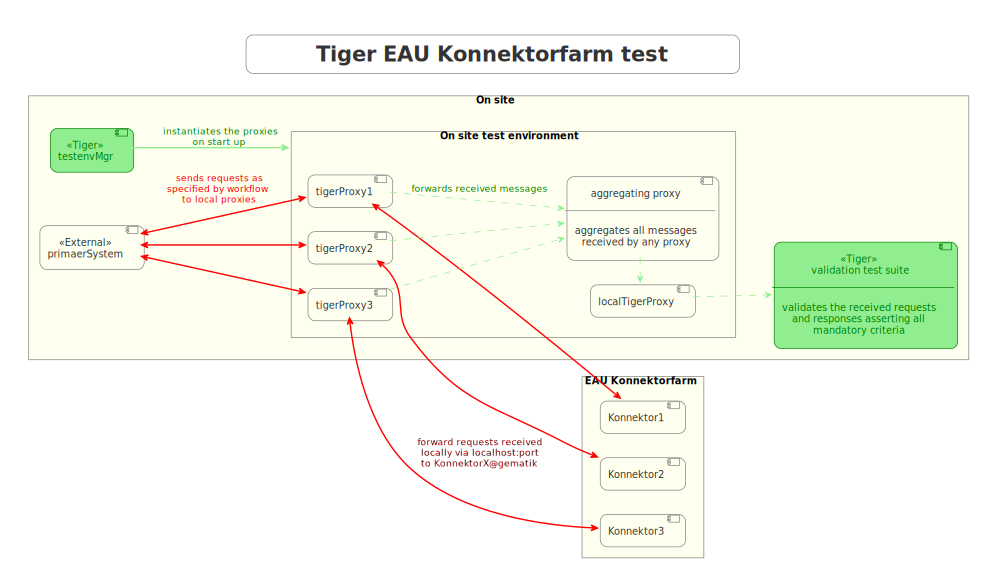
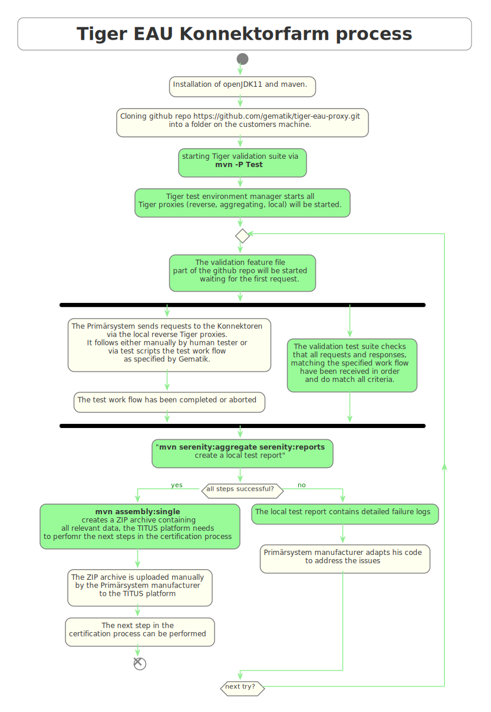
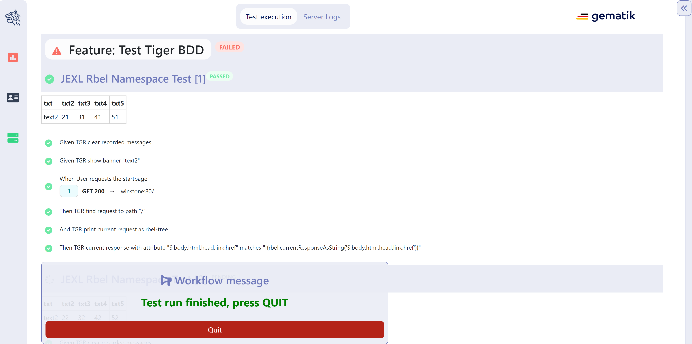
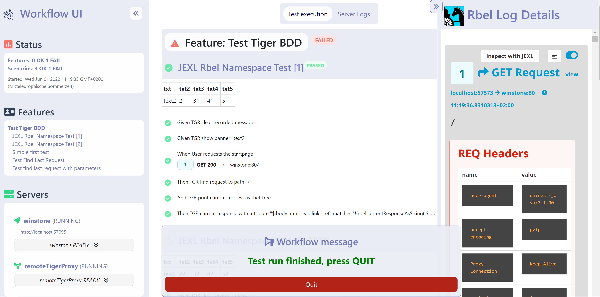

== Tiger Test library

As outlined in xref:tiger_user_manual.adoc#_overview[the overview section] the Tiger test library is one of the three core components of the Tiger test framework.
Its main goal is to provide extensive support for BDD/Cucumber testing and integrating the local Tiger Proxy with the test environment manager and the started test environment.

CAUTION: As of now we do not support multithreaded / parallel test runs.

[#_tiger_test_lib_configuration]
=== Tiger test lib configuration

In the root folder of your test project you may place a _tiger.yaml_ configuration file to customize the Tiger test library integration
and activate / deactivate certain features.

[source,yaml]
----
lib:
    # Flag to activate tracing at the Rbel Path Executor.
    # If activated the Executor will dump all evaluation steps of all levels to the console
    # when traversing through the document tree
    # Deactivated by default
    rbelPathDebugging: false
    # Flag whether the Executor's dump shall be in ANSI color.
    # If you are working on operating systems (Windows) that do not support
    # Ansi color sequences in their console you may deactivate the coloring with this flag.
    # Activated by default.
    rbelAnsiColors: true
    # Flag whether to start a browser window to display
    # the current steps / banner messages / rbel logs
    # when executing the test suite.
    # This feature can be used to instruct the tester to follow
    # a specific test workflow for manual tests.
    # Deactivated by default
    activateWorkflowUi: false
    # Flag whether to add a curl command details button to
    # SerenityRest Restassured calls
    # in the Serenity BDD report
    addCurlCommandsForRaCallsToReport: true
    # Flag whether to create the RBEL HTML reports during
    # a testsuite run, activated by default
    createRbelHtmlReports: true
    # maximum amount of seconds to wait / pause execution via pop up in the workflow ui, default is 5 hours.
    pauseExecutionTimeoutSeconds: 18000

# flag whether to start the local Tiger Proxy (default) or to omit it completely.
# if you have the local Tiger Proxy deactivated you will NOT be able to
# validate / log any traffic data from test requests / responses.
localProxyActive: true
----

[#_cucumber_hooks]
=== Cucumber and Hooks

As Tiger focuses on BDD and Cucumber based test suites all the setup and tear down as well as steps based actions are performed.

That's why it is mandatory to use the TigerCucumberRunner, which internally registers the plugin `io.cucumber.core.pluginTigerSerenityReporterPlugin` to the plugins list.

The LocalProxyRbelMessageListener class initializes a static single RBelMessage listener to collect all messages received by the local Tiger Proxy and provides those messages via a getter method to the Tiger filter and validation steps.

At startup of the TigerCucumberRunner the TigerDirector gets called once to initiate the Tiger test environment manager, the local Tiger Proxy (unless it's configured to be not active) and optionally the workflow UI.
It adds a RbelMessage Listener once to the local Tiger proxy and also clears the RbelMessages queue before each scenario / scenario outline variant.
Utilizing the close integration of SerenityBDD and RestAssured at startup also a Restassured request filter, which parses the details and adds a curl Command details button to the Serenity BDD report, is registered.
The curl command shown in that section in the report allows to repeat the performed REST request, for manual test failure analysis.

After each scenario / data variant all collected RbelMessages are saved as HTML file to the `target/rbellogs` folder, and attached to the SerenityBDD report as test evidence. The current test run state (success/failed rate) is logged to the console.

=== Using the Cucumber Tiger validation steps

The Tiger validation steps are a set of Cucumber steps that enable you to search for requests and associated responses
matching certain criteria. All of that without need to write your own code. Basic knowledge about RBelPath and regular expressions are sufficient.
In order to use these steps you must ensure that the relevant traffic is routed via the local Tiger Proxy of the test suite or
construct a xref:tigerProxy.adoc#_mesh_setup_traffic_endpoints[Tiger Proxy mesh] set up.

==== Filtering requests

.Core features
* Filter for server, method, path, RBelPath node existing / matching given value in request
* Find first / next / last matching request
* Find absolute last request (no path input needed)
* Find first / next / last request containing a RBelPath node
* Clear all recorded messages
* Specify timeout for filtering request

With the `TGR find next request ...` steps you can validate a complete workflow of requests to exist in a specific order and validate each of their responses (see next chapter).

==== Validating responses

.Core features
* Assert that the body of the response matches regex
* Assert that a given RBelPath node exists
* Assert that a given RBelPath node matches regex
* Assert that a given RBelPath node does not match regex
* Assert that a given RBelPath node matches a JSON struct using the JSONChecker feature set
* Assert that a given RBelPath node matches an XML struct using the XMLUnit difference evaluator

.Tiger response validation steps example
[source,gherkin]
--
include::validation-example.feature[]
--

=== Using the HTTP client steps

The Tiger HTTP client steps are a set of Cucumber steps that enable you to perform simple HTTP
requests, with bodies, default and custom headers.

.Tiger response validation steps example
[source,gherkin]
--
include::HttpGlueCodeTest.feature[]
--

===== XMLUnit Diff Builder

Using the validation steps `TGR current response at \{string} matches as XML:` or
`TGR current response at \{string} matches as XML and diff options \{string}:` you are able to compare
the content of any RbelPath node in the response.
The latter method even allows passing in the following options to the XMLUnit's DiffBuilder:

* "nocomment" for DiffBuilder::ignoreComments
* "txtignoreempty" for DiffBuilder::ignoreElementContentWhitespace
* "txttrim" for DiffBuilder::ignoreWhitespace
* "txtnormalize" for DiffBuilder::normalizeWhitespace

Per default the comparison algorithm will ignore mismatches in namespace prefixes and URIs. Comparison is also performed on similarity and not equal content.

For more detailed explanation about the XMLUnit difference evaluator we refer to the https://github.com/xmlunit/user-guide/wiki/DiffBuilder[online documentation of the XMLUnit project].

===== JSONChecker

Using the validation step `TGR current response at \{string} matches as JSON:` you are able to compare the content of any RbelPath node
in the response to the doc string beneath the step, with the help of the JSONChecker comparison algorithm.

The purpose of JSONChecker class is to compare JSON structures, including checking for the integrity of the whole RbelPath node, as well as matching values for particular keys.

To make sure all the attributes in your JSON RbelPath structure are present, such features as ${json-unit.ignore}, $NULL, optional attributes, regular expressions and lenient mode can come in handy.

${json-unit.ignore} is a parameter which allows ignoring certain values in your RbelPath node while comparing, and the result of such comparison always returns true.
It also works when ${json-unit.ignore} is used in a JSON array or nested JSON object.
This parameter should be placed as a value of a key.
To ignore some attributes in the JSON structure, you can set a boolean value checkExtraAttributes as false.
In this case if you miss one attribute in your doc string, the comparison will still be equal to true.

To check whether the value for a particular key is null, you can either use null or parameter $NULL at the place of the value. Checking whether a nested key is null also works with JSONChecker.

Four underscores "____" before the JSON keys indicate that these keys are optional and will be checked for the value ONLY if the value exists in the test JSON RBelPath node.
Please note that checking whether a nested key is optional, is not yet possible with JsonChecker.

JSON Arrays are compared in lenient mode, meaning that the order of elements in JSON array doesn't matter.

Identifying missing keys is made easy in JSONChecker with the help of parameter $REMOVE.

If you specify the name of the key and then $REMOVE parameter as its value, the comparison will result in true, if the key is indeed missing and false, if the key is present. It is worth noting that even if the value of the key is null, the key doesn't count as missing.

Last but not least, regular expressions, which can be used for matching the whole JSON element, as well as particular values. It will be first checked, whether the expected value is equal to the actual one, and only afterwards, if the actual value matches a regular expression.

It should also be noted, that although JSONChecker can match multilevel JSON objects at a high level, it is not yet possible to access nested attributes out of the box. We are working on it :)

.Simple adapted example from the IDP test suite
[source, json]
----
  {
    "alg": "dir",
    "enc": "A256GCM",
    "cty": "$NULL",
    "exp": "[\\d]*",
    "____kid": ".*",
    "dummyentry": "${json-unit.ignore}",
    "dummyarray": [ "entry1", "entry2" ],
    "dummyarray2":  "${json-unit.ignore}"
  }
----

The example above shows three main features of the JSONChecker.

* Value specified as $NULL, meaning this value of this key is equal to null.
* Usage of regular expression (e.g. ".\*" and "[\\d]*") to match values.
* Usage of "____" preceeding a json key: This indicates that the entry is optional but if it exists it must match the given value.
* if a value is specified as "${json-unit.ignore}", there is no check performed at all. This applies also to objects and arrays as seen in the dummyarray2 entry.
* if we match key dummyEntry2 to the value of $REMOVE, it will return true, because this key does not exist.

===== Regex matching

When comparing values (e.g. in the `TGR current response body matches:`) generally the algorithms check for equality and
only check for regex matches if they were not equal.

==== Complete set of steps in validation glue code

// use the extractCommentsFromRbelValidatorGlue.sh in GitBash (Windows) or bash (Linux, Mac)
// to extract anew the steps doc from RbelValidatorGlue.java
[source, java]
----
// extracted from module /tiger-test-lib
// /src/test/java/de/gematik/test/tiger/glue/RBelValidatorGlue.java
include::./RbelValidatorGlueCommentsOnly.java[]
----

==== Complete set of steps in HTTP client glue code

// use the extractCommentsFromRbelValidatorGlue.sh in GitBash (Windows) or bash (Linux, Mac)
// to extract anew the steps doc from RbelValidatorGlue.java
[source, java]
----
// extracted from module /tiger-test-lib
// /src/test/java/de/gematik/test/tiger/glue/HttpGlueCode.java
include::./HttpGlueCodeCommentsOnly.java[]
----

==== Exemplaric scenario Konnektorfarm EAU validation

The EAU Konnektorfarm scenario is a scenario where customers can use their Primärsystem to test signing and verifying documents via a set of Konnektoren and that this works interoperable. For this purpose a phalanx of local Tiger Proxies is set up as reverse proxies for each Konnektor being hosted at the gematik location.
Any message that is forwarded by any of these proxies is forwarded to an aggregating Tiger Proxy which in turn forwards all the received messages to the local Tiger Proxy for assertion via the validation test suite.

So after starting the validation test suite (and the test environment), the customer / Primärsystem manufacturer must perform the specified workflow. The test suite meanwhile will wait for a given order of requests/responses matching specified criteria to appear.
If all is well, at the end the test report JSON files will be packed into a zip archive and can be uploaded to the Titus platform for further certification steps.

[#_workflow_ui]
==== Workflow UI

The Workflow UI is one of the new features which are currently introduced to Tiger. If activated via the `tiger.yaml` configuration file (see xref:_tiger_test_lib_configuration[]), the Workflow UI will be opened in the current browser window during the test run.
If no browser is open at the time a new instance will be launched.

The image above shows the inital startup of the Workflow UI. The Workflow UI is divided into three sections. When the user clicks on the tigers head on the top left the overview section is shown. It tells the user about the overall status, the name of the features and scenarios and the server status and logs.
The section in the middle of the Workflow UI shows the test suite results. Each scenario and the corresponding steps are displayed, showing the user which feature/scenario went through or failed. The communication requests that are called during the step execution are displayed beneath the step that initated the request.
When the user clicks on the light blue rectangle with the number (whereas uneven numbers are requests, even number are responses) of the request then the Rbel Log view opens on the right hand side of the Workflow UI.
These are the RbelMessages that are also saved as HTML files as described in the xref:tigerTestLibrary.adoc#_cucumber_hooks[Cucumber and Hooks] section.
The image below shows all three sections of the Workflow UI.

TGR banner step will be displayed at the bottom of the Workflow UI and will stay there till the next banner step replaces the message. This way you can instruct manual testers to follow a specified test workflow.
This feature is used in the EAU Konnektorfarm validation test suite to guide the Primärsystem manufacturers through the interoperability combinations of signing/verifying documents against all Konnektors available.

.Current message steps for Workflow UI
[source,java]
----
// copied from module /tiger-test-lib
// /src/test/java/de/gematik/test/tiger/glue/TigerGlue.java
include::./TigerGlueCommentsOnly.java[]
----
The pause steps allow to pause the validation test suite. Please note, these steps are only modified for the Workflow UI and don't work on a regular console (no failure, there is just no pause).
The step "wait for user abort" allows to pause the validation test suite and is mainly used in demo scenarios allowing the manual tester to perform demo transactions that will be logged and saved to HTML reports but are not validated. This step subsequently terminates the test execution.

=== Using Tiger test lib helper classes

If you don't want to use the Tiger test framework but only pick a few helper classes the following classes might be of interest to you:

NOTE: All classes listed here are part of the tiger-common module

==== Banner

If you want to use large ASCII art style log banners you may find this class very helpful.
Supports ANSI coloring and a set of different fonts. Furthermore, all banner messages are displayed and highlighted in the Workflow UI
For more details please check the code and its usages in the Tiger test framework.

==== TigerSerializationUtil

This class supports you in converting String representation of YAML and JSON data to an Java JSONObject or extract that or other loaded data to Java Maps. If you are planning to implement test data management or configuration sets, we propose to use the TigerGlobalConfiguration class described xref:tigerConfiguration.adoc#_tiger_configuration[in detail here].

==== TigerPkiIdentityLoader, TigerPkiIdentity

The loader class allows to easily instantiate PKI identities from given files. For more details on the format and the supported file types please check xref:tigerTestEnvironmentManager.adoc#_configuring_pki_identities_in_tiger_proxys_tls_section[this section in the test environment chapter].

==== Performing REST calls with Tiger

Tiger is closely integrated with SerenityBDD, which in turn has integrated the RestAssured library, so if you use the `SerenityRest` helper class, you will get detailed information about each call inside the test report.
The Tiger test library configuration also provides a flag to add curl command details to each of these calls, so that you can easily reproduce the REST call manually in case of test failure analysis.

For more information about REST testing in Tiger/SerenityBDD please check these two documents:

 * https://serenity-bdd.github.io/theserenitybook/latest/serenity-rest.html[Serenity REST]
 * https://serenity-bdd.github.io/theserenitybook/latest/serenity-screenplay-rest.html[Serenity Screenplay REST]

=== Synchronizing BDD scenarios with Polarion test cases (Gematik only)

Within gematik we maintain test cases via feature files being committed to git repositories. To keep traceability to the requriements maintained in Polarion we have a Tiger sub project that syncrhonizes test cases in Polarion with the scenarios in our feature files. It is a one way synchronisation, where the master are the feature files.

To use this feature the scenarios need a minimal set of mandatory annotations:

* **@TCID:xxx** - an unique test case identifier, where 'xxx' matches the value of the custom field "cfInternalId" in Polarion
* **@PRODUKT:p,p,p** - reference to the custom field "cfProductType". You add this annotation above each feature, not each scenario. 'p' is a product, one is mandatory but it can be a list.

And following optional annotations exist:

* @AFO-ID:xxx - a link to a defined requirement (Anforderung) in Polarion, where 'xxx' matches the custom field "cfAfoId"
* @AF-ID:xxx - a link to a defined requirement (Anwendungsfall) in Polarion, where 'xxx' matches the custom field "cfAfId"
* @PRIO:n - priority number (1-4), default is '1'
* @MODUS:xxx - describes the way of testing, default is 'automatisch'
* @STATUS:xxx - describes the status of the test, default is 'implementiert'
* @TESTFALL:n - describes if the test case is a negative testcase or positive one, default is 'positiv'
* @TESTSTUFE:n - describes the test type, default is '3' (which is E2E-Test)
* @DESCRIPTION - if your test case has a description, and you use this annotation, the description will be parsed. If not, the description stays empty and won't overwrite the one already existing in Polarion

If a scenario is identified that has no test case with a matching TCID, it will be created automatically in the sync run. Background blocks will be merged to each scenario before exporting its steps to Polarion.

For more details on how to perform the synchronisation, all choices for the annotations and how to upload generated test run reports to Polarion and Aurora, please check the README.md in the PolarionToolbox project on the Gematik GitLab.
