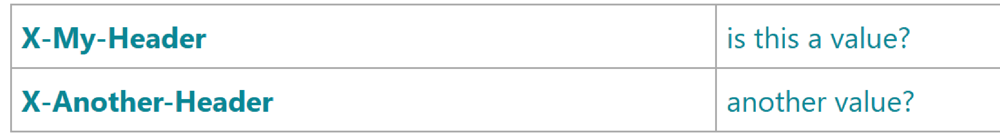
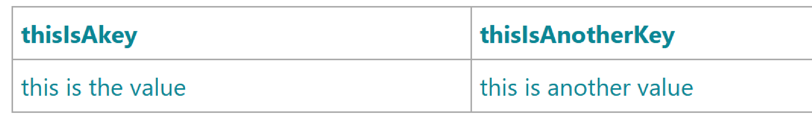

== Tiger Test library

As outlined in xref:tiger_user_manual.adoc#_overview[the overview section] the Tiger test library is one of the three core components of the Tiger test framework.
Its main goal is to provide extensive support for BDD/Cucumber testing and integrating the local Tiger Proxy with the test environment manager and the started test environment.

CAUTION: As of now we do not support multithreaded / parallel test runs.

[#_tiger_test_lib_configuration]
=== Tiger test lib configuration

In the root folder of your test project you may place a _tiger.yaml_ configuration file to customize the Tiger test library integration and activate / deactivate certain features.

[source,yaml]
----
lib:
    # Flag to activate tracing at the Rbel Path Executor.
    # If activated the Executor will dump all evaluation steps of all levels to the console
    # when traversing through the document tree
    # Deactivated by default
    rbelPathDebugging: false
    # Flag whether the Executor's dump shall be in ANSI color.
    # If you are working on operating systems (Windows) that do not support
    # Ansi color sequences in their console you may deactivate the coloring with this flag.
    # Activated by default.
    rbelAnsiColors: true
    # Flag whether to start a browser window to display
    # the current steps / banner messages / rbel logs
    # when executing the test suite.
    # This feature can be used to instruct the tester to follow
    # a specific test workflow for manual tests.
    # Deactivated by default
    activateWorkflowUi: false
    # If the startBrowser and activateWorkflowUi options are true,
    # the test system will try to open the Workflow UI in a browser
    # If the startBrowser option is false and activateWorflowUi is true
    # the test system will wait for the Workflow UI to be activated in
    # some other way. The time to be waited for the Workflow UI to be
    # active can be configured via option workflowUiStartTimeoutInSeconds
    startBrowser: true
    # If the activateBrowser option is false and the workflowUI
    # is supposed to be opened by some other process
    # this option allows to configure how many seconds
    # the test system will wait until the UI has been started
    workflowUiStartTimeoutInSeconds: 120
    # Flag whether to add a curl command details button to
    # SerenityRest RestAssured calls
    # in the Serenity BDD report
    addCurlCommandsForRaCallsToReport: true
    # Flag whether to create the RBEL HTML reports during
    # a testsuite run, activated by default
    createRbelHtmlReports: true
    # maximum amount of seconds to wait / pause execution via pop up in the workflow ui, default is 5 hours.
    pauseExecutionTimeoutSeconds: 18000
    # Customize your Rbel-Logs with your own logo. Must be PNG format.
    # Path should be relative to execution-location
    rbelLogoFilePath: "myLogo.png"
    # If you want to use a fixed port for the workflowUI you can set it here.
    workflowUiPort: 8123
    # Flag whether to clear the initial traffic after the environment startup phase
    # activated by default
    clearEnvironmentStartupTraffic: true

# flag whether to start the local Tiger Proxy (default) or to omit it completely.
# if you have the local Tiger Proxy deactivated you will NOT be able to
# validate / log any traffic data from test requests / responses.
localProxyActive: true

# section to allow adapting the logging levels of packages/class loggers similar to spring boot
logging:
  level:
    # activate tracing for a specific class
    de.gematik.test.tiger.testenvmgr.TigerTestEnvMgr: TRACE
    # activate tracing for all classes and subpackages of a package
    de.gematik.test.tiger.proxy: TRACE
    # activate tracing for the local Tiger Proxy. This logger has a special name due to its importance in the tiger test framework
    localTigerProxy: TRACE
----

[#_cucumber_hooks]
=== Cucumber and Hooks

As Tiger focuses on BDD and Cucumber based test suites all the setup and tear down as well as steps based actions are performed.

That's why it is mandatory to use the TigerCucumberRunner, which internally registers the plugin `io.cucumber.core.pluginTigerSerenityReporterPlugin` to the plugins list.

The LocalProxyRbelMessageListener class initializes a static single RBelMessage listener to collect all messages received by the local Tiger Proxy and provides those messages via a getter method to the Tiger filter and validation steps.

At startup of the TigerCucumberRunner the TigerDirector gets called once to initiate the Tiger test environment manager, the local Tiger Proxy (unless it's configured to be not active) and optionally the workflow UI.
It adds a RbelMessage Listener once to the local Tiger proxy and also clears the RbelMessages queue before each scenario / scenario outline variant.
Utilizing the close integration of SerenityBDD and RestAssured at startup also a Restassured request filter, which parses the details and adds a curl Command details button to the Serenity BDD report, is registered.
The curl command shown in that section in the report allows to repeat the performed REST request, for manual test failure analysis.

After each scenario / data variant all collected RbelMessages are saved as HTML file to the `target/rbellogs` folder, and attached to the SerenityBDD report as test evidence.
The current test run state (success/failed rate) is logged to the console.

=== Using the Cucumber Tiger validation steps

The Tiger validation steps are a set of Cucumber steps that enable you to search for requests and associated responses matching certain criteria.
All of that without need to write your own code.
Basic knowledge about RBelPath and regular expressions are sufficient.
In order to use these steps you must ensure that the relevant traffic is routed via the local Tiger Proxy of the test suite or construct a xref:tigerProxy.adoc#_mesh_setup_traffic_endpoints[Tiger Proxy mesh] set up.

==== Filtering requests

.Core features
* Filter for server, method, path, RBelPath node existing / matching given value in request
* Find first / next / last matching request
* Find absolute last request (no path input needed)
* Find first / next / last request containing a RBelPath node
* Clear all recorded messages
* Specify timeout for filtering request

With the `TGR find next request ...` steps you can validate a complete workflow of requests to exist in a specific order and validate each of their responses (see next chapter).

==== Validating responses

.Core features
* Assert that the body of the response matches regex
* Assert that a given RBelPath node exists
* Assert that a given RBelPath node matches regex
* Assert that a given RBelPath node does not match regex
* Assert that a given RBelPath node matches a JSON struct using the JSONChecker feature set
* Assert that a given RBelPath node matches an XML struct using the XMLUnit difference evaluator

.Tiger response validation steps example
[source,gherkin]
--
include::validation-example.feature[]
--

==== Validating requests

.Core features
* Assert that the body of the request matches regex
* Assert that a given RBelPath contains node
* Assert that a given RBelPath node matches regex
* Assert that a given RBelPath matches regex
* Assert that a given RBelPath node matches as JSON or XML
* Assert that a given RBelPath node does not match regex

.Tiger request validation steps example
[source,gherkin]
--
include::request-validation-example.feature[]
--

==== Regex matching

When comparing values (e.g. in the `TGR current response body matches:`) generally the algorithms check for equality and only check for regex matches if they were not equal.

==== Complete set of steps in validation glue code

// use AnnotationParser.java to extract comments
// to extract anew the steps doc from RbelValidatorGlue.java
// extracted from module /tiger-test-lib
// /src/test/java/de/gematik/test/tiger/glue/RBelValidatorGlue.java
include::./RBelValidatorGlueCommentsOnly.adoc[]

=== Writing your own Glue code

You can define your own BDD steps and write the corresponding glue code in your own project.
You must remember to configure the packages where your glue code is defined in the xref:maven-plugin-generate-drivers[tiger-maven-plugin] configuration.

Additionally, you can use some tiger specific annotations to improve the integration with your glue code with the tiger Workflow Ui and reporting.

==== Resolving Variables

When defining a glue code method, you can use the variables with the names +{tigerResolvedString}+ and +{tigerResolvedUrl}+.
These will be automatically resolved by the TigerGlobalConfiguration resolver, and the result is injected directly in the java method.

Here an example:

[source,java]
----
@Given("an example with a {tigerResolvedString} and a {tigerResolvedUrl}")
public void myExampleMethod(String thisIsTheResolvedStringVariable, URI thisIsTheResolvedUrlVariable){
    //do something with the variables
}
----

When using this step in a feature file, the passed string and url are resolved before being passed to the java code.
Inside the java code you don't need to call the resolver again.
The resolved values are also displayed in the Workflow UI and serenity reports.

===== DataTables and Multiline string arguments

Datatables and multiline strings are special arguments that are passed as the last argument of a method.
They have no placeholder in the cucumber expression.
Here we do not provide an automatic resolving of the arguments before passing them to the java method.
This is because the resolving may not be applicable on every possible use case.
Instead, we provide the marker annotation `@ResolvableArgument` whose purpose is to ensure that the arguments appear resolved in the Workflow Ui and reports.
Inside the java method the code must do the resolving explicitly.

Here are two examples:

[source,java]
----
@Given("here is an example of multiline string argument:")
@ResolvableArgument
public void multilineStringExample(String docstring){
 var resolvedExplicitly = TigerGlobalConfiguration.resolvePlaceholders(docString);
}

@Given("here is an example of datatable argument:")
@ResolvableArgument
public void multilineStringExample(DataTable dataTable){
 var resolvedExplicitly = dataTable.asMap().entrySet().stream()
        .collect(
            Collectors.toMap(
                entry -> resolveToString(entry.getKey()),
                entry -> resolveToString(entry.getValue)));
}
----

==== Formating Tables

Depending on the concrete useage, a `DataTable` may be interpreted by the glue code as a row wise argument or as a column wise argument.
To make it clearer to the user, it may be helpful to highlight the first row or the first column of the table when displaying it in the Workflow Ui.
For that you can use the annotations `@FirstColumnKeyTable` and `@FirstRowKeyTable` on your own glue code.

When applying the annotations to a glue code method with a `DataTable` argument, the datatable will apply a bold formatting to the first column or the first row accordingly.
You can apply both annotations to the same method.

For example, this method is annotated with `@FirstColumnKeyTable`

[source,java]
----
 @When("TGR send empty {requestType} request to {tigerResolvedUrl} with headers:")
  @FirstColumnKeyTable
  public void sendEmptyRequestWithHeaders(Method method, URI address, DataTable customHeaders){}
----

and its argument will be displayed like this in the Workflow Ui:

With `@FirstRowKeyTable` the table will look like this:

=== Modifying RbelObjects (RbelBuilder)

==== Introduction

Tiger supports modifying JSON, XML and several token formats.
After loading in an object from a string or a file the RbelObject can be modified in multiple ways:

* Changing a primitive value at a certain path
* replacing a primitive node by an object node and vice versa
* adding new nodes and primitive values as child path of an existing path
* adding new nodes to an array/list

After the adjustments the values of the modified RbelElements can be asserted.
The object can be serialised back to a string.
Jexl Expressions are implemented, as for reading a file or for serializing:
`'!{rbelObject:serialize("myRbelObject")}'`

==== List of all possible Steps

.Using the Rbel builder steps
// use the AnnotationParser.java to extract comments
// to extract anew the steps doc from RbelBuilderGlueCode.java
include::./RbelBuilderGlueCodeCommentsOnly.adoc[]

==== Usage examples

.Tiger Rbel Builder steps example
[source,gherkin]
--
include::rbelbuilder-example.feature[]
--

=== Using the HTTP client steps

The Tiger HTTP client steps are a set of Cucumber steps that enable you to perform simple HTTP requests, with bodies, default and custom headers.

.Tiger response validation steps example
[source,gherkin]
--
include::HttpGlueCodeTest.feature[]
--

==== Complete set of steps in HTTP client glue code

// use AnnotationParser.java to extract comments
// to extract anew the steps doc from RbelValidatorGlue.java

// extracted from module /tiger-test-lib
// /src/test/java/de/gematik/test/tiger/glue/HttpGlueCode.java
include::./HttpGlueCodeCommentsOnly.adoc[]

==== XMLUnit Diff Builder

Using the validation steps `TGR current response at \{string} matches as XML:` or
`TGR current response at \{string} matches as XML and diff options \{string}:` you are able to compare the content of any RbelPath node in the response.
The latter method even allows passing in the following options to the XMLUnit's DiffBuilder:

* "nocomment" for DiffBuilder::ignoreComments
* "txtignoreempty" for DiffBuilder::ignoreElementContentWhitespace
* "txttrim" for DiffBuilder::ignoreWhitespace
* "txtnormalize" for DiffBuilder::normalizeWhitespace

Per default the comparison algorithm will ignore mismatches in namespace prefixes and URIs.
Comparison is also performed on similarity and not equal content.

For more detailed explanation about the XMLUnit difference evaluator we refer to the https://github.com/xmlunit/user-guide/wiki/DiffBuilder[online documentation of the XMLUnit project].

==== JSONChecker

Using the validation step `TGR current response at \{string} matches as JSON:` you are able to compare the content of any RbelPath node in the response to the doc string beneath the step, with the help of the JSONChecker comparison algorithm.

The purpose of JSONChecker class is to compare JSON structures, including checking for the integrity of the whole RbelPath node, as well as matching values for particular keys.

To make sure all the attributes in your JSON RbelPath structure are present, such features as ${json-unit.ignore}, $NULL, optional attributes, regular expressions and lenient mode can come in handy.

${json-unit.ignore} is a parameter which allows ignoring certain values in your RbelPath node while comparing, and the result of such comparison always returns true.
It also works when ${json-unit.ignore} is used in a JSON array or nested JSON object.
This parameter should be placed as a value of a key.
To ignore some attributes in the JSON structure, you can set a boolean value checkExtraAttributes as false.
In this case if you miss one attribute in your doc string, the comparison will still be equal to true.

To check whether the value for a particular key is null, you can either use null or parameter $NULL at the place of the value.
Checking whether a nested key is null also works with JSONChecker.

Four underscores "____" before the JSON keys indicate that these keys are optional and will be checked for the value ONLY if the value exists in the test JSON RBelPath node.
Please note that checking whether a nested key is optional, is not yet possible with JsonChecker.

JSON Arrays are compared in lenient mode, meaning that the order of elements in JSON array doesn't matter.

Identifying missing keys is made easy in JSONChecker with the help of parameter $REMOVE.

If you specify the name of the key and then $REMOVE parameter as its value, the comparison will result in true, if the key is indeed missing and false, if the key is present.
It is worth noting that even if the value of the key is null, the key doesn't count as missing.

Last but not least, regular expressions, which can be used for matching the whole JSON element, as well as particular values.
It will be first checked, whether the expected value is equal to the actual one, and only afterwards, if the actual value matches a regular expression.

It should also be noted, that although JSONChecker can match multilevel JSON objects at a high level, it is not yet possible to access nested attributes out of the box.
We are working on it :)

.Simple adapted example from the IDP test suite
[source,json]
----
  {
    "alg": "dir",
    "enc": "A256GCM",
    "cty": "$NULL",
    "exp": "[\\d]*",
    "____kid": ".*",
    "dummyentry": "${json-unit.ignore}",
    "dummyarray": [ "entry1", "entry2" ],
    "dummyarray2":  "${json-unit.ignore}"
  }
----

The example above shows three main features of the JSONChecker.

* Value specified as $NULL, meaning this value of this key is equal to null.
* Usage of regular expression (e.g. ".\*" and "[\\d]*") to match values.
* Usage of "____" preceeding a json key: This indicates that the entry is optional but if it exists it must match the given value.
* if a value is specified as "${json-unit.ignore}", there is no check performed at all.
This applies also to objects and arrays as seen in the dummyarray2 entry.
* if we match key dummyEntry2 to the value of $REMOVE, it will return true, because this key does not exist.

===== JSON Schema Validation

Using the validation step `TGR current response at \{string} matches as JSON_SCHEMA:` you are able to assert that the content of any RbelPath node complies with the JSON Schema given in the doc string beneath the step.

We use the JSON Schema version 2020-12 for validation with the additional feature that we can have placeholders in the schema that will be replaced with values from the Tiger Global Configuration.

For example:

[source,gherkin]
----
TGR current response at "$.body" matches as JSON_SCHEMA:
"""
{
  "type": "object",
  "properties": {
    "name": {
      "type": "string"
    },
    "age": {
      "type": "integer",
      "minimum": 0
    },
    "email": {
      "type": "string",
      "format": "email"
    },
    "address": {
      "type": "string",
      "const": "${tiger.value.from.config}"
    }
  },
  "required": [
    "name",
    "age"
  ]
}
"""
----

would validate a message with a JSON body like:

[source,json]
----
{
  "name": "hello",
  "age": 5,
  "email": "hello@example.com",
  "address": "Friedrichstraße"
}
----

assuming that the value of `${tiger.value.from.config}` set in the Tiger Global Configuration is `Friedrichstraße`.

For full details how to specify a JSON Schema, refer to the external resource: https://json-schema.org/understanding-json-schema[Understanding JSON Schema].
In https://json-schema.org/implementations#validators-web-(online)[this list] you can find a list of online validators which you can use to test your schema.
Remember to test under JSON Schema version 2020-12.

=== Exemplaric scenario Konnektorfarm EAU validation

The EAU Konnektorfarm scenario is a scenario where customers can use their Primärsystem to test signing and verifying documents via a set of Konnektoren and that this works interoperable.
For this purpose a phalanx of local Tiger Proxies is set up as reverse proxies for each Konnektor being hosted at the gematik location.
Any message that is forwarded by any of these proxies is forwarded to an aggregating Tiger Proxy which in turn forwards all the received messages to the local Tiger Proxy for assertion via the validation test suite.

image::media/tiger-integration-eau-testenv.svg[title="Tiger EAU Konnektorfarm test environment"]

So after starting the validation test suite (and the test environment), the customer / Primärsystem manufacturer must perform the specified workflow.
The test suite meanwhile will wait for a given order of requests/responses matching specified criteria to appear.
If all is well, at the end the test report JSON files will be packed into a zip archive and can be uploaded to the Titus platform for further certification steps.

image::media/tiger-integration-eau-process.svg[title="Tiger EAU Konnektorfarm process"]

=== Using Tiger test lib helper classes

If you don't want to use the Tiger test framework but only pick a few helper classes the following classes might be of interest to you:

NOTE: All classes listed here are part of the tiger-common module

For BDD feature files Tiger provides some helper steps too.

==== Complete set of helper steps in Tiger glue code

// copied from module /tiger-test-lib
// /src/test/java/de/gematik/test/tiger/glue/TigerGlue.java
include::./TigerGlueCommentsOnly.adoc[]

==== Banner

If you want to use large ASCII art style log banners you may find this class very helpful.
Supports ANSI coloring and a set of different fonts.
Furthermore, all banner messages are displayed and highlighted in the Workflow UI For more details please check the code and its usages in the Tiger test framework.

==== TigerSerializationUtil

This class supports you in converting String representation of YAML and JSON data to an Java JSONObject or extract that or other loaded data to Java Maps.
If you are planning to implement test data management or configuration sets, we propose to use the TigerGlobalConfiguration class described xref:tigerConfiguration.adoc#_tiger_configuration[in detail here].

==== TigerPkiIdentityLoader, TigerPkiIdentity

The loader class allows to easily instantiate PKI identities from given files.
For more details on the format and the supported file types please check xref:tigerTestEnvironmentManager.adoc#_configuring_pki_identities_in_tiger_proxys_tls_section[this section in the test environment chapter].

==== Performing REST calls with Tiger

Tiger is closely integrated with SerenityBDD, which in turn has integrated the RestAssured library, so if you use the `SerenityRest` helper class, you will get detailed information about each call inside the test report.
The Tiger test library configuration also provides a flag to add curl command details to each of these calls, so that you can easily reproduce the REST call manually in case of test failure analysis.

For more information about REST testing in Tiger/SerenityBDD please check these two documents:

* https://serenity-bdd.github.io/docs/guide/user_guide_intro[Serenity]
* https://serenity-bdd.github.io/docs/screenplay/screenplay_rest[Serenity Screenplay REST]

=== Synchronizing BDD scenarios with Polarion test cases (Gematik only)

Within gematik we maintain test cases via feature files being committed to git repositories.
To keep traceability to the requirements maintained in Polarion we have a Tiger sub project that synchronizes test cases in Polarion with the scenarios in our feature files.
It is a one way synchronisation, where the master are the feature files.

To use this feature the scenarios need a minimal set of mandatory annotations:

* **@TCID:xxx** - a unique test case identifier, where 'xxx' matches the value of the custom field "cfInternalId" in Polarion
* **@PRODUKT:p,p,p** - reference to the custom field "cfProductType".
You add this annotation above each feature, not each scenario. 'p' is a product, one is mandatory but it can be a list.

And following optional annotations exist:

* @AFO-ID:xxx - a link to a defined requirement (Anforderung) in Polarion, where 'xxx' matches the custom field "cfAfoId"
* @AF-ID:xxx - a link to a defined requirement (Anwendungsfall) in Polarion, where 'xxx' matches the custom field "cfAfId"
* @AK-ID:xxx - a link to a defined requirement (Akzeptanzkriterium) in Polarion, where 'xxx' matches the work item id
* @PRIO:n - priority number (1-4), default is '1'
* @MODUS:xxx - describes the way of testing, default is 'automatisch'
* @STATUS:xxx - describes the status of the test, default is 'implementiert'
* @TESTFALL:n - describes if the test case is a negative testcase or positive one, default is 'positiv'
* @TESTSTUFE:n - describes the test type, default is '3' (which is E2E-Test)
* @DESCRIPTION - if your test case has a description, and you use this annotation, the description will be parsed.
If not, the description stays empty and won't overwrite the one already existing in Polarion

If a scenario is identified that has no test case with a matching TCID, it will be created automatically in the sync run.
Background blocks will be merged to each scenario before exporting its steps to Polarion.

For more details on how to perform the synchronisation, all choices for the annotations and how to upload generated test run reports to Polarion and Aurora, please check the README.md in the PolarionToolbox project on the Gematik GitLab.

=== JUnit test report when using Scenario Outlines

When using Scenario Outlines in your feature files, the JUnit test report will show each example that has run in the scenario outline as a single test case.
To create a name for each example that is referencing the scenario outline, the system property `cucumber.junit-platform.naming-strategy.short.example-name` is set to the value `pickle` in case it is not set by the environment.