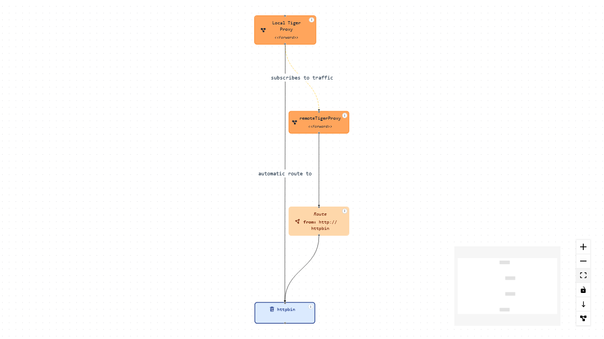
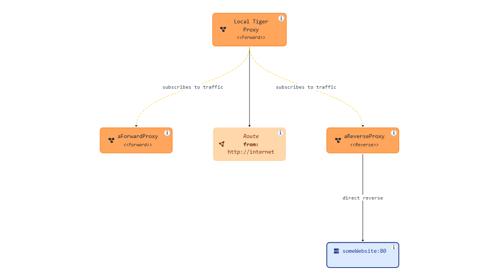
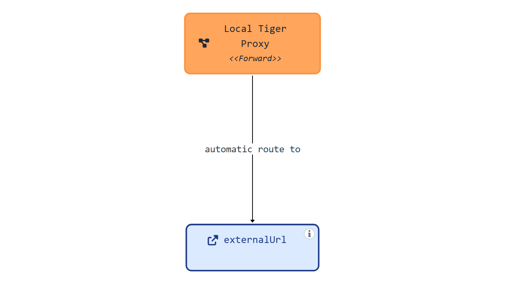
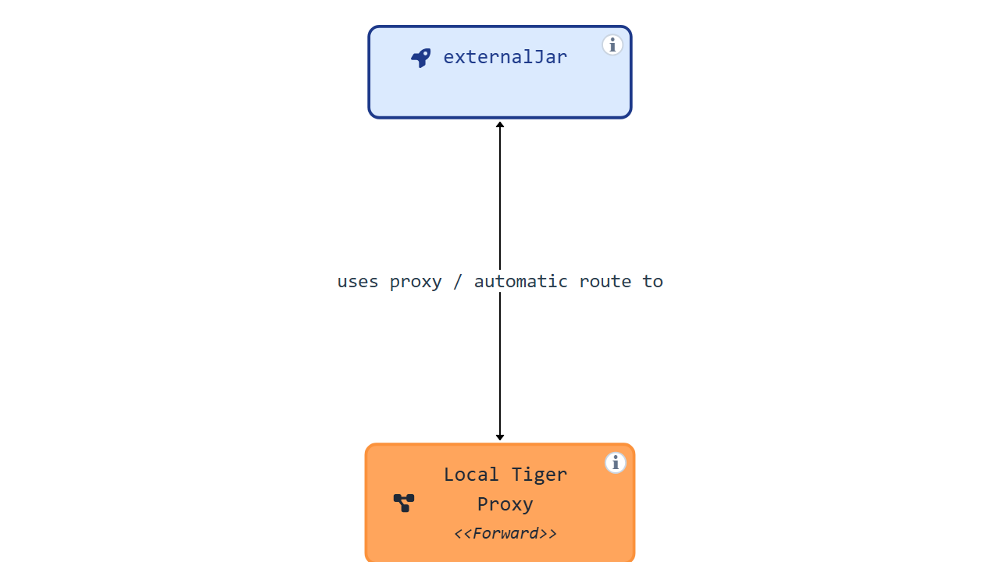
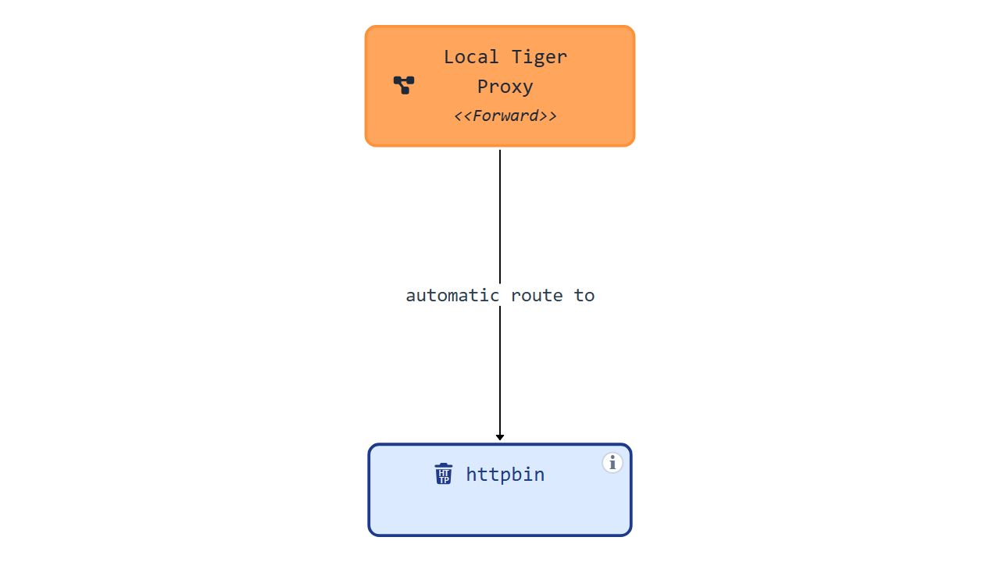
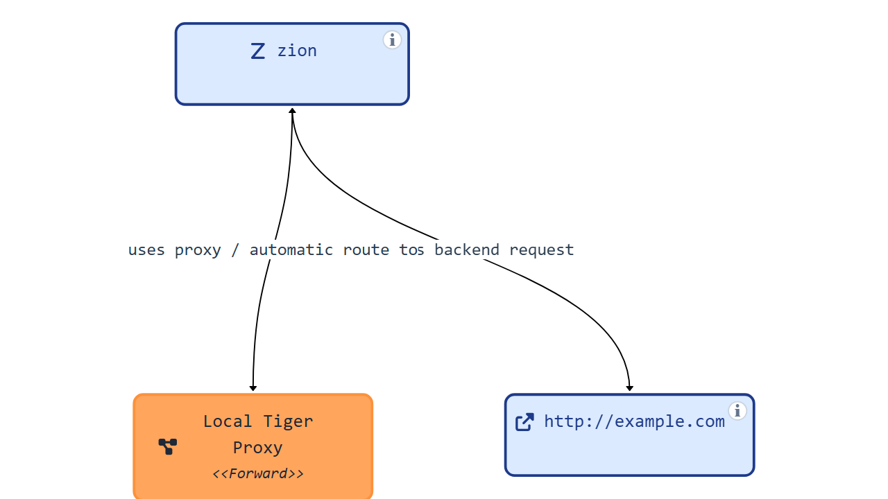
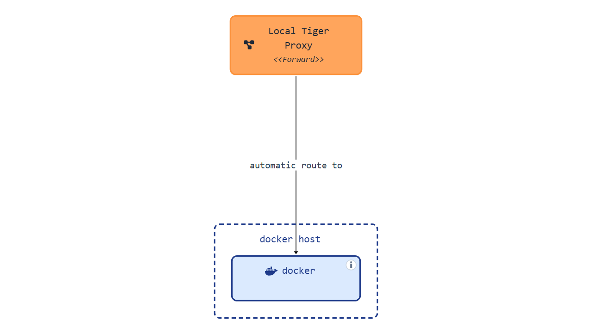
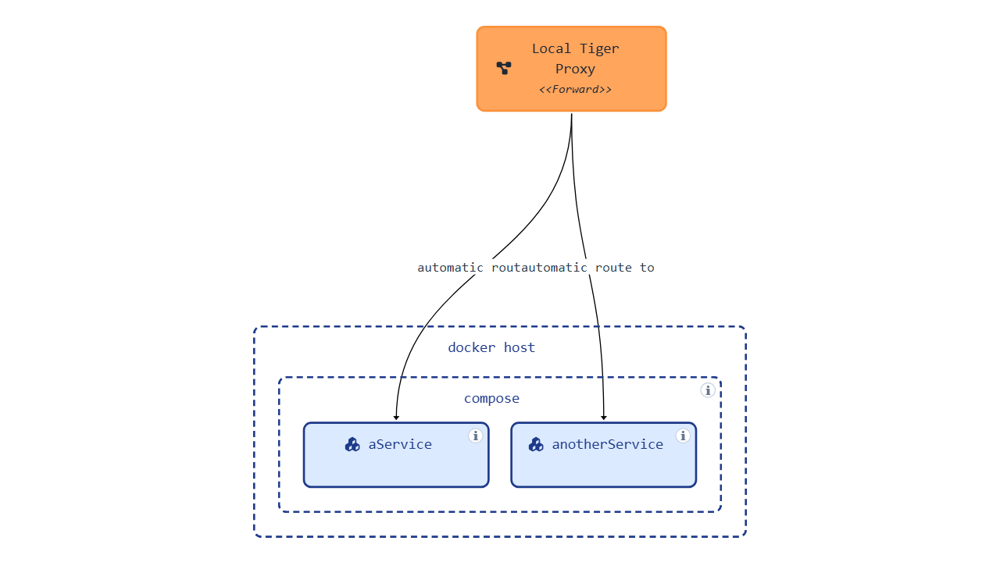
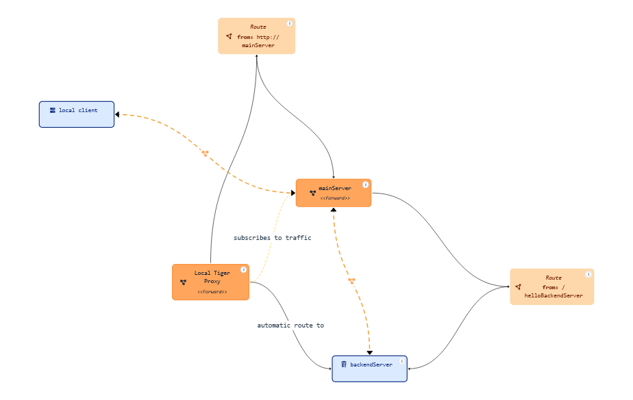

==== Topology Visualizer

The topology visualizer displays the test environment configuration in a graphical way. It reads the tiger configuration and displays the configured servers and how they are connected to each other.

You can access the topology visualizer directly from the Workflow UI.

===== Server Types represented in the Topology Visualizer

Each configured server is displayed as a node in the diagram. An info icon on the node opens a popover dialog with the corresponding YAML configuration.

====== TigerProxy
A tiger proxy is displayed and connected to:

- other proxies from which it receives traffic — these are the ones configured under `tigerProxy.trafficEndpoints`. If one of these traffic endpoints is an external remote proxy, not configured directly in the yaml, we read its configuration from its admin api and display it in the corresponding node.
- to explicitly configured routes — configured under `tigerProxy.proxyRoutes`
- to implicit routes — routes that are automatically created for other server types. This is the case for servers of type `externalUrl`, `externalJar`, `zion`, `httpbin`, `docker` and `compose`.
- to the reverse proxy target — when configured as a direct reverse proxy, the target is displayed and the proxy connects to it.

====== External URL
An `externalUrl` server type is displayed as a simple node with an incoming edge for the implicit route from the local proxy.

====== External JAR
An `externalJar` server type is displayed as a simple node with an incoming edge for the implicit route from the local proxy. Additionally, if the `externalJar` has the configuration properties set to use a proxy (http.proxyHost and http.proxyPort), then an outgoing edge is displayed to the local proxy. These properties can be set in the tiger.yaml like this:

[source,yaml,title="Example of `externalJar` configuration with proxy settings"]
-----
servers:
  mainServer:
    type: externalJar
    externalJarOptions:
      options:
        - -Dhttp.proxyHost=127.0.0.1
        - -Dhttp.proxyPort=${tiger.tigerProxy.proxyPort}`
-----

====== httpbin

A `httpbin` server type is displayed as a simple node with an incoming edge for the implicit route from the local proxy.

====== Zion
A `zion` server type is displayed as a simple node with an incoming edge for the implicit route from the local proxy. Additionally, a `zion` server is automatically configured to use the local proxy and this is represented in the diagram. If there are backend requests in the `zion` configuration, the server is connected to the target of the backend request. Since the zion server is automatically configured to use the tiger proxy, the backend request actually goes through the proxy. This is represented by a "proxy" icon on the backend request connection. Hovering or selecting this connection highlights the proxy through which the backend request goes.

====== docker

The `docker` server type is displayed as a simple node with an incoming edge for the implicit route from the local proxy.
The `docker` node runs inside a docker host. This is represented in the diagram by a dashed box.

====== compose

A `compose` server type is based on a docker compose configuration file. This configuration is represented as a nested node inside the docker host node. For each service defined in the docker compose file, a child node is displayed with an incoming edge for the implicit route from the local proxy.

===== Live data

The topology diagram displays initially all information that can be determined from the tiger configuration. When running a test suite, we may gain additional information about which nodes communicate with each other. Such additional information is gathered based on the metadata of the requests that go through the tiger proxy. We use this information to enrich the diagram with "live edges", indicating that a live data transmission was detected.

It is possible to toggle between the display of all data, only static data and only live data.

===== Standalone mode

As an alternative to the integration in the Workflow UI, the topology visualizer can be used in a standalone mode.
You can download the standalone JAR from the Maven repository: https://repo1.maven.org/maven2/de/gematik/test/tiger-topology-visualizer/{version}/tiger-topology-visualizer-{version}-standalone.jar

and run it with:

[source, shell, subs="attributes"]
-----
java -jar tiger-topology-visualizer-{version}-standalone.jar
-----

This starts a Spring Boot application with the topology visualizer. You can access it at http://localhost:8080. You can upload a tiger configuration file and visualize the topology.

When in standalone mode, you can upload the tiger.yaml and any additionalConfiguration files that are referenced from the main tiger.yaml. File names are resolved based on the base file name, ignoring the file path.
