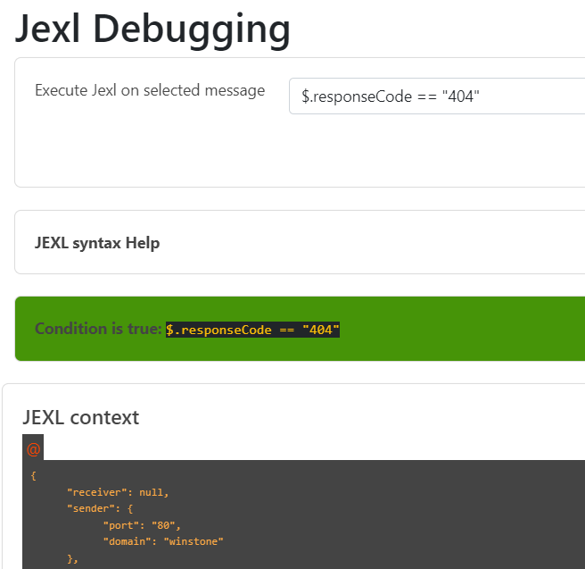
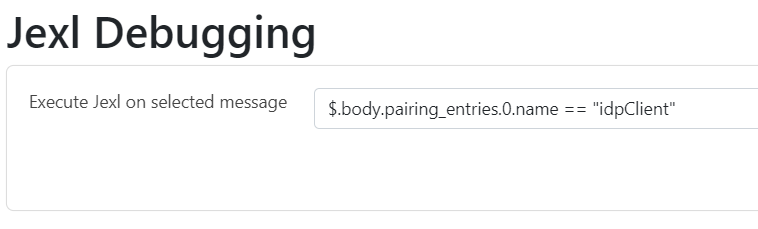
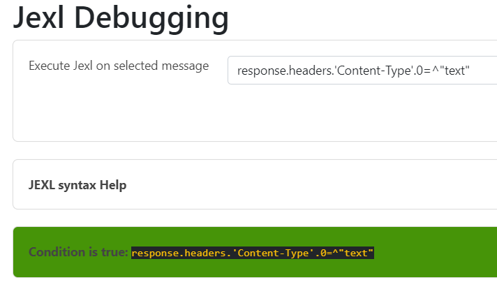

== Tiger User interfaces

include::tigerWorkflowUI.adoc[]

include::tigerWebUI.adoc[]

[#_jexl_expression_detail]
=== Explanation of JEXL Expressions

In the xref:tigerWorkflowUI.adoc#_workflow_ui[Workflow UI] and in the xref:tigerWebUI.adoc#_web_ui[WebUI] you can inspect the requests and response messages.
For that you can use RbelPath and/or JEXL expressions. This section should give you a brief review on the JEXL expressions.

Important to know is that an JEXL expression is usually a "condition1 operator condition2" expression which is compared.
Therefor the following operators could be used.

==== Operators

[cols="10,~"]
|===
|Operator | Description

|and \| && | cond1 __and__ cond2  and cond1 __&&__ cond2 are equivalent
|or \| \|\| | cond1 __or__ cond2  and cond1 \|\| cond2 are equivalent
|not \| ! | The ! operator can be used as well as the word __not__, e.g. !cond1 and not cond1 are equivalent
|== | Equality, e.g. cond1 == cond2

         __null__ is only ever equal to null, that means when you compare null to a non-null value, the result is false.

|!= | Inequality
|> | Greater than
|< | Less than
|>=| Greater than or equal
|<= | Less than ot equal
|=~ | In or match, can be used to check that a string matches a regular expression.
      For example "abcdef" =~ "abc.* returns true. It also checks whether any collection, set or map contains a value or not;
      in that case, it behaves as an "in" operator. "a" =~ ["a","b","c","d","e",f"] returns true.
|!~ | Not in or not-match, can be used to check that a string does not match a regular expression.
      For example "abcdef" !~ "abc.* returns false. It also checks whether any collection, set or map does not contain a value.
     "a" !~ ["a","b","c","d","e",f"] returns false.
|=^ | startsWith, for example "abcdef" =^ "abc" returns true
|!^ | startsNotWith, "abcdef" !^ "abc" returns false
|=$| endsWith, for example "abcdef" =$ "def" returns true
|!$| endsNotWith, for example "abcdef" !$ "def" returns false
|Empty| The unary empty operator behaves like the corresponding function empty().
|size| The unary size operator behaves like the corresponding function size().
|===



==== Access on Array, Lists and Maps

To access maps in JEXL/RbelPath the point notations is used. In case of lists use the number of the list entry you want to access, starting with 0, 1, 2 and so on.



==== Access JEXL contexts

There are predefined JEXL contexts which can be used for the query, for example `isRequest`, `isResponse`, `charset`, `content` or also more
complex contexts like `response.statuscode`, `request.url`, `message.method` etc.
For more details check the InlineJexlToolbox



==== More Examples

`message.headers.'content-length'.0 == "0"`  -> Use single quotes when using JEXL contexts with a hyphen.

`@.body.0.name.content =^ "Jasmin"` -> check whether the content starts with "Jasmin"

`$.body.recordId == "X12349035"`   -> checks for the recordId of a decrypted EPA-VAU-message

`$.header.Content-Type == "application/json"`  -> check if the message is a JSON-message

`request.method == "GET"` -> check if request is da GET request

`charset =~ "UTF-.*"` -> check the charset with a regex

`empty(response.url)==true` oder auch `empty(response.url)` -> url is not set

`$.body.recordId == "Y243631459" && charset == "UTF-8"` -> combines the two criterions

==== POST Form / GET parameters

When accessing parameters POST and GET are handled differently.
POST form data requests contain the data as Url encoded query string in the body of the request.
There is no easy way to decode this data generically within Rbel/JEXL.
To help you ease the situation for POST we do have a helper JEXL inline method: ```!{urlEncoded('value')}```
To access POST form data you may use ```$.body.paramname``` which will return the URL encoded value.

For GET requests you have two options:

* ```$.path.paramname``` which will return the string "paramaname=URLENCODED_VALUE" or
* ```$.path.paramname.value``` which will return the URL decoded original value.

For further help on JEXL please check out the official website (https://commons.apache.org/proper/commons-jexl).
