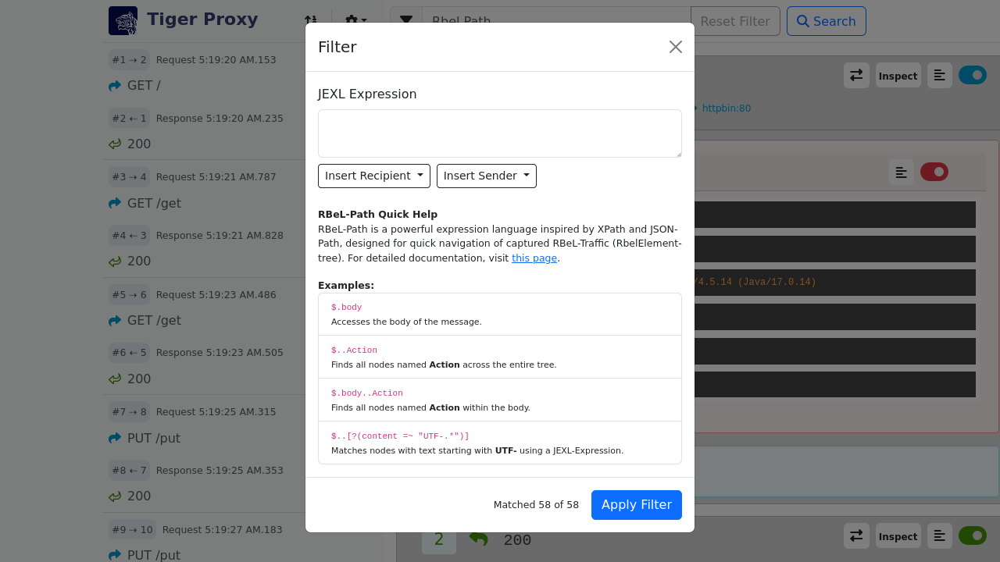
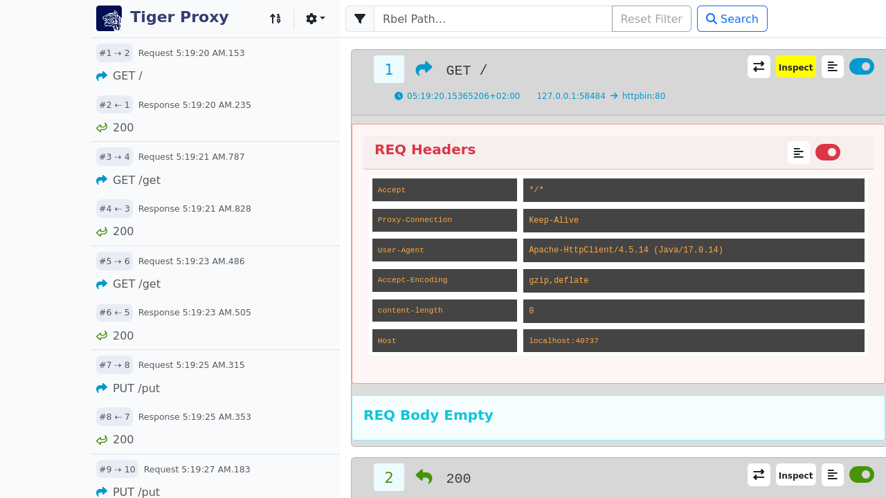
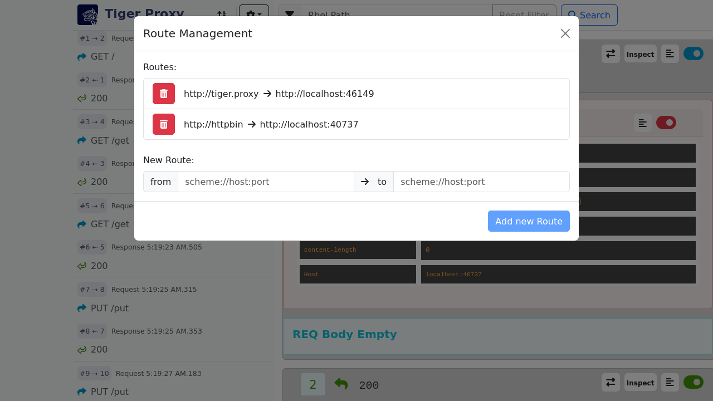
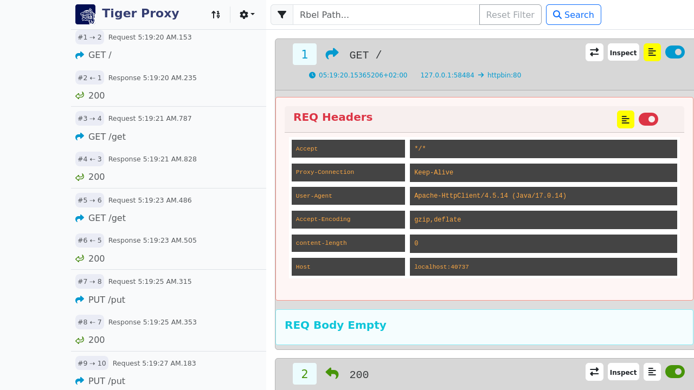

[#_web_ui]
=== Standalone Tiger Proxy Log

To watch the recorded messages and to be able to analyze issues at test run time already you can visit the Tiger Proxy web user interface at:

[source,http request]
----
http://127.0.0.1:${SERVERPORT}/webui
----

With `ADMINPORT` being the configured server port of the Tiger Proxy.

When the user works with the xref:tigerWorkflowUI.adoc#_workflow_ui[Workflow UI] the Tiger Proxy UI can be opened via a link in the Rbel Log Details view in a new browser tab.

==== Overview

The following screenshot shows the WebUI.
On the left side the request/response pairs are displayed.
The user can see the request type and the error code of the response as well as the timestamp of the request.

image::screenshots/webui.png[title="Tiger Proxy Log"]

On the top right the tiger version and the build date are displayed.
In the middle the full request and response messages are shown with detailed header and body.

===== Filter Modal

When a lot of messages are recorded, it is sometimes hard to find the message you are looking for.
Therefore, the user can filter the messages with a Rbel-Path or a regex using either the filter modal as shown in the picture below or the JEXL Debugging modal described xref:_jexl_filter[here].

===== RBel-Path/JEXL Debugging Modal

When the user wants to inspect a Rbel-Path or have a look at some JEXL expressions, the user can click on the corresponding button in the top right corner of the request or the response that is highlighted in the following screenshot.

The picture below shows the RBel-Path tab.
The user can execute the RBel-Path on the request or the response and the result is displayed in the bottom part of the modal.

image::screenshots/webui_inspect_rbelpath_highlight.png[title="RBel-Path"]

For more information in the Rbel-Path check out xref:tigerProxy.adoc#_rbel_path_details[this] section.

The picture below shows the JEXL Debugging tab.
The user can execute the JEXL expression on the request or the response and the result is displayed in the bottom part of the modal.
Further information on JEXL expressions can be found in xref:tigerUserInterfaces.adoc#_jexl_expression_detail[Explanation of JEXL Expressions].

image::screenshots/webui_inspect_jexl_highlight.png[title="JEXL Debugging"]

[#_jexl_filter]
When the user wants to filter the messages with a JEXL expression, the user can click on the "Use as filter" button in the modal.

Behind the settings icon are some modals that are explained in more detail in the following sections.

===== Settings

Behind the settings icon several actions can be triggered:

* *Message Options* … has two possibilities (hide headers and hide details) which collapses either all headers (request headers as well as response headers) or all the detailed information of the requests and responses
* *Export* … allows you to export all or the currently filtered received messages as an HTML page or as a machine-readable tgr file.
* *Configure Routes* … allows you to modify and add the routes configured on this Tiger Proxy
* *Reset Messages* … allows you to reset all the messages and import a previously stored traffic file.
* *Quit Proxy* … quits the Tiger Proxy.

===== Routing Modal

The user can add/delete routes in the routing modal which is shown in the following screenshot.

===== Message Content

The user can have a look at the request/response message content of the header, body or both by clicking on the corresponding button in the top right corner of the request or the response that is highlighted in the following screenshot.

The picture below shows the content of the whole response.

image::screenshots/webui_btn_content.png[title="Example of the content of a response"]

In case that the message is too large to be rendered fully (displaying a "<...redacted due to size of" text), the message will have a "Full Message" button in the top right corner of the request or the response that is highlighted in the following screenshot.

image::screenshots/webui_full_message.png[title="Button to show the full message"]

By clicking on this button the full message will be displayed in a new tab/window.

image::screenshots/webui_single_message_page.png[title="Single message view to show the full message"]

===== Switching between request/response

Since the order in the list is based upon the reception of the corresponding message it can be hard to find the corresponding request or response to a given message.
To make this easier the user can switch between the request and the response by clicking on the corresponding button in the top right corner of the request or the response that is highlighted in the following screenshot.

