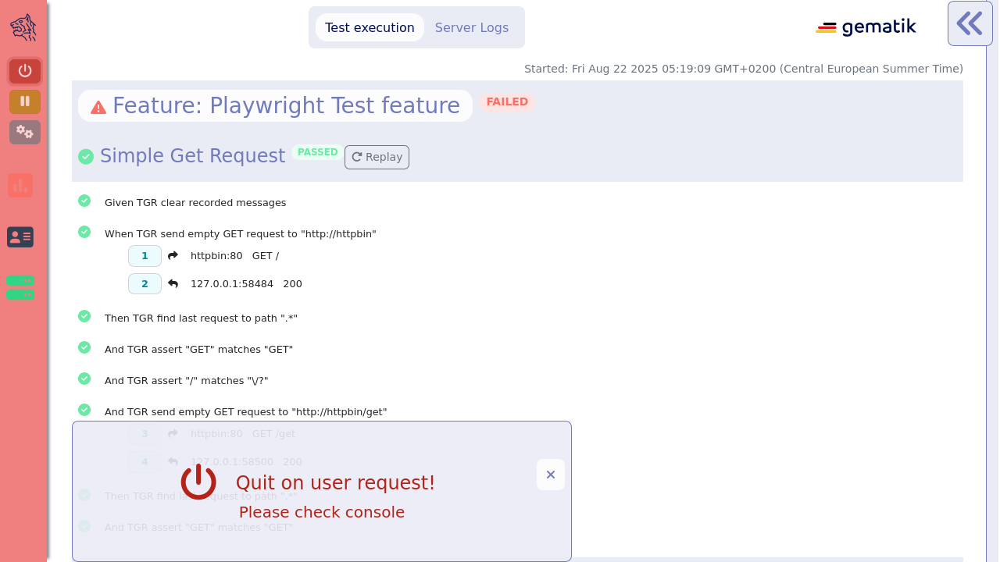
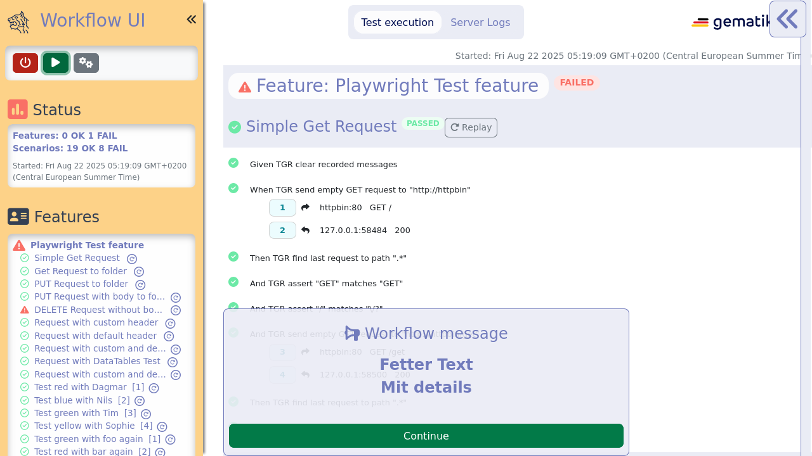
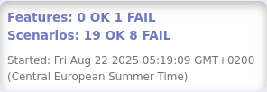
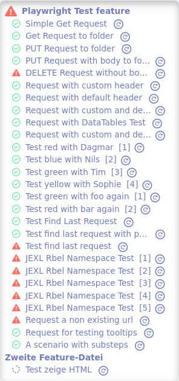
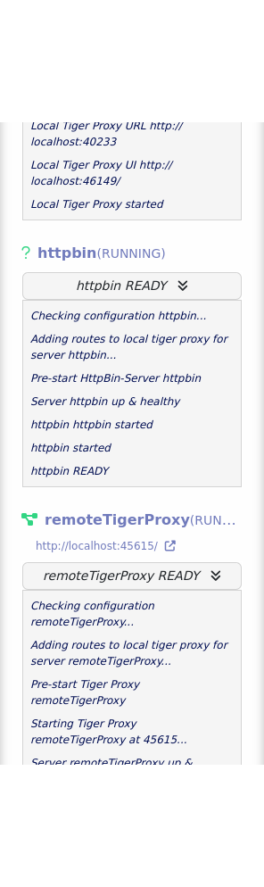
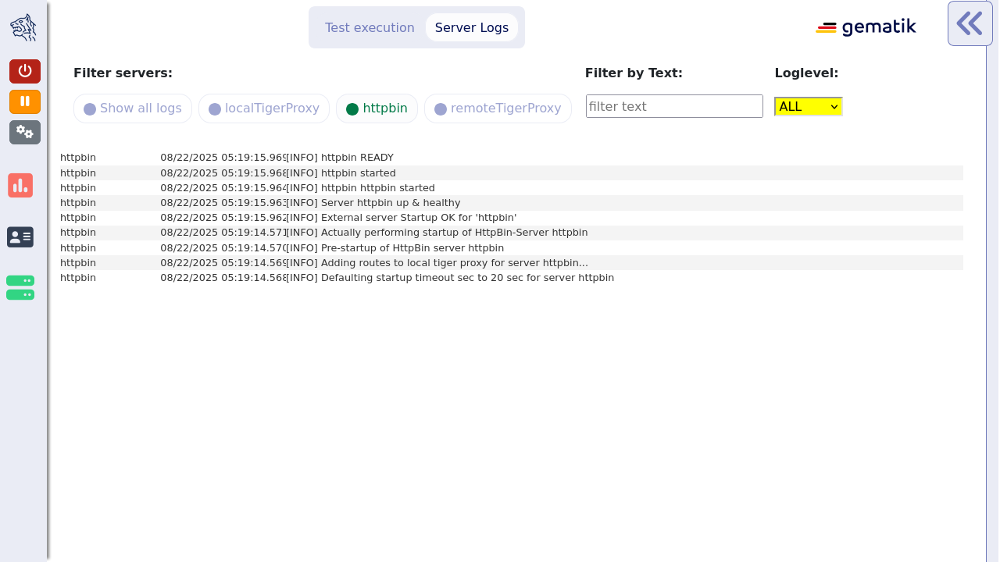
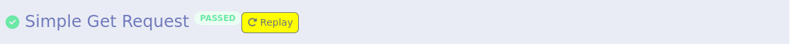
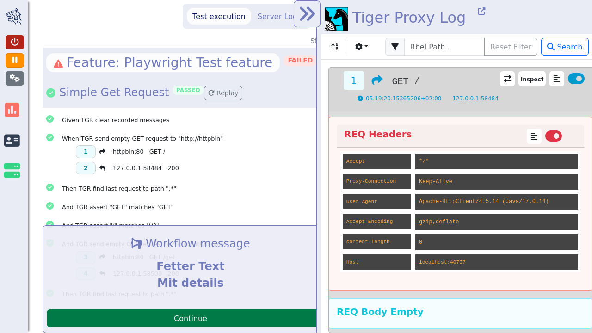

[#_workflow_ui]
==== Workflow UI

The Workflow UI is one of the central features which are currently introduced to Tiger.
If activated via the `tiger.yaml` xref:_tiger_test_lib_configuration[configuration file], the Workflow UI will be opened in the current browser window during the test run.
If no browser is open at the time a new instance will be launched.

The image above shows the inital startup of the Workflow UI.
The Workflow UI is divided into three sections: the xref:_status_bar[status bar], the xref:_main_window[main window] with xref:_test_execution[test execution] and xref:_server_logs[server logs] and the xref:_rbel_logs[Rbel log details] (a slimmed down version of the xref:tigerWebUI.adoc#_web_ui[WebUI]).

[#_status_bar]
===== Status Bar

The section on the left is called status bar as shown in the picture below.

image::screenshots/sidebarclosed_highlight.png[title="the status bar is situated on the left"]

When the user clicks on the tigers head on the top left the status bar slides open as shown below.

image::screenshots/sidebaropen.png[title="open status bar"]

image::screenshots/sidebarbuttons.png[title="status bar buttons: abort, pause, configuration editor"]

[#_pause]
The first button stops the test execution and terminates the servers.
As seen in the following screenshot the background color of the status bar changed to red and at a banner is shown that tells the user that the test execution has been aborted.
Once the Workflow UI has quit, searches and filtering on the xref:_rbel_logs[Rbel log details] as well as on the xref:tigerWebUI.adoc#_web_ui[Web UI] are no longer possible.

By clicking on the second button the test execution pauses.
The background color of the status bar and the pause button change to indicate the pause as shown in the following picture.

The test execution will be resumed once the user clicks on the green play button.
The third button opens the Configuration Editor which is explained in detail in xref:_tiger_configuration_editor[this] section.

Below the buttons the status box shows how many feature files and how many scenarios were executed and also the amount of failed tests are shown.

In the feature box below each scenario name is displayed.
The names are linked to the test and when the user clicks on the scenario the test is shown in the test execution on the main section.
The green icon in front of the name indicates a passed scenario, the red exclamation mark indicates a failed scenario.
The numbers in square brackets indicate that this is part of an outline scenario, meaning a test scenario that is run multiple times with different test data.

The server box above displays the configured servers, its status (e.g. STARTING, RUNNING, STOPPED) and some outputs of its logs.
When the icon color before the server name is green then the server is up and running correctly.

Below the server box the version number and the build date of the currently used tiger release is displayed.

image::screenshots/sidebar_version_build.png[title="tiger version and build"]

The status bar can be minimized by clicking on the double arrow or by clicking on any of the icons in the status bar (e.g. status box icon, feature box icon, server box icon, tiger head icon).

[#_main_window]
===== Main window

The main window of the Workflow UI has two sections: the xref:_test_execution[test execution] and the xref:_server_logs[server logs] which can be selected by the two buttons on top of the Workflow UI as seen in the picture below.

[#_server_logs]
By clicking on the server logs button on top of the main window the user can have a look at the log files of each server.
There the user can use several filter options to search in the log files.
There are the following server buttons: you can see all logs of all servers, or only the logs of one or more servers by clicking on the corresponding buttons.
The user can also search via text input after a certain text phrase.
It is also possible to distinguish between the different log levels.
In the picture below only the httpbin server is selected.

[#_test_execution]
In the test execution tab the user sees the executed features and their scenarios as well as their execution status.
A test can be either passed or failed.
In the example below the scenario has passed but the feature itself has failed, which means that at least one of the scenarios of the feature has failed.

image::screenshots/maincontent_tabs_highlight.png[title="Test execution"]

image::screenshots/maincontent_table_highlight.png[title="execution status for scenarios and features"]

Beside the status at the end of the feature/scenario name the user can also see the status at the icon before the name.
During text execution or while xref:_pause[pausing] the Workflow UI there is a third status the feature/scenario can have which is "pending".
The icon before the name would be a spinner icon to indicate that status.

TGR banner step will be displayed at the bottom of the Workflow UI and will stay there till the next banner step replaces the message.
This way you can instruct manual testers to follow a specified test workflow.
This feature is used in the EAU Konnektorfarm validation test suite to guide the Primärsystem manufacturers through the interoperability combinations of signing/verifying documents against all Konnektors available.

Additionally, a test scenario can be replayed.
When clicking the replay button, the scenario will be rerun again.
If placeholder variables were modified with the configuration editor, the new values will be used when replaying the scenario.

[#_rbel_logs]
The communication requests that are called during the step execution are displayed beneath the step that initated the request.
When the user clicks on the light blue rectangle with the number (whereas uneven numbers are requests, even number are responses) of the request then the Rbel Log view opens on the right hand side of the Workflow UI as shown on the screenshot below.

In the Rbel Log Details view the RbelMessages are displayed that are also saved as HTML files as described in the xref:tigerTestLibrary.adoc#_cucumber_hooks[Cucumber and Hooks] section.
Next to the headline there is a link to the xref:tigerWebUI.adoc#_web_ui[WebUI (aka Tiger Proxy UI)] which opens the WebUI in a new tab as shown in the picture below.

The Rbel Log Details view is described in the xref:tigerWebUI.adoc#_web_ui[WebUI] section as it is a slimmed down version of the WebUI.
In order to increase/decrease the width of the Rbel Log Details view the user can drag the border between the main window and the Rbel Log Details view.
The Rbel Log Details can be minimized by clicking on the double arrow on the top left of the Rbel Log Details section.

